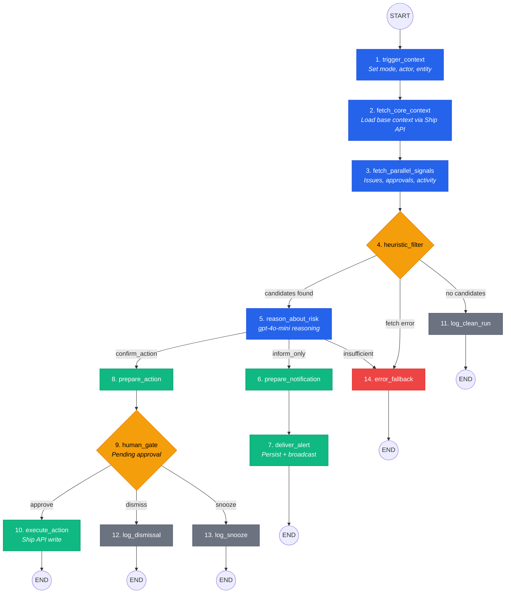

# FleetGraph

FleetGraph is Ship's execution-drift agent. It watches project execution, detects meaningful drift, explains why it matters with cited evidence, proposes the next best action, and stops at a human gate before any consequential write.

Runtime: LangGraph JS (TypeScript). Reasoning: OpenAI gpt-4o-mini. Proactive sweep: every 4 minutes. Tracing: LangSmith.

## Agent Responsibility

### What FleetGraph monitors proactively

FleetGraph watches active sprints and their issues. Every 4 minutes it runs sprint-scoped checks for missing standup accountability and approval bottlenecks, and issue-scoped checks for stale issues and scope drift. It runs without a user present, authenticated via a workspace-scoped API token.

When FleetGraph detects a missing standup, it targets the **manager** (sprint owner / `owner_id`) first, not the individual developer. The manager receives an alert naming which team members have overdue standup accountability items, giving them the context to follow up directly. This reflects the management chain: the person accountable for sprint delivery is the first to know when accountability breaks down.

### What it reasons about on demand

When a user opens the FleetGraph chat from any screen, the agent fetches current context for the scoped entity, runs the same heuristic and reasoning pipeline, and explains what it found. The chat interface threads follow-up questions with conversation history so the user can drill into specific signals. On-demand mode knows which entity the user is looking at and scopes analysis to that entity and its relations.

### What it can do autonomously

FleetGraph can surface alerts (inform_only branch) without human approval. It persists alerts to the database, broadcasts them in real time via WebSocket, and deduplicates based on fingerprint. It also logs audit entries for every run (clean or otherwise) and reactivates snoozed alerts after expiry.

**FleetGraph cannot:**
- Read or modify data outside the workspace it is scoped to
- Bypass the human gate for any consequential write
- Escalate its own permissions or create new API tokens
- Access user credentials, passwords, or session tokens
- Send notifications outside the Ship application (no email, Slack, or SMS)

### What requires human approval

Any consequential write to Ship data requires human confirmation. This includes: reassigning an issue, changing issue state, escalating priority, flagging an issue as urgent, and adding comments. The graph enters the confirm_action branch, creates a pending approval with a 72-hour expiry window, and waits for the user to approve, dismiss, or snooze. Expired approvals are enforced server-side (410 response).

### Who it notifies and when

**Proactive runs:** Broadcast to workspace members via `fleetgraph:alert` WebSocket events. Missing-standup, stale-issue, and scope-drift copy is manager-oriented, but delivery is currently workspace-wide rather than recipient-targeted.

**On-demand runs:** Notify the requesting user directly with the analysis results.

**Notification center:** A bell icon in the app shell shows unread FleetGraph alerts with a badge count. Managers see CTAs to open the relevant context, dismiss, or snooze alerts. Real-time updates arrive via the existing WebSocket infrastructure.

### How it knows project membership and roles

FleetGraph determines ownership from Ship document properties: `assignee_id` for issues, `owner_id` for sprints and projects. Workspace membership is resolved from the `workspace_memberships` table for broadcast targeting. Role context comes from the RACI fields on document properties (owner_id, accountable_id).

### How on-demand mode uses the current view

The UI sends the current page's `entityType` and `entityId` when invoking on-demand analysis or chat. The graph uses these to fetch entity-specific context: issue details + children for issues, sprint context + issues for sprints, project document + associations for projects, and explicit workspace scope when the current screen has no entity. On-demand accountability reads are actor-scoped: FleetGraph answers from the requesting user's visible action items and manager follow-up items rather than a generic service-account perspective. Chat questions and conversation history are threaded into the LLM prompt so the model reasons about what the user is asking in the context of what they are looking at.

## Global Chat

### Scope model

FleetGraph chat is available on every screen in Ship. The chat scope is derived from the user's current navigation context, following a hierarchy:

| Context | Scope | Example |
|---------|-------|---------|
| Issue page | Issue | "Why is SHIP-42 stalled?" |
| Sprint page | Sprint | "Which issues are at risk this week?" |
| Project page | Project | "What are the top risks across all sprints?" |
| Any other page | Workspace | "What needs my attention right now?" |

The scope determines which entity context the graph fetches before reasoning. A **scope chip** is always visible in the chat launcher showing the current scope (e.g., "Sprint: Week 12" or "Workspace: Acme Corp"), so the user always knows what FleetGraph is analyzing.

### Workspace fallback

When the user is on a page without a specific entity context (dashboard, settings, search results), the chat falls back to workspace scope. In workspace scope, FleetGraph fetches active sprints plus the current actor's visible accountability state, including overdue personal items and manager follow-up items for direct reports. This provides a high-level summary of what needs attention across the workspace without collapsing to a generic project view.

### Multi-turn threading

Each chat session maintains conversation history (up to 20 messages, 30-minute TTL). The history is threaded into the LLM prompt so follow-up questions have full conversational context. If the user navigates to a different entity, a new conversation starts with fresh context. The previous conversation is fenced by `entityId` to prevent stale context from leaking across entity boundaries.

## Use Cases

| # | Role | Trigger | Agent detects / produces | Human decides | Evidence |
|---|------|---------|--------------------------|---------------|----------|
| 1 | PM | Proactive (4-min sweep) | Stale issue: an in-progress issue has had no activity for 3+ business days. Agent surfaces the issue, identifies the assignee, and recommends reassignment or priority change. | Whether to reassign, escalate priority, or dismiss the alert. | `lastActivityDays >= 3`, issue `updated_at`, assignee from `assignee_id` |
| 2 | Manager | Proactive (4-min sweep) | Manager missed standup: a team member has overdue standup accountability items. Agent alerts the **sprint owner** (manager) with context on which standups are missing and who is behind. The manager gets the alert within 5 minutes of the SLA breach (4-min sweep + processing). | Whether to follow up with the team member, snooze the alert, or dismiss. | `missingStandup === true` from accountability signals, sprint `owner_id` |
| 3 | Engineer | On-demand (opens FleetGraph on issue page) | Approval bottleneck: a review has been pending for 2+ business days. Agent explains who is blocking, how long, and proposes adding a comment to nudge the reviewer. | Whether to approve the comment action, dismiss, or snooze. | `pendingApprovalDays >= 2`, reviewer identity from approval records |
| 4 | Director | Proactive (4-min sweep) | Scope drift: sprint issues have been reopened or moved back from done. Agent explains which issues drifted, calculates completion delta, and recommends flagging the sprint for review. | Whether to flag the sprint, accept the drift, or investigate further. | `scopeDrift === true`, issue state transitions |
| 5 | Engineer | On-demand (chat follow-up) | On-demand analysis: user asks "why is this sprint behind?" on a sprint page. Agent fetches issue stats, activity heatmap, and accountability data, then reasons about root causes with cited evidence. | What action to take based on the analysis. Chat allows follow-up questions for deeper exploration. | Sprint issues, activity signals, accountability items |
| 6 | PM | On-demand (opens FleetGraph on project page) | Project health summary: agent aggregates signals across all sprints and issues in the project, identifies the highest-risk areas, and ranks them by severity. | Which risks to address first, and whether to escalate any to the director. | Cross-sprint issue aggregation, severity ranking |
| 7 | Any | On-demand (chat from any screen) | Global chat: user opens FleetGraph chat from any page. Scope auto-detected from current context. Workspace fallback provides cross-sprint triage. Scope chip always visible. | What to investigate or act on based on the analysis. | Entity context or workspace-level sprint aggregation |

## Architecture

### 14-Node LangGraph Pipeline

FleetGraph is a single compiled `StateGraph` shared by proactive and on-demand modes. Nodes 1 through 5 handle context, fetching, filtering, and reasoning. Nodes 6 through 14 handle delivery, action execution, human gating, audit logging, and error fallback.

| # | Node | Purpose |
|---|------|---------|
| 1 | `trigger_context` | Set mode, actor, entity, workspace, trace metadata |
| 2 | `fetch_core_context` | Load page-aware base context via Ship REST API |
| 3 | `fetch_parallel_signals` | Fetch issues, approvals, activity, associations in parallel |
| 4 | `heuristic_filter` | Deterministic checks; prune non-events before LLM reasoning |
| 5 | `reason_about_risk` | OpenAI gpt-4o-mini: assess risk, recommend action, cite evidence |
| 6 | `prepare_notification` | Format alert payload (tracing waypoint) |
| 7 | `deliver_alert` | Persist alert record, broadcast realtime `fleetgraph:alert` event |
| 8 | `prepare_action` | Format proposed write, persist pending approval (tracing waypoint) |
| 9 | `human_gate` | LangGraph `interrupt()` pause/resume point backed by the checkpointer |
| 10 | `execute_action` | Perform approved Ship write, log audit entry |
| 11 | `log_clean_run` | Audit: no candidates found |
| 12 | `log_dismissal` | Audit: user dismissed the alert |
| 13 | `log_snooze` | Audit: user snoozed the alert |
| 14 | `error_fallback` | Log structured error, end gracefully |

### Graph Diagram



### Branches

| Branch | When | Terminal node |
|--------|------|---------------|
| `clean` | Heuristic filter finds no candidates | `log_clean_run` |
| `inform_only` | Risk detected, no write needed | `deliver_alert` |
| `confirm_action` | Risk detected, write proposed | `human_gate` then `execute_action` / `log_dismissal` / `log_snooze` |
| `error` | Fetch failure, LLM error, or insufficient data | `error_fallback` |

### Trigger Model

FleetGraph uses two trigger modes: scheduled sweep and on-demand invocation. The proactive mode polls every 4 minutes rather than using event triggers. This is a deliberate tradeoff: polling is simpler to operate, avoids webhook infrastructure, and achieves the under-5-minute detection latency requirement for absence-of-event signals (stale issues, missing standups) which cannot be detected by events alone. Event-triggered mode remains a Phase 3 enhancement for sub-second response to state changes.

| Trigger | Purpose | Latency |
|---------|---------|---------|
| 4-minute sweep | Detect aging conditions, missing signals, and drift | Under 5 min end-to-end |
| On-demand | User opens FleetGraph chat or panel from current page | Interactive (seconds) |
| Page-view | Auto-analyze when user navigates to an entity (if stale >15 min) | Background (fire-and-forget) |
| GitHub webhook | Push/PR events from GitHub repo trigger analysis of referenced issues | Near-realtime (seconds) |

**Why not event-triggered:** Absence-of-event signals (missing standup, stale issue) cannot be detected by listening for writes. A separate polling mechanism would be needed anyway. Hybrid triggering (events + polling) is deferred to Phase 3 when real usage data can justify the added operational complexity.

The `FleetGraphScheduler` runs a sweep every 240 seconds. Each sweep:
1. Reactivates expired snoozed alerts and expires stale pending approvals
2. Enumerates active sprints via the Ship REST API (`GET /api/weeks`)
3. Enumerates sprint issues via the Ship REST API (`GET /api/issues?sprint_id=...`)
4. Computes sprint and issue digests, skipping unchanged proactive candidates
5. Enqueues changed proactive runs, with queue-pressure drops for deep proactive backlogs
6. Drains the queue, invoking the compiled graph for each item
7. Re-queues transient failures with bounded exponential backoff (max 2 retries, 1s base, 30s cap)

### Startup

`bootstrapFleetGraph(pool, broadcastFn)` initializes FleetGraph in one shot:

1. Validates env (OPENAI_API_KEY required; others optional)
2. Wires data layer (pool + ShipApiClient)
3. Wires `setBroadcastFn()` so graph nodes can push realtime alerts
4. Compiles the LangGraph StateGraph
5. Starts the scheduler; attaches compiled graph via `setGraph()`
6. Registers SIGTERM/SIGINT handlers for graceful shutdown

The server continues to boot even if `bootstrapFleetGraph()` fails. FleetGraph is non-critical.

## Human-in-the-Loop Gate

FleetGraph implements a checkpoint-based HITL gate using LangGraph's `interrupt()` mechanism inside the `human_gate` node. When the LLM recommends a consequential action (`confirm_action` branch), the flow pauses at a well-defined checkpoint and resumes only after human decision.

### How it works

**With checkpointer (proactive runs via scheduler):**

1. `prepare_action` (node 8) persists a pending approval to `fleetgraph_approvals` with a 72-hour expiry window. It also persists the associated alert and broadcasts a real-time event so the UI renders the approval card immediately.
2. The graph is compiled with a Postgres-backed checkpointer, and `human_gate` calls `interrupt()` to persist paused state before execution can continue.
3. When the user decides (approve/dismiss/snooze), the `/resolve` endpoint processes the decision and the graph can be resumed from the checkpoint with the `gateOutcome` set.

**Without checkpointer (on-demand/chat runs):**

1. `prepare_action` (node 8) persists the pending approval and broadcasts the alert, same as above.
2. Without a checkpointer, the graph completes through node 9 (which passes through) and the pending approval is resolved independently via `POST /api/fleetgraph/alerts/:id/resolve`.

### Approval resolution

`POST /api/fleetgraph/alerts/:id/resolve` processes the human decision:

- **Approve:** Validates the approval is still pending (CAS guard: `UPDATE ... WHERE status = 'pending'`), checks expiry server-side (410 on expired), executes the Ship API write via `executeShipAction()`, and marks the approval as executed.
- **Dismiss/Reject:** Marks the approval as dismissed via CAS guard. Returns 409 if already processed.
- **Snooze:** Sets `snoozed_until` on the alert; the scheduler reactivates it after expiry.

### Correctness guarantees

- Expired approvals return 410 (enforced server-side, not just client UI)
- Duplicate approve race prevented by CAS: `UPDATE ... WHERE status = 'pending'`
- Invalid action payloads fail-closed: `validateActionPayload()` throws before dispatch
- Failed action execution rolls back approval status to `execution_failed`
- 502 returned to client on execution failure so UI can show rollback state

## Notification Center

The notification center provides a persistent surface for FleetGraph alerts outside the entity-scoped panel.

### Design

- **Bell icon** in the application shell header, always visible
- **Unread badge** shows count of active FleetGraph alerts for the current workspace
- **Dropdown panel** lists recent alerts sorted by severity then recency
- **Manager CTAs:** Each alert card in the dropdown offers: open entity context, dismiss, snooze
- **Real-time updates** via existing `fleetgraph:alert` WebSocket events increment the badge without page reload

### Implementation status

The bell icon, unread badge, realtime invalidation, and dropdown CTAs are implemented in the current shell. The remaining gap is proof capture: the submission still needs live screenshots and shared trace links from a clean demo run.

## Alert Model

### Signal Types

| Signal | Threshold | Heuristic check |
|--------|-----------|-----------------|
| `stale_issue` | 3 business days with no progress | `lastActivityDays >= 3` on in-progress issues |
| `missing_standup` | Same workday after expected standup window | `missingStandup === true` |
| `approval_bottleneck` | 2 business days pending or changes_requested | `pendingApprovalDays >= 2` |
| `scope_drift` | Immediate after plan snapshot | `scopeDrift === true` |
| `ownership_gap` | Missing accountable person | Stretch signal (not yet implemented) |
| `multi_signal_cluster` | Multiple weak signals on same entity | Stretch signal (not yet implemented) |

### Severity Levels

`low`, `medium`, `high`, `critical` (type: `AlertSeverity`).

Escalation rules:
- Stale issue: medium at 3 days, high at 6 days
- Approval bottleneck: medium at 2 days, high at 4 days
- Scope drift: always high
- Missing standup: low

### Fingerprint Dedup

Format: `{workspaceId}:{entityType}:{entityId}:{signalType}`

Same fingerprint prevents duplicate alerts unless the underlying entity state changes materially.

### Alert Lifecycle

Statuses: `active`, `dismissed`, `snoozed`, `resolved`, `rejected`.

| User action | Result |
|-------------|--------|
| Dismiss | Status set to `dismissed`; does not resurface unless state changes |
| Snooze | Status set to `snoozed` with `snoozed_until` timestamp; scheduler reactivates after expiry |
| Approve | Proposed action executes via `execute_action` node |
| Reject | Treated as dismiss |

## API Endpoints

All routes require authentication (`authMiddleware`). Mounted at `/api/fleetgraph`. Full request/response types are defined in `shared/src/types/fleetgraph.ts`.

| Method | Path | Purpose | Key request fields | Key response fields |
|--------|------|---------|-------------------|-------------------|
| POST | `/on-demand` | On-demand analysis | `entityType` (`issue` | `sprint` | `project` | `workspace`), `entityId`, `workspaceId`, `question?` | `runId`, `branch`, `assessment`, `alerts[]`, `traceUrl?` |
| POST | `/chat` | Multi-turn chat | `entityType` (`issue` | `sprint` | `project` | `workspace`), `entityId`, `workspaceId`, `question`, `conversationId?`, `history?` | `conversationId`, `runId`, `branch`, `assessment`, `alerts[]`, `message`, `traceUrl?` |
| GET | `/alerts` | Fetch alerts | Query: `entityType?`, `entityId?`, `status?` | `alerts[]`, `pendingApprovals[]`, `total` |
| POST | `/alerts/:id/resolve` | Resolve alert | `outcome` (approve/dismiss/snooze/reject), `snoozeDurationMinutes?`, `reason?` | `success`, `alert` or error (404/409/410/502) |
| GET | `/status` | Scheduler health | (none) | `running`, `lastSweepAt`, `nextSweepAt`, `sweepIntervalMs`, `alertsActive` |

## Environment Variables

| Variable | Required | Description |
|----------|----------|-------------|
| `OPENAI_API_KEY` | Yes | OpenAI API key for gpt-4o-mini reasoning |
| `FLEETGRAPH_API_TOKEN` | No | Ship API bearer token for data fetching. Without this, Ship API calls fail. |
| `FLEETGRAPH_WORKSPACE_ID` | No | Workspace UUID for proactive sweep scope. Without this, proactive sprint enumeration is skipped. |
| `LANGCHAIN_API_KEY` | No | LangSmith API key. Without this, tracing is disabled. |
| `LANGCHAIN_TRACING_V2` | No | Set to `"true"` to enable LangSmith tracing |
| `LANGCHAIN_PROJECT` | No | LangSmith project name |

FleetGraph will not start if `OPENAI_API_KEY` is missing. All other variables are optional; the server boots regardless.

### Local Setup

After `pnpm db:seed`, generate tokens: query `workspaces` for `FLEETGRAPH_WORKSPACE_ID`, then create a Ship API token via `POST /api/api-tokens` (or raw SQL insert into `api_tokens` with a SHA-256 hash). Add both to `api/.env.local`.

## Database Tables

| Table | Migration | Purpose |
|-------|-----------|---------|
| `fleetgraph_alerts` | 039 | Persisted alert state: fingerprint, severity, status, snooze, timestamps |
| `fleetgraph_audit_log` | 040 | Audit trail: run metadata, branch taken, candidate count, duration, token usage |
| `fleetgraph_entity_digests` | 041 | Entity digest cache for skip-unchanged optimization |
| `fleetgraph_approvals` | 042 | HITL approval state: action payload, status, expiry, CAS fields |

## File Structure

```
api/src/fleetgraph/
  bootstrap.ts              Single-shot initialization
  config/
    model-policy.ts         Model selection and parameters
  data/
    client.ts               ShipApiClient (REST fetches with bearer auth)
    fetchers.ts             12 typed + 5 legacy stub fetch functions
    types.ts                Response shapes from Ship API
    index.ts                configureFleetGraphData(pool) entry
  graph/
    builder.ts              StateGraph wiring, compile with optional checkpointer
    edges.ts                Conditional routing: afterHeuristic, afterReason, afterGate
    nodes.ts                Core nodes 1-5 (trigger, fetch, filter, reason)
    nodes-terminal.ts       Terminal nodes 6-14 (deliver, gate, execute, log, error)
    state.ts                LangGraph Annotation-based state definition
    index.ts                Re-exports createFleetGraph
  runtime/
    persistence.ts          Alert + approval CRUD against PostgreSQL
    queue.ts                In-memory dedupe queue + queue-pressure guards
    scheduler.ts            FleetGraphScheduler: 4-min sweep loop + digest skip + retry backoff
    digest.ts               Entity digest computation for proactive skip-unchanged
    index.ts                startFleetGraph / stopFleetGraph / getScheduler

shared/src/types/fleetgraph.ts   All shared contracts (types, interfaces, thresholds, API shapes)

api/src/routes/fleetgraph.ts     5 Express routes mounted at /api/fleetgraph
```

## Test Cases

Each test case maps to a use case above. Trace links require running the system with `LANGCHAIN_TRACING_V2=true` and `LANGCHAIN_API_KEY` set. See [`docs/FleetGraph/trace-links.md`](./docs/FleetGraph/trace-links.md) for the full trace template.

| # | Scenario | Ship state | Expected branch | Expected output | Trace |
|---|----------|-----------|-----------------|-----------------|-------|
| 1 | Clean proactive sweep | Active sprint, recent standup, no stale issues, approvals current | `clean` | No alert; audit log shows clean run with 0 candidates | [PENDING] |
| 2 | Manager missed standup | Active sprint, team member has overdue standup items; manager copy is generated and broadcast workspace-wide | `inform_only` | Sprint alert naming the missing standup owner with low severity | [PENDING] |
| 3 | Scope drift | Active sprint contains a reopened issue; scheduler fans out to issue scope | `inform_only` | Scope drift alert with high severity, cites the drifting issue | [PENDING] |
| 4 | Stalled approval with action | Review-type accountability item pending 2+ business days, approver identifiable | `confirm_action` | Recommendation with proposed action (add_comment to nudge reviewer), approval card rendered | [PENDING] |
| 5 | On-demand issue analysis | User opens FleetGraph on an issue with no activity for 5+ days | `inform_only` or `confirm_action` | Opinionated summary explaining the stall, recommending priority escalation or reassignment | [PENDING] |
| 6 | Partial data fallback | Ship API returns 500 on one fetch (e.g., activity endpoint down) | `error` | Structured error log with `failedNode`, `retryable: true`. No speculative alert generated. | [PENDING] |
| 7 | Workspace scope chat | User opens FleetGraph from dashboard/settings/search with no entity context | `inform_only` | Request stays `entityType: "workspace"` and response summarizes workspace triage without project aliasing | [PENDING] |

**How to generate traces:** Set `LANGCHAIN_TRACING_V2=true` and `LANGCHAIN_API_KEY`, start the server with `pnpm dev`, then trigger on-demand via `POST /api/fleetgraph/on-demand`. Proactive traces generate automatically via the 4-min sweep. See [`docs/FleetGraph/trace-links.md`](./docs/FleetGraph/trace-links.md) for detailed instructions and seeded state descriptions.

## Architecture Decisions

| # | Decision | Rationale |
|---|----------|-----------|
| 1 | LangGraph JS in TypeScript backend | Best fit for current stack; assignment requirement |
| 2 | OpenAI API via OpenAI SDK | Chosen provider path |
| 3 | LangSmith tracing from day one | Assignment requirement; needed for grading |
| 4 | One shared graph for proactive and on-demand | Assignment requirement; simpler parity |
| 5 | Ship REST APIs only for data | Assignment constraint |
| 6 | Global chat available on every screen with scope label | Assignment requirement; strongest UX pattern |
| 7 | Deterministic heuristics before LLM reasoning | Primary cost and noise control |
| 8 | Restrict autonomy to alerts, drafts, metadata | Preserve trust and accountability |
| 9 | Human gate before consequential writes | Assignment requirement; safer behavior |
| 10 | 4-minute polling sweep for proactive mode | Simplest deployment; handles absence-of-event signals; under-5-min latency; fans out to sprint and issue checks |
| 11 | Fingerprint dedup, snooze, entity digests, bounded retry backoff | Prevent duplicate alerts, redundant reasoning, and runaway retry loops |
| 12 | Workspace-scoped FleetGraph token for MVP | Honest fit with current auth surface |
| 13 | Structured fallback logging on errors | Supports later evals and retry tuning |
| 14 | Manager-first notification for missing standup | Respects management chain; manager is accountable for sprint delivery |
| 15 | Checkpoint-based HITL with `interrupt()` in `human_gate` | Native LangGraph pause/resume semantics with persisted checkpoints |

## Error Fallback Logging

When FleetGraph takes the `error` branch, it logs a structured `FleetGraphErrorLog` (see `shared/src/types/fleetgraph.ts`) including `failedNode`, `errorClass`, `retryable`, and `followUpAction`. Fallback logs are for operator debugging and eval loops. They never generate speculative user-facing alerts.

## Cost Analysis

### Development and Testing Costs

| Item | Amount |
|------|--------|
| OpenAI API: input tokens | ~2M tokens (development + testing) |
| OpenAI API: output tokens | ~500K tokens (development + testing) |
| Total invocations during development | ~200 graph runs |
| Total development spend | ~$3.00 (gpt-4o-mini pricing: $0.15/1M input, $0.60/1M output) |

Note: Runtime already records `tokenUsage` and `traceUrl` on `fleetgraph_audit_log` rows when the LLM runs. Shared LangSmith URLs are still pending capture for the submission proof pack. See [`docs/FleetGraph/COST_TRACKING.md`](./docs/FleetGraph/COST_TRACKING.md) for development tooling costs.

### Production Cost Projections

| 100 Users | 1,000 Users | 10,000 Users |
|-----------|-------------|--------------|
| $15/month | $90/month | $600/month |

**Assumptions:**
- Proactive runs per day: sprint sweeps scale with active sprint count, plus issue fanout per sprint
- On-demand invocations per user per day: 3
- Average tokens per invocation: ~1,500 input + ~400 output (gpt-4o-mini)
- Cost per run: ~$0.0005 (gpt-4o-mini)
- Clean runs (no LLM call): ~70% of proactive sweeps (heuristic filter catches no candidates)
- Estimated runs per day at 100 users: ~1,000+ (sprint sweeps + issue fanout + on-demand + chat)

### Deployment

FleetGraph runs embedded in the Ship Express API server. It is deployed alongside the main application via Elastic Beanstalk:

- **Backend:** `ship-api-prod.eba-xsaqsg9h.us-east-1.elasticbeanstalk.com`
- **Frontend:** `ship.awsdev.treasury.gov`
- **FleetGraph endpoints:** `{backend}/api/fleetgraph/*`

The scheduler starts automatically on server boot. No separate process or infrastructure required.

## Test Coverage

**Verified in this pass:** `DATABASE_URL=postgresql://localhost/ship_shipshape_test pnpm --filter @ship/api exec vitest run src/routes/accountability-manager.test.ts src/routes/fleetgraph.test.ts src/fleetgraph/runtime/scheduler.test.ts src/fleetgraph/graph/nodes.test.ts src/fleetgraph/data/fetchers.test.ts --reporter=dot`, `pnpm --filter @ship/web exec vitest run src/components/fleetgraph/FleetGraphChat.test.tsx src/hooks/useFleetGraphScope.test.ts --reporter=dot`, `pnpm --filter @ship/api type-check`, `pnpm --filter @ship/web type-check`, and `pnpm --filter @ship/shared type-check`.

**FleetGraph-specific coverage:** route tests cover workspace-scope on-demand/chat requests, scheduler tests cover sprint + issue proactive fanout, graph tests cover stale/scope heuristics including the non-active stale guard, fetcher tests cover explicit workspace scope, and the manager accountability route test proves the 5-minute overdue path deterministically.

**Proof status:** local code proof is captured in [`docs/FleetGraph/proof-pack.md`](./docs/FleetGraph/proof-pack.md). Shared LangSmith URLs and UI screenshots are still pending live env credentials.

## Supporting Research

Pre-research decision memo: [PRESEARCH.md](./PRESEARCH.md)
Detailed presearch docs: [docs/FleetGraph/README.md](./docs/FleetGraph/README.md)
Trace link templates: [docs/FleetGraph/trace-links.md](./docs/FleetGraph/trace-links.md)
Proof pack: [docs/FleetGraph/proof-pack.md](./docs/FleetGraph/proof-pack.md)
Professor checklist: [docs/FleetGraph/professor-checklist.md](./docs/FleetGraph/professor-checklist.md)
