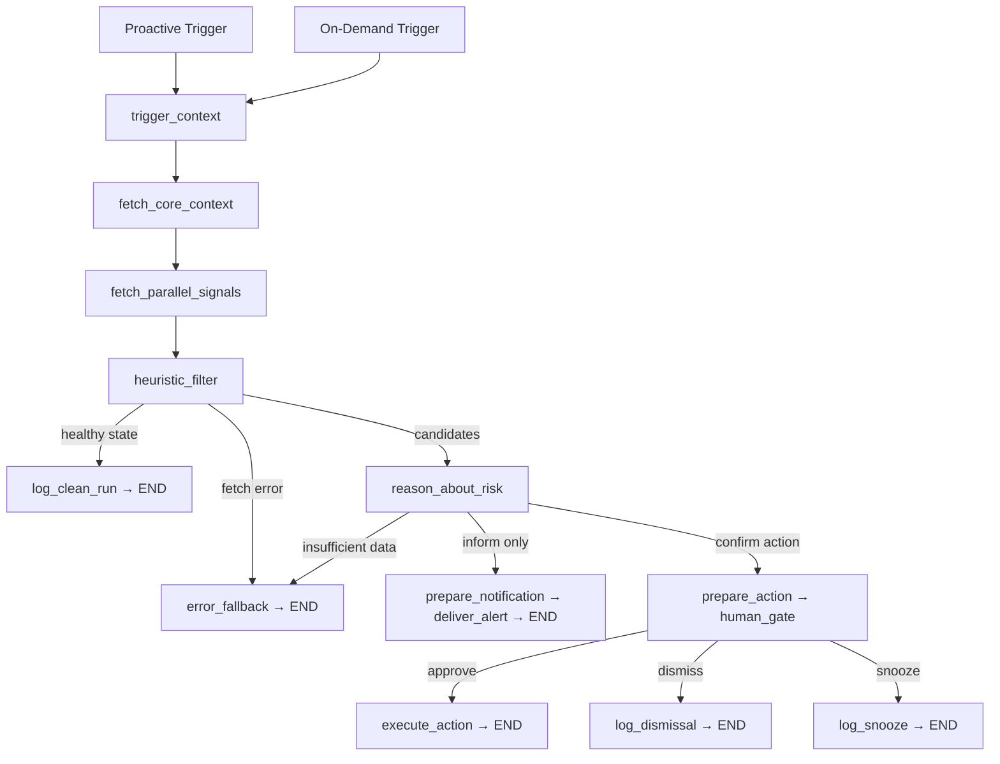

# FleetGraph Pre-Research: Decision Memo

## Executive Summary

**Recommendation:** proceed with FleetGraph as a **page-aware execution-drift agent** for Ship, with a focused analyst role inside the product.

It watches for drift humans miss, explains why it matters with cited evidence, suggests the next action, and pauses before any consequential write. This memo locks the decisions needed to write `FLEETGRAPH.md`.

## Decision Snapshot

| # | Decision | Rationale |
|---|----------|-----------|
| 1 | LangGraph JS runtime | TypeScript repo; assignment requirement |
| 2 | LangSmith tracing from day one | Assignment requirement; shareable trace links for grading |
| 3 | Single graph for proactive + on-demand | Assignment requirement; modes share state shape, differ at entry |
| 4 | 4-minute hybrid trigger (events + sweep) | Meets <5 min latency with margin for fetch + reasoning |
| 5 | Ship REST API only | Assignment constraint; REST API serves as the system interface |
| 6 | Page-aware embedded chat | Assignment requirement; first answer knows current entity |
| 7 | Reuse `accountability:updated` for MVP alerts | Lowest-friction realtime path already in Ship |
| 8 | Deterministic filter before OpenAI reasoning | Primary cost control; expensive calls only on candidates |
| 9 | Workspace-scoped FleetGraph API token | Honest auth via existing `POST /api/api-tokens` |
| 10 | Stretch creativity deferred to `FLEETGRAPH.md` | Keep presearch feasible and defendable |

## Delivery Requirements At A Glance

| Stage | Assignment asks | What this memo must lock |
|---|---|---|
| Pre-Search | Agent responsibility + architecture decisions before coding | Responsibility boundary, use cases, trigger model, graph shape, HITL, deployment stance |
| MVP | Running graph, tracing, 5+ use cases, branching graph outline, 1+ HITL gate, real Ship data, deployed app, defended trigger model | Smallest end-to-end slice that proves proactive + on-demand on one shared graph |
| Early / Polish | Test cases, architecture decisions, stronger documentation, cleaner delivery | Which MVP decisions scale cleanly, where polish adds clarity instead of rework |
| Final | All deliverables, including cost analysis and full submission quality | What remains for cost model, broader trace set, and final presentation quality |

## MVP Coverage

| Requirement | MVP bar | Presearch decision |
|---|---|---|
| Two modes on one graph | 1 proactive + 1 on-demand path on shared graph | Single LangGraph with different entry triggers |
| Context-aware embedded chat | Embedded issue/sprint/project chat | Page context is a required input |
| Proactive detection under 5 min | Event triggers + 4-minute sweep | Hybrid trigger model |
| LangSmith tracing from day one | 2+ shared traces with different paths | Trace every run, tag by mode/entity/branch |
| Graph architecture with branching | Context, fetch, reasoning, action, HITL, fallback branches | Graph over chain |
| 5+ use cases | Ship 6 defendable use cases | Keep six core use cases |
| Human-in-the-loop | 1+ approval gate on consequential action | Inform freely; gate writes always |
| Real Ship data | Live Ship API path end to end | Stay inside current Ship API surface |
| Deployment | Public app with running graph | In-repo backend worker loop for MVP |
| Trigger/cost defense | Threshold choices + token budget | Deterministic filter before model reasoning |

## Polish / Final Coverage

| Requirement area | Full / polish bar | Presearch direction |
|---|---|---|
| Trace set | Clean, alert, HITL, fallback coverage | Demo set already defined |
| UX quality | Better prompts, clearer recommendations, tighter approvals | Page-aware embedded UX |
| Reliability | Stronger dedupe, restart safety, richer recovery paths | Persist fingerprints and alert state |
| Documentation | Test matrix, architecture decisions, cost analysis | Keep appendix material citation-ready |
| Scale model | Runs/day and monthly cost projections | Add cost model in `FLEETGRAPH.md` |

## Why This Agent Shape

External product patterns point to five design rules worth carrying into FleetGraph:

| Principle | Industry evidence | FleetGraph implication |
|-----------|------------------|----------------------|
| Role-bound over generic | Asana frames agents as role-shaped teammates | Focused drift analyst with a clear Ship-native job |
| Current-view context first | Notion starts from current page; Copilot runs inside plan surface | On-demand loads entity context before first response |
| Hybrid triggering | Notion supports schedules + events; Jira documents both | Event-triggered + 4-min sweep for absence detection |
| Low autonomy ceiling on writes | ClickUp drafts to Docs; Notion emphasizes undo/reviewability | Detect, summarize, route autonomously; gate all writes |
| Inherit host permissions | Rovo enforces user/project perms; Asana inherits enterprise controls | Use Ship ownership/membership fields as the access model |

## MVP Scope

### Six use cases (minimum five required)

| # | Role | Trigger | Agent produces | Human decides |
|---|------|---------|---------------|---------------|
| 1 | Engineer | Opens issue page | Why this issue is drifting/blocked, citing history + children | Unblock, escalate, split, or wait |
| 2 | PM | Sprint standup coverage is overdue | Missing standup coverage + at-risk work | Remind, snooze, intervene |
| 3 | PM | Sprint issues differ from plan snapshot | Scope drift delta from original plan | Accept change or rebalance |
| 4 | Director | Multiple signals cluster on one project | Concise risk brief with top risks + next action | Escalate, reassign, hold |
| 5 | Manager | Approval has stalled | Aging `plan_approval` / `review_approval` with routing | Approve, request changes, delegate |
| 6 | Any | Opens FleetGraph from current page | "What matters here right now?" with page-aware context | Act on recommendation or follow up |

## How It Works

### Trigger model

| Trigger | Purpose | Latency |
|---------|---------|---------|
| Event-triggered | React to issue/sprint/approval writes | Seconds |
| 4-minute sweep | Catch absence-of-event + aging conditions | <5 min end-to-end |
| On-demand | User opens chat from current page | Interactive |
| Page-view | Auto-analyze on entity navigation (stale >15 min) | Background (fire-and-forget) |
| GitHub webhook | Push/PR events map to Ship issues via refs | Near-realtime (seconds) |

### Signal thresholds (conservative defaults, configurable per workspace)

| Signal | Threshold | Rationale |
|--------|-----------|-----------|
| Missing standup | Same workday after expected window | Time to post before flagging |
| Stale in-progress issue | 3 business days between meaningful progress signals | Reduces noise inside a sprint |
| Approval bottleneck | 2 business days pending/changes_requested | Approvals block downstream work |
| Scope drift | Immediate after plan snapshot | Planning event with immediate review value |
| Carryover pattern (stretch) | 3+ consecutive sprints | Points to decomposition failure |

### State model

| State bucket | What it holds | Why it matters |
|---|---|---|
| Per-run state | mode, actor, entity, fetched context, candidates, assessment, branch | Keeps proactive and on-demand runs on one shared state shape |
| Persisted alert state | fingerprint, last surfaced time, snooze state, last outcome | Supports dedupe, snooze, and restart-safe behavior |
| Cache state | entity digests and short-lived fetch reuse | Reduces repeated API work and token spend |

### Cost control

| Run type | Context shape | Cost control |
|---|---|---|
| Proactive sweep | Small filtered candidate context | Deterministic checks before model reasoning |
| On-demand first response | Current page context first | Keep entity context primary, avoid global dumps |
| Follow-up turns | Rolling conversation window | Summarize stale turns and trim token baggage |

### Graph architecture

**Why a graph:** Entity type changes the fetch plan. Fetches need parallel fan-out. Human approval requires interruptible pause. Clean, alert, approval, and error runs remain visibly distinct in traces.

### Required demo trace set

1. Clean proactive sweep (healthy state)
2. Proactive sweep that surfaces an alert + routes notification
3. On-demand page query reaching a human approval gate
4. Error/partial-data run taking the fallback branch

### Notification routing

| Signal level | First target | Escalation target | Escalation trigger |
|-------------|-------------|-------------------|-------------------|
| Issue | Current assignee | Accountable project owner | Repeated signal across sweeps |
| Sprint | Sprint owner | Manager via `reports_to` | Follow-through remains pending after 1 business day |
| Project | Project owner | Program/project lead | Multi-signal cluster |

MVP delivery: reuse `accountability:updated` realtime event with FleetGraph-specific payload.

### Deployment

In-repo, same backend process. Proactive mode runs as a worker loop with 4-minute scheduler + event-triggered entrypoints. Auth via workspace-scoped `FLEETGRAPH_API_TOKEN`. Restart-safe because alert state is persisted. MVP feasibility stays inside current Ship APIs; the appendix lists the exact surfaces.

## Guardrails and HITL

### Autonomy boundary

| Allowed autonomously | Always requires confirmation |
|--------------------------|----------------------------|
| Generate risk assessment | Issue state changes |
| Save insight record | Approval state changes |
| Send in-app alert | Reassignment |
| Prepare draft recommendation | Scope changes |
| Refresh insight with new evidence | Edits to content |

### Surfacing policy

A condition is worth surfacing when **all** hold:
- Changes a decision someone needs to make this sprint
- Grounded in Ship data the graph can cite
- Has a clear likely owner
- Fresh, worsening, or newly combined with another signal
- Represents a fresh state or a materially changed tracked state

### Confirmation UX

Embedded card in sidebar showing: evidence first, proposed action second, then `Approve` / `Dismiss` / `Snooze`. Dismissed alerts resurface after a material state change. Snoozed alerts resume after expiry or state change.

### Error handling

| Mode | On API failure |
|------|---------------|
| Proactive | Skip alerting on uncertain data; retry next sweep |
| On-demand | Answer with partial context, clearly labeled incomplete |

All failures traced in LangSmith. Alerts follow confirmed fetch evidence.

## Risks / Open Questions

| Risk | Mitigation | Status |
|------|-----------|--------|
| Alert noise in early runs | Conservative thresholds + under-alert policy | Mitigated by design |
| Token cost on large workspaces | Deterministic filter before reasoning; entity digest cache (4-min TTL) | Mitigated by design |
| Current document history surface is route-specific | Use the specific history endpoints available today | Accepted constraint |
| Cold-start projects have limited history | Degrade gracefully; state that history is still forming | Accepted |
| Chat history bloating context | Rolling window; summarize stale turns; entity context anchors | Mitigated by design |
| Single-workspace MVP auth model | Production path: per-workspace tokens or service identity | Deferred |

## What's Next

Write `FLEETGRAPH.md` using this memo as the decision base.

Cover these sections next: Agent Responsibility, Graph Diagram, Use Cases, Trigger Model, Test Cases, Architecture Decisions, and Cost Analysis.

## Appendix: External Pattern Scan

| Tool | Source | Key takeaway |
|------|--------|-------------|
| Asana AI Teammates | [product page](https://asana.com/product/ai/ai-teammates), [help](https://help.asana.com/s/article/ai-teammates) | Role-shaped teammates with bounded access, checkpoints, team-visible work; understand work through the Work Graph |
| Notion Agent + Custom Agents | [agent](https://www.notion.com/help/notion-agent), [custom](https://www.notion.com/help/custom-agent) | On-demand starts from current page; custom agents run background on triggers/schedules with explicit logging |
| ClickUp Project Updater | [help](https://help.clickup.com/hc/en-us/articles/37999413186711-Project-Updater) | Consolidates progress/risks/decisions, asks where to write the update |
| Microsoft Copilot in Planner | [agent](https://support.microsoft.com/en-us/office/access-project-manager-agent-86bf60a1-239d-4c37-b7b6-9a4111e1cc02), [FAQ](https://support.microsoft.com/en-us/office/frequently-asked-questions-about-copilot-in-planner-40710220-75f3-4a61-897c-54a1052155c4) | Project-native agent inside workflow tool; plan-specific reasoning |
| Atlassian Jira + Rovo | [triggers](https://support.atlassian.com/cloud-automation/docs/jira-automation-triggers/), [scheduled](https://support.atlassian.com/automation/kb/trigger-an-automation-rule-based-on-a-due-date-field/), [Rovo](https://www.atlassian.com/software/rovo/connectors/jira) | Both event and scheduled triggers; Rovo enforces user/project permissions at query time |

### Existing Ship API surface

| Surface | Route | FleetGraph use |
|---------|-------|---------------|
| Sprint context | `GET /api/claude/context?context_type={standup,review,retro}` | Sprint-scoped on-demand + proactive checks |
| Issues | `GET /api/issues`, `GET /api/issues/:id` | Core issue fetches |
| Issue history | `GET /api/issues/:id/history` | Stale/blocker reasoning evidence |
| Issue children | `GET /api/issues/:id/children` | Dependency context |
| Document associations | `GET /api/documents/:id/associations` | Relationship graph |
| Workspace members | `GET /api/workspaces/:id/members` | Notification routing + role context |
| Sprints | `GET /api/weeks` | Active sprint enumeration |
| Activity | `GET /api/activity/{entityType}/{entityId}` | Project/sprint activity |
| Accountability | `GET /api/accountability/action-items` | Seed deterministic checks |
| Realtime events | `broadcastToUser(..., 'accountability:updated', ...)` | MVP alert delivery |
| Embedded UI pattern | `web/src/components/sidebars/QualityAssistant.tsx` | FleetGraph panel reference |

---

*Sources: `requirements.md`, `FleetGraph_PRD.pdf`, external product scan (2026-03-16)*
