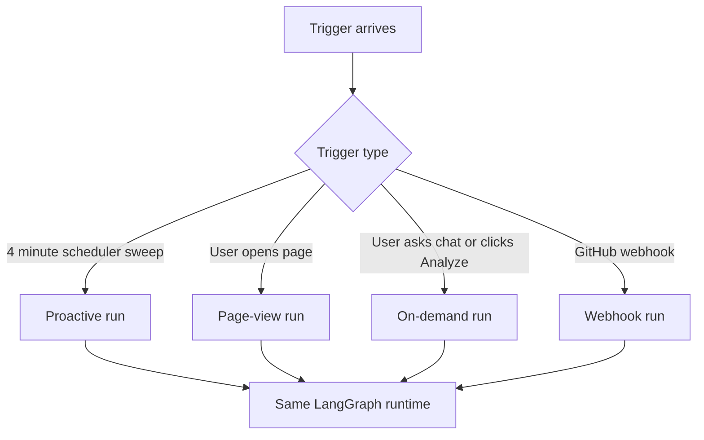
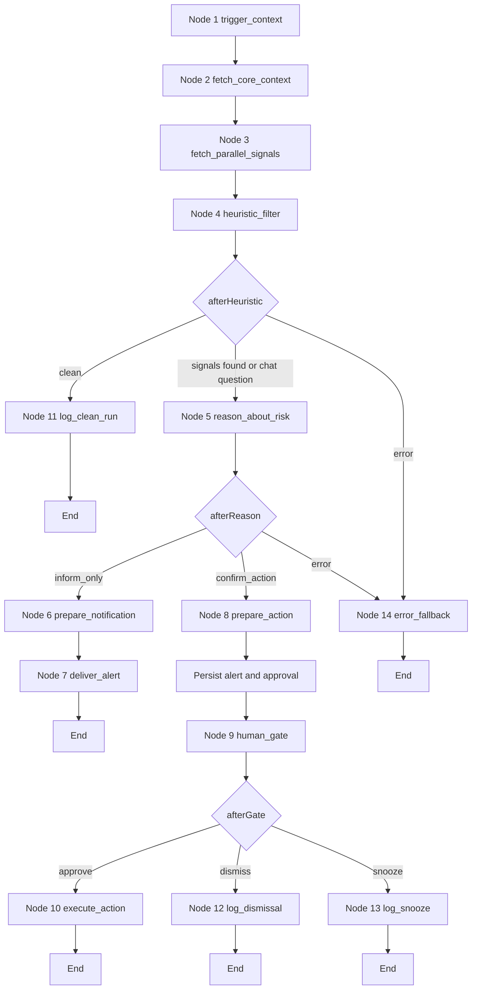
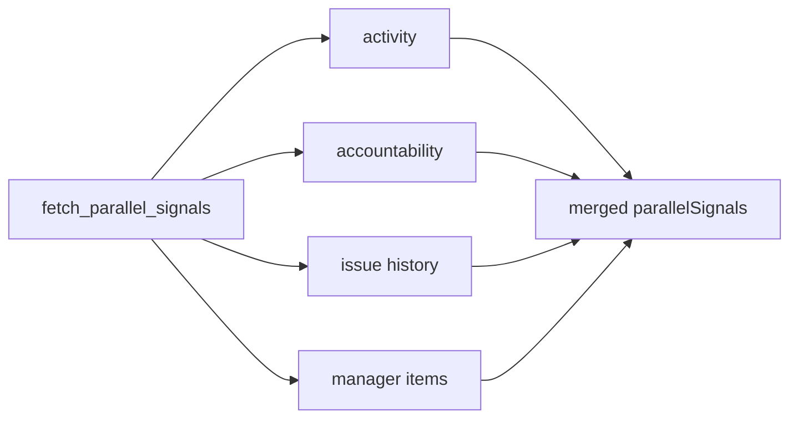
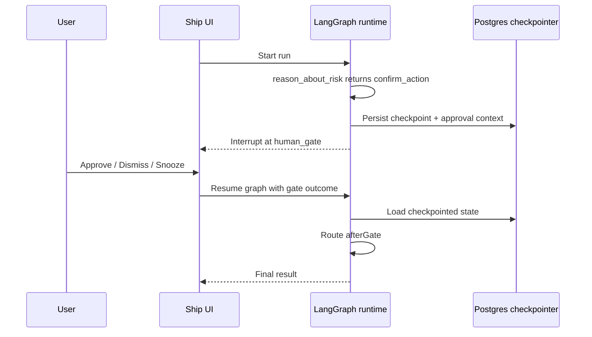

# FleetGraph LangGraph Runtime Architecture

## Audience

CTO and technical leads who want to understand how FleetGraph uses LangGraph in Ship today.

## Executive Summary

FleetGraph uses LangGraph as an orchestration and state-management layer for project health analysis inside Ship.

It is not a free-form autonomous agent. The graph is structured around:

- deterministic context and signal gathering
- a single reasoning step after evidence is assembled
- conditional branching into notification or human-approved action paths
- persisted pause and resume for human-in-the-loop approvals

The result is a system that is easier to reason about than an agent loop, while still giving us graph-native branching, state propagation, tracing, and resumability.

## Why We Use A Graph

We use LangGraph because FleetGraph has real branch points:

- sometimes there is no issue, and the run should terminate cleanly
- sometimes there is an informational finding, and we should alert only
- sometimes we want to propose an action, but require approval before execution
- sometimes data fetches fail, and we need a safe fallback path

Those are graph concerns, not simple request-handler concerns.

## When The Graph Runs

FleetGraph supports four trigger types in the current codebase:

- proactive scheduler sweep
- page-view trigger when a user navigates to an entity
- on-demand run from the UI
- GitHub webhook trigger

The same graph handles all of them. Only the trigger source changes.

## Runtime Flow

This is the current LangGraph execution flow in FleetGraph.

## Node Purposes

| Node | Why it exists | When it runs |
| --- | --- | --- |
| `trigger_context` | Normalizes run metadata and scope | Every run |
| `fetch_core_context` | Loads the entity the run is about | Every run |
| `fetch_parallel_signals` | Gathers health signals from Ship-side data sources | Every run after context |
| `heuristic_filter` | Converts raw data into candidate signals such as stale issue or approval bottleneck | Every run after fetch |
| `reason_about_risk` | Produces the assessment once evidence exists | Any run with candidate signals or chat question |
| `prepare_notification` | Prepares an informational path | When assessment says `inform_only` |
| `deliver_alert` | Persists and broadcasts the alert | Informational path |
| `prepare_action` | Creates persisted alert and approval metadata before pause | When assessment says `confirm_action` |
| `human_gate` | Pauses graph execution for approval | Consequential action path |
| `execute_action` | Applies an approved Ship action | After explicit approval |
| `log_clean_run` | Records a clean pass with no issue | No signal path |
| `log_dismissal` | Records a declined action | Dismiss path |
| `log_snooze` | Records delayed follow-up | Snooze path |
| `error_fallback` | Fails closed and preserves observability | Any error branch |

## Where Parallelism Actually Happens

FleetGraph is a graph with conditional branching, but it is not yet a wide fan-out and fan-in graph at the topology level.

Current parallelism happens inside the `fetch_parallel_signals` node. That node uses parallel calls to gather:

- activity
- accountability
- issue history
- manager action items

This design keeps graph topology simple while still reducing latency where it matters most: data collection.

Implication for leadership: we are using LangGraph for orchestration and branch control first, and selective internal parallelism second.

## State Management Model

FleetGraph uses a typed shared run state carried through the graph. Each node returns partial state updates, and LangGraph merges them.

The important state groups are:

- run identity: `runId`, `traceId`, `mode`, `workspaceId`, `actorUserId`
- scope: `entityType`, `entityId`, `pageContext`
- fetched data: `coreContext`, `parallelSignals`
- decision state: `candidates`, `branch`, `assessment`
- human gate state: `gateOutcome`, `snoozeUntil`
- telemetry: `runStartedAt`, `tokenUsage`, `traceUrl`
- chat context: `chatQuestion`, `chatHistory`
- failure state: `error`

This matters because each stage can remain simple. Nodes do not need to reconstruct context from scratch.

## Human-In-The-Loop And Checkpointing

Consequential actions do not execute inline.

The action path does this:

1. Persist alert and approval metadata
2. Pause the graph at `human_gate`
3. Wait for user input
4. Resume from the checkpoint with `approve`, `dismiss`, or `snooze`

This is the strongest reason to use LangGraph here. It gives us a first-class pause and resume model instead of ad hoc workflow code.

## Why This Design Works For Ship

This design fits Ship because the product already has:

- scoped entities such as issues, weeks, and projects
- structured accountability data
- clear ownership and approval concepts
- actions that are meaningful but sometimes consequential

FleetGraph sits on top of those workflows instead of inventing a separate agent universe.

## Current Design Tradeoffs

### Strengths

- deterministic before generative
- clear visible branch differences for tracing and grading
- stateful pause and resume for approvals
- simple graph topology with low cognitive overhead
- reusable graph across proactive and on-demand modes

### Limitations

- graph-level parallel branching is limited today
- candidate prioritization is still mostly heuristic rather than policy-driven orchestration
- the graph is centered on one entity per run, not multi-entity planning across a large workspace
- some proactive capability still depends on available API context and service-token reads

## Bottom Line

FleetGraph uses LangGraph as a disciplined runtime for:

- collecting context
- gathering evidence in parallel where useful
- branching on real conditions
- pausing safely for human approval
- resuming from durable state

That makes it a good fit for Ship's operational workflows and a better fit than either:

- a linear controller pipeline with custom branching glue
- or an unconstrained autonomous agent loop
