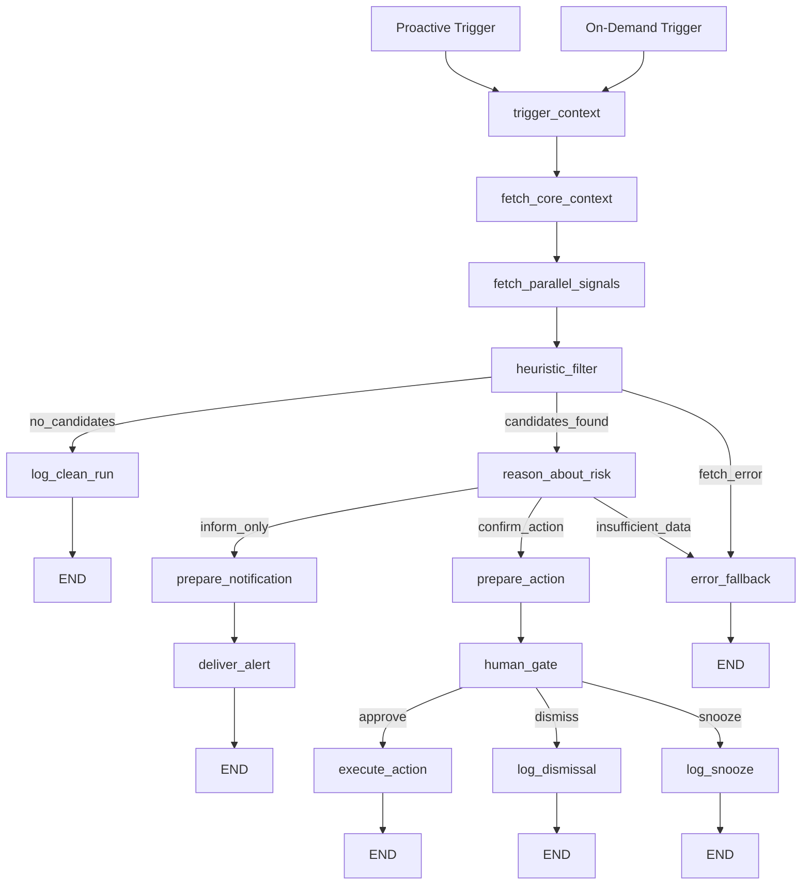

# FleetGraph PRESEARCH
## Provenance

- Requirements-backed: assignment constraints and grader-facing deliverables from `requirements.md`. Where `FleetGraph_PRD.pdf` diverges, `requirements.md` wins.
- Codebase-backed: current Ship routes, files, UI patterns, and infra only when this doc cites specific Ship paths or endpoints.
- External-doc-backed: vendor pricing and API behavior only.
- Proposed design: FleetGraph architecture, node layouts, schemas, code sketches, and rollout plans unless explicitly marked as current Ship behavior.
- Assumption: latency budgets, scale math, token budgets, and operational estimates that are not directly measured in this repo.
- Reading rule: unlabeled code blocks are proposed FleetGraph implementation sketches, not current Ship code.


## Requirement Locks

These are non-negotiable because they come straight from the assignment in `requirements.md`.

- Use **LangGraph** for the graph runtime
- Use **LangSmith tracing from day one**
- Every run must be traceable
- Shared **public/shareable LangSmith trace links** are required for submission and team review
- Proactive and on-demand modes must use the **same graph**
- The chat UI must be **embedded in the current Ship page**
- The chat must be **aware of the page and entity the user is looking at**
- Ship **REST APIs** are the data source
- AI must go through the **OpenAI API via the OpenAI SDK**
- Consequential actions require a **human-in-the-loop gate**

## Sources

- Repo grading artifact: `requirements.md`
- Supplemental source: `FleetGraph_PRD.pdf`
- Cross-document reconciliation: [`CANONICAL_RECONCILIATION.md`](./CANONICAL_RECONCILIATION.md)
- Official product pattern scan completed on **2026-03-16** across Asana, Notion, ClickUp, Microsoft Planner, and Atlassian Jira/Rovo docs

This presearch is written to match `requirements.md` first. The PDF fills in wording and context where the repo handout is abbreviated. Any grader-visible SDK or deliverable assumption should be re-checked against `requirements.md` before code starts.

## Reconciliation Locks

- Canonical proactive MVP: stale issues, scope drift, approval bottlenecks, ownership gaps, and multi-signal drift
- Workspace-wide standup coverage and inferred accountability remain stretch until Ship exposes admin-capable service-token reads
- Hybrid trigger is event-triggered candidates plus a 4-minute sweep
- Proactive and on-demand modes continue to use the same graph
- HITL lifecycle is `pending`, `approved`, `dismissed`, `snoozed`, `executed`, `execution_failed`, `expired` with 72-hour expiry
- Resumable checkpoint state lives in the `fleetgraph` schema and uses stable thread IDs

## External Product Pattern Scan

Selected comparison set:

- **Asana AI Teammates**
- **Notion Agent + Custom Agents**
- **ClickUp Project Updater**
- **Microsoft Copilot in Planner / Project Manager agent**
- **Atlassian Jira Automation + Rovo**

Why this set:

- all are current, official product/help sources
- all live inside work-management or team-knowledge products close to Ship
- together they cover the two FleetGraph modes: contextual chat and background automation

High-signal product patterns:

| Pattern | What others do | Why it matters for FleetGraph |
|---|---|---|
| Narrow role over generic chatbot | Asana frames agents as role-shaped teammates such as analysts, specialists, and investigators rather than one broad assistant | FleetGraph should be a focused execution-drift agent, not a general Ship chatbot |
| Current-view context first | Notion Agent starts from the current page or selected blocks; Copilot in Planner runs inside the current plan surface | On-demand FleetGraph should begin with issue, sprint, or project context already loaded |
| Background mode uses triggers + schedules | Notion Custom Agents support both schedules and event triggers; Jira automation documents both event and scheduled triggers | Hybrid triggering is the most defensible choice for under-5-minute detection |
| Low autonomy ceiling on system-of-record writes | ClickUp Project Updater drafts updates into Docs; Notion emphasizes undo/reviewability; Asana emphasizes checkpoints and control | FleetGraph should autonomously detect, summarize, and route, then stop at human gates for consequential writes |
| Native permissions and scoped access | Asana AI Teammates inherit enterprise controls; Rovo enforces user and project permissions at query time; Notion Custom Agents act only on granted pages and apps | FleetGraph should rely on Ship ownership and membership fields, not invent a second access model |
| Alerting should stay narrow and accountable | Jira automation examples route to the assignee or project context; Notion logs runs and watched surfaces explicitly | FleetGraph should notify the directly responsible owner first, then escalate only after persistence or severity |

What changed in this presearch because of the scan:

- responsibility boundary is tighter: execution drift and next-best action
- trigger decision is stronger: event-triggered plus sub-5-minute sweep
- autonomy policy is firmer: inform, draft, and route without mutating Ship by default
- context rule is clearer: current page first, nearby graph second, wider project only when needed
- permission model is simpler: inherit Ship's native ownership, accountability, and membership surfaces

Top 5 lessons to carry into `FLEETGRAPH.md`:

1. Strong agents are role-bound, not general.
2. On-demand assistants win by starting from the current page, not from an empty prompt box.
3. Background agents need both event triggers and scheduled sweeps because many failures are about missing action.
4. Trust comes from visible evidence, narrow notifications, logs, undoability, and approval gates.
5. Access should inherit the host product's existing graph of people, projects, and permissions.

## Repo-Safe Starting Point

Before deciding what FleetGraph should do, anchor on what Ship already exposes today.

| Existing surface | Current route or file | FleetGraph use |
|---|---|---|
| Context API for sprint workflows | `GET /api/claude/context?context_type={standup,review,retro}` | Reuse for sprint-scoped on-demand context and proactive sprint checks |
| Issue list and issue detail | `GET /api/issues`, `GET /api/issues/:id` | Core issue fetches |
| Issue history | `GET /api/issues/:id/history` | Evidence for stale/blocker reasoning |
| Issue children | `GET /api/issues/:id/children` | Dependency and sub-issue context |
| Document associations | `GET /api/documents/:id/associations` | Project, sprint, parent, program relationships |
| Workspace members | `GET /api/workspaces/:id/members` | Notification routing and role context |
| Current sprint listing | `GET /api/weeks` | Enumerate active/current sprints for proactive mode |
| Activity aggregation | `GET /api/activity/{entityType}/{entityId}` | Project and sprint activity without inventing a generic history API |
| Accountability signals | `GET /api/accountability/action-items` | Seed deterministic checks |
| Realtime events | `broadcastToUser(..., 'accountability:updated', ...)` | MVP alert delivery path |
| Embedded assistant pattern | `web/src/components/sidebars/QualityAssistant.tsx` | Advisory sidebar interaction pattern only; useful as UI precedent, not a drop-in FleetGraph chat implementation |

Important boundary:

- Ship does **not** currently expose a generic `GET /api/documents/:id/history` route
- MVP FleetGraph should not depend on that route existing
- Where entity history is needed, use the **specific** history endpoints that exist today

## Working Thesis

FleetGraph should be a **project execution drift agent** for Ship.

That means:

- Watch for execution drift humans miss
- Explain why the drift matters with concrete Ship evidence
- Suggest the next best action
- Push low-risk alerts proactively
- Pause before any consequential write

Why this is the right lane:

- It fits the assignment's proactive + on-demand split
- It benefits from graph reasoning across issues, sprints, approvals, and accountability
- It feels native to Ship
- It is stronger than a generic chatbot

## Phase 1: Define Your Agent

### 1. Agent Responsibility Scoping

#### What events in Ship should the agent monitor proactively?

FleetGraph MVP should monitor these conditions because they are both valuable and supportable from the current API surface.

1. **Missing standups in the current sprint**
   - Enumerate current sprints with `GET /api/weeks`
   - Pull sprint context with `GET /api/claude/context?context_type=standup&sprint_id=X`
   - Surface when a current sprint has no fresh standup evidence for the workday

2. **Stale in-progress issues**
   - Fetch issues with `GET /api/issues?sprint_id=X&state=in_progress`
   - Inspect candidates with `GET /api/issues/:id/history`
   - Surface when an issue is active but shows no recent meaningful change

3. **Sprint scope drift after planning snapshot**
   - Read sprint fields including `planned_issue_ids` and `snapshot_taken_at` from sprint payloads returned by `GET /api/weeks`
   - Compare against current sprint issues from `GET /api/issues?sprint_id=X`
   - Surface when work has entered the sprint after the saved plan

4. **Approval bottlenecks**
   - Read `plan_approval` and `review_approval` from sprint payloads
   - Surface when approvals stay in `pending` or `changes_requested` beyond the agreed threshold

5. **RACI and ownership gaps**
   - Read project and sprint responsibility fields already present in document payloads
   - Cross-check current workspace members from `GET /api/workspaces/:id/members`
   - Surface when accountability is missing, duplicated, or obviously weak

6. **Risk clusters**
   - Aggregate multiple weak signals on the same project or sprint
   - Surface only when the combined picture changes a real decision

Why these:

- They match the assignment prompt directly
- They work in both proactive and on-demand modes
- They use current Ship APIs
- They produce concrete next actions

#### What constitutes a condition worth surfacing?

A condition is worth surfacing when all of these are true:

- It changes a decision someone needs to make this sprint
- It is grounded in Ship data the graph can cite
- It has a clear likely owner or accountable person
- It is fresh, worsening, or newly combined with another signal
- It has not already been dismissed or snoozed for the same underlying state

Noise policy:

- Do not alert on stable known risk
- Do not alert on weak evidence with no likely action
- Do not alert twice for the same fingerprint unless the entity state changed

#### What is the agent allowed to do without human approval?

Allowed without approval:

- Generate a risk assessment
- Save an insight record
- Send an in-app alert
- Prepare a draft recommendation
- Refresh a previously surfaced insight with new evidence

Not allowed without approval:

- Any `PATCH` that changes issue, sprint, project, or approval state
- Any reassignment of `assignee_id`, `owner_id`, or `accountable_id`
- Any scope mutation
- Any edit to user-authored content
- Any action that impersonates a user

#### What must always require confirmation?

Always gated:

- Issue state changes
- Approval state changes
- Reassignment
- Scope changes
- Edits to project, sprint, plan, retro, or issue content

The gate must surface:

- What FleetGraph detected
- What evidence it used
- What action it wants to take
- What happens if the user approves

#### How does the agent know who is on a project?

Use existing surfaces only.

| Need | Route | Notes |
|---|---|---|
| Workspace members | `GET /api/workspaces/:id/members` | Source of active users and roles |
| Issue assignee | `GET /api/issues/:id` | Individual issue ownership |
| Sprint owner and approval fields | `GET /api/weeks` or sprint document payload | Sprint-level ownership and approval context |
| Project responsibility fields | project document payload | `owner_id`, `accountable_id`, consulted, informed |
| Org-chart relationship | person document fields already used by sprint flows | `reports_to` for escalation |
| Accountability inference | `GET /api/accountability/action-items` | Existing synthetic ownership hints |

Rule:

- Prefer explicit ownership fields first
- Use accountability items second
- Use org-chart escalation only after a signal persists

#### How does the agent know who to notify?

Notification routing policy:

| Signal level | First target | Escalation target | Escalation trigger |
|---|---|---|---|
| Issue | current assignee | accountable project owner | repeated signal across multiple sweeps |
| Sprint | sprint owner | their manager via `reports_to` | no action after one business day |
| Project | project owner | accountable program or project lead | multi-signal cluster |

MVP delivery path:

- Reuse realtime event plumbing with `accountability:updated`
- Include FleetGraph-specific payload data in the event body
- If needed later, split to a dedicated `fleetgraph:insight` event after frontend event typing is extended

Why this choice:

- Minimal new surface for MVP
- Matches current Ship realtime behavior
- Still supports badge, toast, and panel refresh

#### How does the on-demand mode use context from the current view?

This is a hard requirement. FleetGraph chat is not a standalone assistant.

The UI must pass the current page context into the graph:

```ts
{
  entityType: 'issue' | 'sprint' | 'project',
  entityId: string,
  workspaceId: string,
  actorUserId: string
}
```

Context by page:

| Page | Data FleetGraph loads first | Current route support |
|---|---|---|
| Issue | issue details, issue history, children, associations | `GET /api/issues/:id`, `GET /api/issues/:id/history`, `GET /api/issues/:id/children`, `GET /api/documents/:id/associations` |
| Sprint | review context, sprint issues, sprint activity, approval fields | `GET /api/claude/context?context_type=review&sprint_id=X`, `GET /api/issues?sprint_id=X`, `GET /api/activity/sprint/X`, sprint payload from `GET /api/weeks` |
| Project | project document, project activity, accountability items, current sprint/project relationships | project payload, `GET /api/activity/project/X`, `GET /api/accountability/action-items`, associations |

Design rule:

- The first answer in chat should already understand the page the user is on
- The user should not need to restate the entity they are looking at
- The graph should branch differently for issue, sprint, and project pages

### 2. Use Case Discovery

Required minimum is five. MVP should commit to six.

| # | Role | Trigger | Agent detects or produces | Human decides |
|---|---|---|---|---|
| 1 | Engineer | Opens an issue page | Explains why the current issue is drifting or blocked, using issue history and child issue context | unblock, escalate, split, or wait |
| 2 | PM | Current sprint has no fresh standup activity | Flags missing standup coverage and identifies the sprint work at risk | remind, snooze, or intervene |
| 3 | PM | Sprint issue set differs from plan snapshot | Explains scope drift and highlights the delta from the original plan | accept scope change or rebalance sprint |
| 4 | Director | Multiple signals cluster on one project | Produces a concise project risk brief with top risks and next recommended action | escalate, reassign attention, or hold |
| 5 | Manager | Approval has stalled | Identifies aging `plan_approval` or `review_approval` and routes to the right approver | approve, request changes, or delegate |
| 6 | Any role | User opens FleetGraph from the current page | Answers "what matters here right now?" using page-aware context | act on a recommendation or ask follow-up |

Why these six:

- They cover Director, PM, and Engineer
- They prove proactive push and on-demand pull
- They can all be traced with visibly different graph paths
- They stay inside the current Ship API surface

Stretch use cases for `FLEETGRAPH.md`, not MVP contract:

- Shadow work detection across sprint edits
- Carryover pattern detection across multiple sprints
- Deeper accountability drift scoring
- Auto-generated standup drafts from recent activity
- Comparative sprint health against team baseline

Those are good creative directions, but they should be presented as follow-on differentiators unless their API evidence path is nailed down.

Use-case additions worth carrying forward:

| Candidate | Keep now? | Why |
|---|---|---|
| Sprint carryover pattern detection | Yes, as stretch | Strong planning signal and queryable from existing sprint and issue relationships |
| Auto-generated standup drafts | Yes, as stretch | Reduces user friction instead of only surfacing missing behavior |
| Retro theme mining | Later | Valuable, but needs stronger recurrence and content-quality controls |
| Document staleness and reference decay | Later | Useful, but needs more confidence in document freshness semantics |
| Shadow work detection | Yes, as stretch | Strong planning-accuracy signal and close to current scope |

### 3. Trigger Model Decision

#### Chosen model

Hybrid: **event-triggered + 4-minute sweep**

| Trigger | Purpose | Why |
|---|---|---|
| Event-triggered | React fast to issue, sprint, and approval writes | Best latency for changes that already emit events |
| 4-minute sweep | Catch absence-of-event and aging conditions | Gives real margin under the `< 5 minute` requirement |
| Page-view | Auto-analyze on entity navigation (stale >15 min) | Proactive without user action; reuses queue + graph |
| GitHub webhook | Push/PR events map to Ship issues via refs | Near-realtime code-to-issue correlation |

Why not 5 minutes:

- The assignment measures time until the agent surfaces the issue
- A 5-minute poll plus processing time is risky
- A 4-minute sweep leaves margin for fetch, reasoning, and delivery

Event sources:

- Existing write paths that already broadcast `accountability:updated`
- Approval changes
- Issue updates
- Sprint submissions or edits

Sweep checks:

- Missing standups
- Aging approvals
- Stale in-progress issues
- Risk clustering

Initial threshold defaults for MVP:

| Signal | Initial threshold | Why |
|---|---|---|
| Missing standup | same workday after expected standup window | catches coordination gaps while still giving the team time to post |
| Stale in-progress issue | no meaningful progress signal for 3 business days | conservative enough to reduce noise, still useful inside a sprint |
| Approval bottleneck | pending or changes requested for 2 business days | approvals block downstream work and need faster escalation |
| Scope drift | immediate once work enters after planning snapshot | this is a planning event, not a slow-burn signal |
| Carryover pattern | issue appears in 3 or more consecutive sprints | points to planning or decomposition failure, not one bad sprint |

Threshold policy:

- keep thresholds configurable per workspace
- ship conservative defaults for MVP
- prefer under-alerting to noisy automation until real traces justify tuning

Scale assumption:

- Deterministic checks first
- OpenAI reasoning only runs on candidates
- The expensive part is reasoning, not polling

## Phase 2: Graph Architecture

### 4. Node Design



Node responsibilities:

| Node | Type | Purpose |
|---|---|---|
| `trigger_context` | Context | mode, actor, entity, workspace, trace metadata |
| `fetch_core_context` | Fetch | page-aware base context |
| `fetch_parallel_signals` | Fetch | issues, approvals, activity, associations, accountability in parallel |
| `heuristic_filter` | Deterministic | prune obvious non-events before OpenAI reasoning |
| `reason_about_risk` | Reasoning | analyze relationships, urgency, and next action |
| `prepare_notification` | Action | format the alert payload |
| `prepare_action` | Action | draft the proposed write |
| `human_gate` | HITL | require approval, dismiss, or snooze |
| `execute_action` | Action | perform approved write |
| `log_clean_run` | Output | trace the no-risk branch |
| `error_fallback` | Error | trace failure and fail gracefully |

Required visible trace paths:

- Clean run
- Inform-only alert
- Confirm-action branch
- Error/fallback branch

This matters because the assignment explicitly requires traces that prove different graph execution paths.

Why graph over chain:

- entity type changes the fetch plan and reasoning path
- fetch nodes need parallel fan-out
- proactive and on-demand runs share state shape but differ at entry and branching
- human approval requires an interruptible pause before action
- clean, alerting, approval, and error runs must be visibly distinct in traces

A simple chain can summarize. FleetGraph needs branching, pause-and-resume behavior, and explicit conditional routing.

### 5. State Management

Per-run graph state:

```ts
interface FleetGraphState {
  mode: 'proactive' | 'on-demand';
  actorUserId: string | null;
  workspaceId: string;
  entity: { type: 'issue' | 'sprint' | 'project'; id: string } | null;
  coreContext: Record<string, unknown> | null;
  signals: Record<string, unknown>;
  candidates: Array<Record<string, unknown>>;
  assessment: {
    severity: 'none' | 'low' | 'medium' | 'high';
    explanation: string;
    recommendation: string | null;
  } | null;
  branch: 'clean' | 'inform_only' | 'confirm_action' | 'error';
  proposedAction: Record<string, unknown> | null;
  conversationWindow: Array<Record<string, unknown>>;
  traceId: string;
}
```

Persisted state between proactive runs:

- alert fingerprint
- last surfaced time
- snoozed until
- last entity digest
- last outcome

Why persist:

- dedupe alerts
- honor dismiss and snooze
- avoid rediscovering the same unchanged state every 4 minutes

How to avoid redundant API calls:

- request-scope memoization inside one run
- entity digest cache for unchanged sprint/project state
- lazy deep fetches only after deterministic filters flag a candidate

Cold-start behavior:

- if there is not enough historical context, FleetGraph should say so explicitly
- low-history projects should still get ownership-gap checks, approval checks, and current-page summaries
- historical comparisons such as carryover or baseline velocity should degrade to `not enough history yet`

On-demand conversation history policy:

- keep a rolling window of recent user and agent turns instead of full-chat replay
- preserve the current entity context as the anchor even when older turns are trimmed
- summarize stale turns before they become token-heavy baggage
- never let chat history displace current-page evidence as the primary source of truth

### 6. Human-in-the-Loop Design

Consequential actions require confirmation.

Confirmation UX:

- Embedded FleetGraph card in the current page sidebar
- Evidence first
- Proposed action second
- Buttons: `Approve`, `Dismiss`, `Snooze`

If dismissed:

- mark the alert resolved for that fingerprint
- do not resurface unless the underlying state materially changes

If snoozed:

- suppress until snooze expiry
- resume only after expiry or state change

Why this is important:

- It satisfies the assignment
- It keeps FleetGraph trustworthy
- It makes proactive behavior useful instead of creepy

### 7. Error and Failure Handling

If a Ship API call fails:

- trace the failure in LangSmith
- return a bounded fallback path
- avoid sending speculative alerts

Graceful degradation policy:

| Mode | Behavior |
|---|---|
| Proactive | skip alerting on uncertain data, retry on next sweep |
| On-demand | answer with partial context only when clearly labeled incomplete |

Cache rules:

| Data | TTL |
|---|---|
| entity digest | 4 minutes |
| alert metadata | persistent |
| fetched page context | request scope only |
| pre-action validation fetch | always refetch |

## Phase 3: Stack and Deployment

### 8. Deployment Model

MVP deployment choice:

- Keep FleetGraph in the Ship backend repo
- Run proactive mode as a worker loop in the backend process
- Use LangGraph JS in the same TypeScript stack

Why:

- fastest path
- no extra service to deploy
- easy LangSmith instrumentation
- easy reuse of current auth and realtime plumbing

Where proactive mode runs:

- backend worker loop
- 4-minute scheduler
- event-triggered entrypoints on existing write paths

How it is kept alive:

- same backend process as Ship API for MVP
- restart-safe because alert state is persisted

How it authenticates with Ship without a user session:

- MVP assumption: one workspace / one demo environment
- provision one dedicated FleetGraph API token for that workspace through `POST /api/api-tokens`
- store as `FLEETGRAPH_API_TOKEN`
- all graph fetches go through Ship REST APIs with bearer auth

Follow-on production path:

- one FleetGraph token per workspace, or a formal service identity layer

That keeps the presearch honest: the assignment says REST API only, and current tokens are workspace-scoped.

Multi-workspace note:

- MVP assumes one workspace token and one demo environment
- production shape should partition sweeps, alert dedupe, and token management by workspace
- thresholds, quiet hours, and escalation policy should also become workspace-scoped

### 9. Performance

How the trigger model meets the latency goal:

| Path | Target |
|---|---|
| Event-triggered | seconds |
| Sweep-triggered | under 5 minutes end to end |
| On-demand | fast enough to feel interactive on a single page |

Token budget:

| Run type | Input | Output | Strategy |
|---|---|---|---|
| Proactive candidate | small filtered context | short assessment | deterministic filter first |
| On-demand first response | page-aware context only | concise recommendation | no giant global context dump |
| On-demand follow-up | rolling window only | incremental answer | trim stale chat context |

Primary cost cliffs:

1. Sending full rich document bodies when metadata would do
2. Invoking OpenAI reasoning before deterministic filtering
3. Re-reasoning over unchanged entities
4. Letting chat history grow without pruning

## Observability and Submission Readiness

LangSmith plan:

- enable tracing on every run
- use one FleetGraph LangSmith project
- tag runs by `mode`, `entityType`, and `branch`
- keep at least two shareable trace links ready for MVP
- keep additional trace links for later milestones and team review

Submission rule:

- every milestone should include trace links that teammates and graders can open
- the trace set should include different branches, not only happy-path runs

Recommended demo trace set:

1. Clean proactive sweep with no candidate risk
2. Proactive sweep that surfaces an alert and routes a notification
3. On-demand page query that reaches a human approval gate
4. Error or partial-data run that takes the fallback branch

This demo set is more defensible than four variations of the same happy path.

## Architecture Decisions Summary

| # | Decision | Why |
|---|---|---|
| 1 | LangGraph JS | Best fit for TypeScript repo and assignment |
| 2 | LangSmith from day one | Explicit assignment requirement |
| 3 | Same graph for proactive and on-demand | Explicit assignment requirement |
| 4 | 4-minute hybrid trigger model | Meets latency with margin |
| 5 | REST API only | Explicit assignment constraint |
| 6 | Page-aware embedded chat | Explicit assignment requirement |
| 7 | Reuse `accountability:updated` for MVP alerts | Lowest-friction realtime path |
| 8 | Deterministic filter before OpenAI reasoning | Main cost control |
| 9 | Workspace-scoped FleetGraph token for MVP | Honest auth model with current API token support |
| 10 | Stretch creativity belongs in `FLEETGRAPH.md` | Keep presearch feasible and defendable |

## Final Position

The right presearch answer is not "build a chatbot."

The defendable answer is:

- FleetGraph is a page-aware execution drift agent
- It pushes only meaningful, evidence-backed alerts
- It reasons differently on issue, sprint, and project pages
- It uses LangGraph and LangSmith visibly
- It ships with shareable traces
- It respects human approval for consequential actions
- It stays inside the current Ship API surface for MVP

`FLEETGRAPH.md` is where the creative differentiation should happen.

Good creative space:

- the exact responsibility boundary
- what counts as "meaningful" drift
- what recommendations feel smartest on each page
- which stretch use cases make FleetGraph feel unique

## Appendix: Selected Tool Research

This appendix keeps the external scan lightweight and citation-ready for `FLEETGRAPH.md`.

| Tool | Official source | High-signal takeaway | FleetGraph implication |
|---|---|---|---|
| Asana AI Teammates | https://asana.com/product/ai/ai-teammates | Agents are defined as teammates with a specific role, bounded access, checkpoints, and team-visible work | Define FleetGraph as one specific teammate: execution-drift analyst for Ship |
| Asana AI Teammates Help | https://help.asana.com/s/article/ai-teammates | Teammates understand work through the Work Graph and follow existing access controls | Use Ship's native project, sprint, issue, and responsibility graph as the authority |
| Notion Agent | https://www.notion.com/help/notion-agent | On-demand agent starts from the current page or selected content and supports undo | Embedded FleetGraph should treat current page context as mandatory, and keep edits reviewable |
| Notion Custom Agents | https://www.notion.com/help/custom-agent | Shared agents run in the background on triggers and schedules, with explicit access, logs, and activity history | Hybrid proactive mode plus explicit logging is consistent with current product practice |
| ClickUp Project Updater | https://help.clickup.com/hc/en-us/articles/37999413186711-Project-Updater | Project updater consolidates progress, risks, and decisions, then asks where to write the update | FleetGraph can draft summaries and updates, while preserving a human decision on publication |
| Microsoft Project Manager agent | https://support.microsoft.com/en-us/office/access-project-manager-agent-86bf60a1-239d-4c37-b7b6-9a4111e1cc02 | Agent works alongside the team, can create plans, execute tasks, and act on feedback inside Planner | Confirms demand for project-native agents that operate inside the workflow tool rather than beside it |
| Microsoft Copilot in Planner FAQ | https://support.microsoft.com/en-us/office/frequently-asked-questions-about-copilot-in-planner-40710220-75f3-4a61-897c-54a1052155c4 | Planner AI focuses on planning, management, execution, and plan-specific questions | Supports page-aware on-demand reasoning anchored to the active planning surface |
| Atlassian Jira automation triggers | https://support.atlassian.com/cloud-automation/docs/jira-automation-triggers/ | Rules can start from both events and schedules | Reinforces hybrid triggering rather than choosing one trigger family only |
| Atlassian due-date scheduled trigger example | https://support.atlassian.com/automation/kb/trigger-an-automation-rule-based-on-a-due-date-field/ | Absence- or time-based conditions require scheduled checks even when event automations exist | Missing standups, stale blockers, and aging approvals need sweeps, not webhooks alone |
| Atlassian Rovo Jira connector | https://www.atlassian.com/software/rovo/connectors/jira | Rovo enforces user and project permissions at query time | FleetGraph should respect current viewer or service-scope permissions on every fetch and suggestion |

Selected synthesized lessons:

1. Strong agents are role-bound, not general.
2. On-demand assistants win by starting from the current page, not from an empty prompt box.
3. Background agents need both event triggers and scheduled sweeps because many failures are about missing action.
4. Trust comes from visible evidence, narrow notifications, logs, undoability, and approval gates.
5. Access should inherit the host product's existing graph of people, projects, and permissions.

## Deferred Ideas For Later Review

These ideas are intentionally kept out of the MVP contract but should stay visible:

| Idea | Why deferred | Review later if |
|---|---|---|
| Retro theme mining | needs stronger recurrence and content-quality controls | retro data quality is stable and we want cross-sprint pattern insight |
| Document staleness and reference decay | freshness semantics are weaker than issue and sprint signals | linked docs become a recurring execution risk in traces |
| Two-pass confidence scoring | adds model cost before baseline alert noise is measured | deterministic filtering still produces too much noise |
| Semantic memory store | adds long-lived behavior and tuning risk early | team-specific conventions repeatedly change urgency judgments |
| Entity-weighted risk scoring | strong idea, but better as a second-pass ranking layer | first traces show the need for finer severity ordering |
