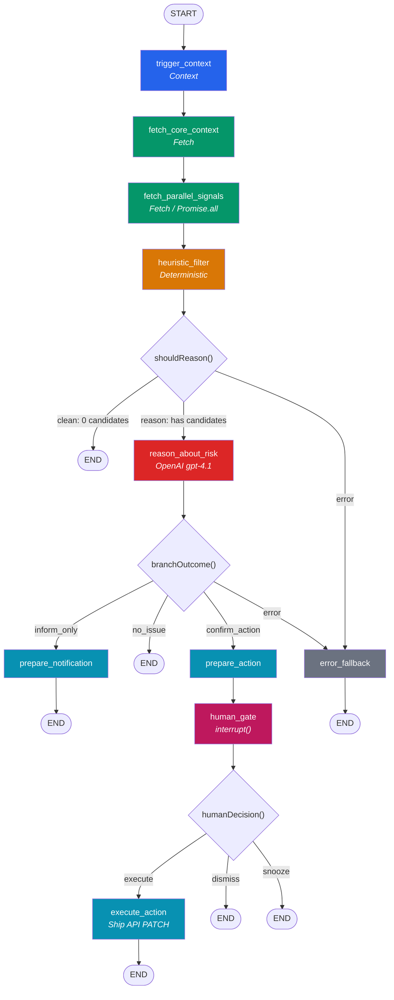

# Node Design Deep Dive
## Provenance

- Requirements-backed: assignment constraints and grader-facing deliverables from `requirements.md`. Where `FleetGraph_PRD.pdf` diverges, `requirements.md` wins.
- Codebase-backed: current Ship routes, files, UI patterns, and infra only when this doc cites specific Ship paths or endpoints.
- External-doc-backed: vendor pricing and API behavior only.
- Proposed design: FleetGraph architecture, node layouts, schemas, code sketches, and rollout plans unless explicitly marked as current Ship behavior.
- Assumption: latency budgets, scale math, token budgets, and operational estimates that are not directly measured in this repo.
- Reading rule: unlabeled code blocks are proposed FleetGraph implementation sketches, not current Ship code.


## Purpose

Implementation blueprint for the FleetGraph LangGraph StateGraph. After reading this document, a developer can scaffold the entire `api/src/fleetgraph/` directory, wire all nodes and edges, and have copy-pasteable TypeScript skeletons for every file.

This document synthesizes the Presearch node inventory (05) and LangGraph integration guide (04) into the actual file-by-file build plan for Phase 2.

## Reconciliation Note

- Resumable flows use stable thread IDs; do not mint timestamped IDs for approvals or multi-turn chat
- Proactive runs that can pause should key thread IDs by alert fingerprint
- The canonical fallback sweep cadence is 4 minutes

---

## 1. File Structure

```
api/src/fleetgraph/
  graph.ts                          # StateGraph definition, compilation, singleton export
  state.ts                          # FleetGraphState annotation, all shared types
  types.ts                          # CandidateSignal, RiskAssessment, ApprovalPayload, etc.
  nodes/
    trigger-context.ts              # Entry normalization (proactive vs on-demand)
    fetch-core-context.ts           # Primary entity fetch (issue/sprint/project)
    fetch-parallel-signals.ts       # Supplementary parallel fetches
    heuristic-filter.ts             # Deterministic signal detection
    reason-about-risk.ts            # OpenAI Responses structured reasoning
    prepare-notification.ts         # Build notification payload (inform_only path)
    prepare-action.ts               # Build approval payload (confirm_action path)
    human-gate.ts                   # LangGraph interrupt for HITL
    execute-action.ts               # Approved mutation against Ship API
    error-fallback.ts               # Error capture + withErrorHandling wrapper
  edges/
    should-reason.ts                # heuristic_filter -> reason_about_risk OR END
    branch-outcome.ts               # reason_about_risk -> inform/confirm/no_issue/error
    human-decision.ts               # human_gate -> execute/dismiss/snooze
  client/
    ship-client.ts                  # Typed Ship REST API client
  worker/
    sweep.ts                        # Proactive cron: enumerate entities, invoke graph
  heuristics/
    missing-standup.ts              # BG-1
    stale-issue.ts                  # BG-2
    approval-bottleneck.ts          # BG-3
    scope-drift.ts                  # BG-4
    risk-cluster.ts                 # BG-5
    utils.ts                        # hashSignal, date helpers, business day math
```

---

## 2. State Annotation (`state.ts`)

The single source of truth for every field that flows through the graph. All nodes read from and write to this shape.

```typescript
// api/src/fleetgraph/state.ts

import { Annotation } from "@langchain/langgraph";
import type {
  CandidateSignal,
  RiskAssessment,
  ApprovalPayload,
  HumanDecision,
  ActionResult,
  FleetGraphError,
} from "./types.js";

export const FleetGraphState = Annotation.Root({
  // ---- trigger_context writes ----
  mode: Annotation<"proactive" | "on_demand">,
  actorId: Annotation<string | null>,
  entityId: Annotation<string>,
  entityType: Annotation<"issue" | "sprint" | "project">,
  workspaceId: Annotation<string>,
  traceId: Annotation<string>,

  // ---- fetch_core_context writes ----
  coreContext: Annotation<Record<string, unknown>>({
    reducer: (_prev, next) => next,
    default: () => ({}),
  }),

  // ---- fetch_parallel_signals writes ----
  signals: Annotation<Record<string, unknown>>({
    reducer: (_prev, next) => next,
    default: () => ({}),
  }),

  // ---- heuristic_filter writes ----
  candidates: Annotation<CandidateSignal[]>({
    reducer: (_prev, next) => next,
    default: () => [],
  }),

  // ---- reason_about_risk writes ----
  riskAssessment: Annotation<RiskAssessment | null>({
    reducer: (_prev, next) => next,
    default: () => null,
  }),

  // ---- prepare_notification writes ----
  notification: Annotation<Record<string, unknown> | null>({
    reducer: (_prev, next) => next,
    default: () => null,
  }),

  // ---- prepare_action writes ----
  approvalPayload: Annotation<ApprovalPayload | null>({
    reducer: (_prev, next) => next,
    default: () => null,
  }),

  // ---- human_gate writes ----
  humanDecision: Annotation<HumanDecision | null>({
    reducer: (_prev, next) => next,
    default: () => null,
  }),

  // ---- execute_action writes ----
  actionResult: Annotation<ActionResult | null>({
    reducer: (_prev, next) => next,
    default: () => null,
  }),

  // ---- error_fallback reads ----
  error: Annotation<FleetGraphError | null>({
    reducer: (_prev, next) => next,
    default: () => null,
  }),
});

/** Full populated state shape */
export type FleetGraphStateType = typeof FleetGraphState.State;

/** Partial update returned by nodes */
export type FleetGraphStateUpdate = typeof FleetGraphState.Update;
```

### Reducer rationale

Every channel uses last-write-wins (`(_prev, next) => next`). FleetGraph nodes execute sequentially along each path; no two nodes write the same field in a single step. `candidates` uses last-write-wins rather than append because `heuristic_filter` is the sole producer and always writes the complete array.

If a future node needs append semantics (e.g., accumulating conversation history for multi-turn reasoning), change its reducer to:

```typescript
conversationHistory: Annotation<Message[]>({
  reducer: (prev, next) => [...prev, ...next],
  default: () => [],
}),
```

---

## 3. Shared Types (`types.ts`)

```typescript
// api/src/fleetgraph/types.ts

/** Risk signal produced by heuristic_filter */
export interface CandidateSignal {
  signalType:
    | "missing_standup"
    | "stale_issue"
    | "approval_bottleneck"
    | "scope_drift"
    | "risk_cluster"
    | "capacity_overload"
    | "ownership_gap";
  severity: "low" | "medium" | "high" | "critical";
  entityId: string;
  entityType: "issue" | "sprint" | "project";
  evidence: Record<string, unknown>;
  fingerprint: string;
}

/** Structured output from the reasoning node */
export interface RiskAssessment {
  overallSeverity: "none" | "low" | "medium" | "high" | "critical";
  explanation: string;
  recommendation: string;
  suggestedAction: {
    type: "no_action" | "notify" | "mutate";
    target?: string;
    payload?: Record<string, unknown>;
  };
  confidence: number; // 0-100
}

/** Approval payload surfaced to the human */
export interface ApprovalPayload {
  threadId: string;
  actionType: string;
  targetEntityId: string;
  targetEntityType: string;
  evidenceSummary: string;
  recommendedEffect: string;
  riskTier: "low" | "medium" | "high";
  generatedAt: string;
  fingerprint: string;
  traceLink: string;
}

/** Human response to an approval gate */
export type HumanDecision =
  | { action: "approve" }
  | { action: "dismiss"; reason?: string }
  | { action: "snooze"; until: string };

/** Action execution result */
export interface ActionResult {
  success: boolean;
  httpStatus?: number;
  response?: Record<string, unknown>;
  error?: string;
}

/** Structured error for trace visibility */
export interface FleetGraphError {
  message: string;
  node: string;
  recoverable: boolean;
}
```

---

## 4. Graph Definition (`graph.ts`)

Complete graph assembly, compilation, and singleton export.

```typescript
// api/src/fleetgraph/graph.ts

import { StateGraph, START, END } from "@langchain/langgraph";
import { PostgresSaver } from "@langchain/langgraph-checkpoint-postgres";
import pg from "pg";

import { FleetGraphState } from "./state.js";

// ---- Node imports ----
import { triggerContext } from "./nodes/trigger-context.js";
import { fetchCoreContext } from "./nodes/fetch-core-context.js";
import { fetchParallelSignals } from "./nodes/fetch-parallel-signals.js";
import { heuristicFilter } from "./nodes/heuristic-filter.js";
import { reasonAboutRisk } from "./nodes/reason-about-risk.js";
import { prepareNotification } from "./nodes/prepare-notification.js";
import { prepareAction } from "./nodes/prepare-action.js";
import { humanGate } from "./nodes/human-gate.js";
import { executeAction } from "./nodes/execute-action.js";
import { errorFallback, withErrorHandling } from "./nodes/error-fallback.js";

// ---- Edge imports ----
import { shouldReason } from "./edges/should-reason.js";
import { branchOutcome } from "./edges/branch-outcome.js";
import { humanDecision } from "./edges/human-decision.js";

// ---------------------------------------------------------------------------
// Graph construction
// ---------------------------------------------------------------------------

const workflow = new StateGraph(FleetGraphState)

  // ---- Register nodes ----
  // Order does not affect execution; edges determine flow.
  // Error wrapper on every node except human_gate (must not catch GraphInterrupt)
  // and error_fallback (terminal; must not recurse).
  .addNode("trigger_context", withErrorHandling("trigger_context", triggerContext))
  .addNode("fetch_core_context", withErrorHandling("fetch_core_context", fetchCoreContext))
  .addNode("fetch_parallel_signals", withErrorHandling("fetch_parallel_signals", fetchParallelSignals))
  .addNode("heuristic_filter", withErrorHandling("heuristic_filter", heuristicFilter))
  .addNode("reason_about_risk", withErrorHandling("reason_about_risk", reasonAboutRisk))
  .addNode("prepare_notification", withErrorHandling("prepare_notification", prepareNotification))
  .addNode("prepare_action", withErrorHandling("prepare_action", prepareAction))
  .addNode("human_gate", humanGate)
  .addNode("execute_action", withErrorHandling("execute_action", executeAction))
  .addNode("error_fallback", errorFallback)

  // ---- Linear edges: entry through heuristic filter ----
  .addEdge(START, "trigger_context")
  .addEdge("trigger_context", "fetch_core_context")
  .addEdge("fetch_core_context", "fetch_parallel_signals")
  .addEdge("fetch_parallel_signals", "heuristic_filter")

  // ---- Conditional edge 1: should we invoke the LLM? ----
  .addConditionalEdges("heuristic_filter", shouldReason, {
    reason: "reason_about_risk",
    clean: END,
    error: "error_fallback",
  })

  // ---- Conditional edge 2: what did the LLM conclude? ----
  .addConditionalEdges("reason_about_risk", branchOutcome, {
    no_issue: END,
    inform_only: "prepare_notification",
    confirm_action: "prepare_action",
    error: "error_fallback",
  })

  // ---- Notification path terminates ----
  .addEdge("prepare_notification", END)

  // ---- Action path enters HITL gate ----
  .addEdge("prepare_action", "human_gate")

  // ---- Conditional edge 3: what did the human decide? ----
  .addConditionalEdges("human_gate", humanDecision, {
    execute: "execute_action",
    dismiss: END,
    snooze: END,
  })

  // ---- Terminal edges ----
  .addEdge("execute_action", END)
  .addEdge("error_fallback", END);

// ---------------------------------------------------------------------------
// Checkpointer + compilation
// ---------------------------------------------------------------------------

let _checkpointer: PostgresSaver | null = null;

async function getCheckpointer(): Promise<PostgresSaver> {
  if (_checkpointer) return _checkpointer;

  const pool = new pg.Pool({
    connectionString: process.env.DATABASE_URL,
  });

  _checkpointer = new PostgresSaver(pool, undefined, {
    schema: "fleetgraph",
  });

  await _checkpointer.setup();
  return _checkpointer;
}

export type CompiledFleetGraph = Awaited<ReturnType<typeof compileFleetGraph>>;

async function compileFleetGraph() {
  const checkpointer = await getCheckpointer();

  return workflow.compile({
    checkpointer,
  });
}

// ---------------------------------------------------------------------------
// Singleton export
// ---------------------------------------------------------------------------

let _compiled: CompiledFleetGraph | null = null;

export async function getFleetGraph(): Promise<CompiledFleetGraph> {
  if (!_compiled) {
    _compiled = await compileFleetGraph();
  }
  return _compiled;
}

// ---------------------------------------------------------------------------
// Invocation helpers (used by API routes and sweep worker)
// ---------------------------------------------------------------------------

import { Command } from "@langchain/langgraph";

/** Start a new graph run */
export async function invokeFleetGraph(input: {
  entityId: string;
  entityType: "issue" | "sprint" | "project";
  workspaceId: string;
  actorId?: string;
  alertFingerprint?: string;
}) {
  const graph = await getFleetGraph();
  const threadId = input.actorId
    ? `fg-chat-${input.workspaceId}-${input.entityType}-${input.entityId}-${input.actorId}`
    : `fg-alert-${input.workspaceId}-${input.alertFingerprint ?? `${input.entityType}-${input.entityId}`}`;

  return graph.invoke(
    {
      entityId: input.entityId,
      entityType: input.entityType,
      workspaceId: input.workspaceId,
      actorId: input.actorId ?? null,
    },
    {
      configurable: { thread_id: threadId },
      metadata: {
        mode: input.actorId ? "on_demand" : "proactive",
        entityType: input.entityType,
        entityId: input.entityId,
        workspaceId: input.workspaceId,
      },
      tags: [
        "fleetgraph",
        input.actorId ? "on_demand" : "proactive",
        input.entityType,
      ],
    },
  );
}

/** Resume a paused graph with a human decision */
export async function resumeFleetGraph(
  threadId: string,
  decision: { action: "approve" } | { action: "dismiss"; reason?: string } | { action: "snooze"; until: string },
) {
  const graph = await getFleetGraph();

  return graph.invoke(
    new Command({ resume: decision }),
    { configurable: { thread_id: threadId } },
  );
}
```

### Registration order note

`addNode` order is cosmetic. LangGraph determines execution order from edges. The linear section (`START -> trigger_context -> fetch_core_context -> fetch_parallel_signals -> heuristic_filter`) runs sequentially. All branching is handled by the three conditional edges.

---

## 5. Node Implementations

Every node follows the same contract:

```typescript
async function nodeName(
  state: typeof FleetGraphState.State
): Promise<Partial<typeof FleetGraphState.Update>>
```

Reads from `state`, returns only the fields it writes.

---

### 5.1 `trigger-context.ts`

```typescript
// api/src/fleetgraph/nodes/trigger-context.ts

import type { FleetGraphStateType, FleetGraphStateUpdate } from "../state.js";

/**
 * Normalizes the entry payload into a uniform state shape.
 * Runs for both proactive and on-demand invocations.
 *
 * Time budget: < 50ms
 * Deterministic: Yes
 * LLM: No
 */
export async function triggerContext(
  state: FleetGraphStateType,
): Promise<Partial<FleetGraphStateUpdate>> {
  const traceId = crypto.randomUUID();
  const mode = state.actorId ? "on_demand" : "proactive";

  // TODO: If entityType is missing, infer from Ship API document_type lookup.
  // In practice callers should always provide entityType to avoid the extra call.

  return {
    mode,
    actorId: state.actorId ?? null,
    entityId: state.entityId,
    entityType: state.entityType,
    workspaceId: state.workspaceId,
    traceId,
  };
}
```

---

### 5.2 `fetch-core-context.ts`

```typescript
// api/src/fleetgraph/nodes/fetch-core-context.ts

import type { FleetGraphStateType, FleetGraphStateUpdate } from "../state.js";
import { createShipClient } from "../client/ship-client.js";

/**
 * Loads the primary context for the target entity.
 * Fetch strategy varies by entityType. All calls parallelized with Promise.all.
 *
 * Time budget: < 2s
 * Deterministic: Yes
 * LLM: No
 */
export async function fetchCoreContext(
  state: FleetGraphStateType,
): Promise<Partial<FleetGraphStateUpdate>> {
  const ship = createShipClient(state.workspaceId, state.actorId);

  switch (state.entityType) {
    case "issue":
      return { coreContext: await fetchIssueContext(ship, state.entityId) };

    case "sprint":
      return { coreContext: await fetchSprintContext(ship, state.entityId) };

    case "project":
      return { coreContext: await fetchProjectContext(ship, state.entityId) };
  }
}

// ---------------------------------------------------------------------------
// Per-entity fetch strategies
// ---------------------------------------------------------------------------

async function fetchIssueContext(ship: ReturnType<typeof createShipClient>, entityId: string) {
  const [issue, history, children, associations] = await Promise.all([
    ship.get(`/api/issues/${entityId}`),
    ship.get(`/api/issues/${entityId}/history`),
    ship.get(`/api/issues/${entityId}/children`),
    ship.get(`/api/documents/${entityId}/associations`),
  ]);

  return { issue, history, children, associations };
}

async function fetchSprintContext(ship: ReturnType<typeof createShipClient>, entityId: string) {
  const [claudeContext, issues, activity] = await Promise.all([
    ship.get(`/api/claude/context?context_type=review&sprint_id=${entityId}`),
    ship.get(`/api/issues?sprint_id=${entityId}`),
    ship.get(`/api/activity/sprint/${entityId}`),
  ]);

  return { claudeContext, issues, activity };
}

async function fetchProjectContext(ship: ReturnType<typeof createShipClient>, entityId: string) {
  const [project, activity, actionItems, retroContext] = await Promise.all([
    ship.get(`/api/projects/${entityId}`),
    ship.get(`/api/activity/project/${entityId}`),
    ship.get(`/api/accountability/action-items`),
    ship.get(`/api/claude/context?context_type=retro&project_id=${entityId}`),
  ]);

  return { project, activity, actionItems, retroContext };
}
```

---

### 5.3 `fetch-parallel-signals.ts`

```typescript
// api/src/fleetgraph/nodes/fetch-parallel-signals.ts

import type { FleetGraphStateType, FleetGraphStateUpdate } from "../state.js";
import { createShipClient } from "../client/ship-client.js";

/**
 * Fetches supplementary signals independent of each other and of coreContext.
 * All fetches run in parallel via Promise.allSettled for partial-failure tolerance.
 *
 * Time budget: < 2s
 * Deterministic: Yes
 * LLM: No
 */
export async function fetchParallelSignals(
  state: FleetGraphStateType,
): Promise<Partial<FleetGraphStateUpdate>> {
  const ship = createShipClient(state.workspaceId, state.actorId);
  const fetches: Record<string, Promise<unknown>> = {};

  // ---- Sprint / Project signals ----
  if (state.entityType === "sprint" || state.entityType === "project") {
    const sprintId =
      state.entityType === "sprint"
        ? state.entityId
        : extractSprintIds(state.coreContext);

    const { from, to } = computeSprintDateRange(state.coreContext);

    fetches.standups = ship.get(`/api/standups?date_from=${from}&date_to=${to}`);
    fetches.sprintIssues = ship.get(`/api/issues?sprint_id=${sprintId}`);

    // Plan snapshot for scope drift detection
    if (state.entityType === "sprint") {
      fetches.sprintDetail = ship.get(`/api/weeks/${state.entityId}`);
    }
  }

  // ---- Issue signals ----
  if (state.entityType === "issue") {
    fetches.associations = ship.get(
      `/api/documents/${state.entityId}/associations`,
    );
  }

  // ---- Resolve all in parallel (settled to tolerate partial failures) ----
  const entries = Object.entries(fetches);
  const results = await Promise.allSettled(entries.map(([, p]) => p));

  const signals: Record<string, unknown> = {};
  entries.forEach(([key], i) => {
    const result = results[i];
    if (result.status === "fulfilled") {
      signals[key] = result.value;
    } else {
      // Log but do not fail the node; downstream heuristics handle missing data
      console.warn(
        `[FleetGraph] Signal fetch "${key}" failed: ${result.reason}`,
      );
      signals[key] = null;
    }
  });

  return { signals };
}

// ---------------------------------------------------------------------------
// Helpers (TODO: move to shared utils once stable)
// ---------------------------------------------------------------------------

function extractSprintIds(coreContext: Record<string, unknown>): string {
  // TODO: Extract active sprint ID from project context
  // For projects, coreContext.retroContext contains sprint references
  const retro = coreContext.retroContext as any;
  return retro?.sprints?.[0]?.id ?? "";
}

function computeSprintDateRange(
  coreContext: Record<string, unknown>,
): { from: string; to: string } {
  // TODO: Extract sprint start/end dates from coreContext
  // Fallback: current business week
  const now = new Date();
  const monday = new Date(now);
  monday.setDate(now.getDate() - ((now.getDay() + 6) % 7));
  const friday = new Date(monday);
  friday.setDate(monday.getDate() + 4);

  return {
    from: monday.toISOString().split("T")[0],
    to: friday.toISOString().split("T")[0],
  };
}
```

---

### 5.4 `heuristic-filter.ts`

```typescript
// api/src/fleetgraph/nodes/heuristic-filter.ts

import type { FleetGraphStateType, FleetGraphStateUpdate } from "../state.js";
import type { CandidateSignal } from "../types.js";

import { detectMissingStandup } from "../heuristics/missing-standup.js";
import { detectStaleIssues } from "../heuristics/stale-issue.js";
import { detectApprovalBottleneck } from "../heuristics/approval-bottleneck.js";
import { detectScopeDrift } from "../heuristics/scope-drift.js";
import { detectRiskCluster } from "../heuristics/risk-cluster.js";

/**
 * Runs pure deterministic checks against fetched data.
 * No LLM involvement. Produces candidate signals for the reasoning node.
 * An empty candidates array means no issues detected (clean run).
 *
 * Time budget: < 100ms
 * Deterministic: Yes
 * LLM: No
 */
export async function heuristicFilter(
  state: FleetGraphStateType,
): Promise<Partial<FleetGraphStateUpdate>> {
  const candidates: CandidateSignal[] = [];

  // ---- BG-1: Missing standup ----
  if (state.entityType === "sprint" || state.entityType === "project") {
    const standup = detectMissingStandup(state.coreContext, state.signals);
    if (standup) candidates.push(standup);
  }

  // ---- BG-2: Stale issues ----
  const sprintIssues = state.signals.sprintIssues as any[] | null;
  if (sprintIssues) {
    const stale = detectStaleIssues(sprintIssues);
    candidates.push(...stale);
  }

  // ---- BG-3: Approval bottleneck ----
  const bottleneck = detectApprovalBottleneck(state.coreContext);
  if (bottleneck) candidates.push(bottleneck);

  // ---- BG-4: Scope drift ----
  const drift = detectScopeDrift(state.coreContext, state.signals);
  candidates.push(...drift);

  // ---- BG-5: Risk clustering (runs last, aggregates others) ----
  const cluster = detectRiskCluster(candidates, state.coreContext);
  if (cluster) candidates.push(cluster);

  return { candidates };
}
```

---

### 5.5 `reason-about-risk.ts`

```typescript
// api/src/fleetgraph/nodes/reason-about-risk.ts

import OpenAI from "openai";
import { z } from "zod";
import { zodResponseFormat } from "openai/helpers/zod";
import { wrapOpenAI } from "langsmith/wrappers";

import type { FleetGraphStateType, FleetGraphStateUpdate } from "../state.js";
import type { RiskAssessment } from "../types.js";

// ---- Wrapped client for LangSmith trace visibility ----
const openai = wrapOpenAI(new OpenAI());

// ---- Zod schema for structured output ----
const RiskAssessmentSchema = z.object({
  overallSeverity: z.enum(["none", "low", "medium", "high", "critical"]),
  explanation: z
    .string()
    .describe("2-3 sentence explanation of the risk assessment"),
  recommendation: z
    .string()
    .describe("Concrete next action the team should take"),
  suggestedAction: z.object({
    type: z.enum(["no_action", "notify", "mutate"]),
    target: z.string().optional().describe("Entity ID to act on"),
    payload: z
      .record(z.unknown())
      .optional()
      .describe("Mutation payload if type=mutate"),
  }),
  confidence: z
    .number()
    .int()
    .min(0)
    .max(100)
    .describe("Model confidence in this assessment"),
});

/**
 * Sends candidate signals + summarized context to OpenAI Responses API.
 * Returns a structured RiskAssessment.
 * Only runs when candidates.length > 0 (guarded by shouldReason edge).
 *
 * Time budget: < 5s
 * Deterministic: No
 * LLM: Yes (OpenAI Responses API via centralized model policy)
 */
export async function reasonAboutRisk(
  state: FleetGraphStateType,
): Promise<Partial<FleetGraphStateUpdate>> {
  // Defensive guard (shouldReason edge should prevent reaching here with 0 candidates)
  if (state.candidates.length === 0) {
    return { riskAssessment: null };
  }

  const response = await openai.responses.parse({
    model: getFleetGraphModel("reasoning_primary"),
    instructions: buildInstructions(state.entityType, state.mode),
    input: [
      {
        role: "user",
        content: JSON.stringify({
          candidates: state.candidates,
          context: summarizeContext(state.coreContext, state.entityType),
          signals: summarizeSignals(state.signals),
        }),
      },
    ],
    text: {
      format: zodResponseFormat(RiskAssessmentSchema, "risk_assessment"),
    },
  });

  return {
    riskAssessment: response.output_parsed as RiskAssessment,
  };
}

// ---------------------------------------------------------------------------
// Prompt construction
// ---------------------------------------------------------------------------

function buildInstructions(
  entityType: string,
  mode: string,
): string {
  return `You are FleetGraph, a project intelligence agent for Ship.

Your job: analyze flagged risk signals for a ${entityType} and produce a structured risk assessment.

Context:
- Mode: ${mode}
- You receive candidate signals that passed deterministic heuristic checks
- You receive the full entity context from the Ship API
- You must assess whether these signals represent real delivery risk

Rules:
- Be specific. Reference issue titles, dates, and people by name.
- If multiple signals point to the same root cause, unify them.
- severity=none means the heuristic was a false positive. Explain why.
- severity=critical means imminent delivery failure. Be direct.
- suggestedAction.type=mutate only for clear, reversible, low-risk changes (reassignment, status update)
- suggestedAction.type=notify for everything else that needs human attention
- confidence below 60 means you are uncertain. Set suggestedAction.type=notify, not mutate.
- Keep explanation under 3 sentences.
- Keep recommendation to one concrete action.`;
}

// ---------------------------------------------------------------------------
// Context summarization (reduce token count)
// ---------------------------------------------------------------------------

function summarizeContext(
  coreContext: Record<string, unknown>,
  entityType: string,
): Record<string, unknown> {
  // TODO: Implement per-entityType field extraction
  // Issue: title, state, priority, assignee, timestamps, history (last 10), children states
  // Sprint: sprint plan, issue stats, standup count, approval states, owner
  // Project: title, plan, ICE scores, sprint count, issue count, action items
  // Omit: full TipTap JSON bodies, raw document content, unchanged history entries
  return coreContext;
}

function summarizeSignals(
  signals: Record<string, unknown>,
): Record<string, unknown> {
  // TODO: Strip large arrays down to counts + representative samples
  return signals;
}
```

---

### 5.6 `prepare-notification.ts`

```typescript
// api/src/fleetgraph/nodes/prepare-notification.ts

import type { FleetGraphStateType, FleetGraphStateUpdate } from "../state.js";

/**
 * Builds a notification payload from the risk assessment.
 * Does not deliver the notification; that happens downstream or via a webhook.
 * Exists so the payload is inspectable in LangSmith traces before delivery.
 *
 * Time budget: < 50ms
 * Deterministic: Yes
 * LLM: No
 */
export async function prepareNotification(
  state: FleetGraphStateType,
): Promise<Partial<FleetGraphStateUpdate>> {
  const assessment = state.riskAssessment!;

  return {
    notification: {
      type: "fleet_graph_alert",
      workspaceId: state.workspaceId,
      entityId: state.entityId,
      entityType: state.entityType,
      severity: assessment.overallSeverity,
      title: buildNotificationTitle(assessment.overallSeverity, state.candidates),
      body: assessment.explanation,
      recommendation: assessment.recommendation,
      evidence: state.candidates.map((c) => ({
        signalType: c.signalType,
        severity: c.severity,
        entityId: c.entityId,
      })),
      traceLink: buildTraceLink(state.traceId),
      createdAt: new Date().toISOString(),
    },
  };
}

// ---------------------------------------------------------------------------
// Helpers
// ---------------------------------------------------------------------------

function buildNotificationTitle(
  severity: string,
  candidates: { signalType: string }[],
): string {
  const signalTypes = [...new Set(candidates.map((c) => c.signalType))];
  const label = signalTypes.length === 1
    ? formatSignalType(signalTypes[0])
    : `${signalTypes.length} risk signals`;

  return `[${severity.toUpperCase()}] ${label} detected`;
}

function formatSignalType(type: string): string {
  return type.replace(/_/g, " ").replace(/\b\w/g, (c) => c.toUpperCase());
}

function buildTraceLink(traceId: string): string {
  const project = process.env.LANGCHAIN_PROJECT || "fleetgraph-dev";
  return `https://smith.langchain.com/projects/${project}?filter=has(metadata,"traceId") and eq(metadata["traceId"],"${traceId}")`;
}
```

---

### 5.7 `prepare-action.ts`

```typescript
// api/src/fleetgraph/nodes/prepare-action.ts

import type { FleetGraphStateType, FleetGraphStateUpdate } from "../state.js";
import type { ApprovalPayload } from "../types.js";

/**
 * Builds an approval payload for a consequential action.
 * This is what the human sees in the HITL gate.
 * No writes happen until the human approves.
 *
 * Time budget: < 50ms
 * Deterministic: Yes
 * LLM: No
 */
export async function prepareAction(
  state: FleetGraphStateType,
): Promise<Partial<FleetGraphStateUpdate>> {
  const assessment = state.riskAssessment!;
  const action = assessment.suggestedAction;

  const payload: ApprovalPayload = {
    threadId: state.traceId,
    actionType: describeActionType(action),
    targetEntityId: action.target || state.entityId,
    targetEntityType: state.entityType,
    evidenceSummary: assessment.explanation,
    recommendedEffect: assessment.recommendation,
    riskTier: mapSeverityToRiskTier(assessment.overallSeverity),
    generatedAt: new Date().toISOString(),
    fingerprint: state.candidates[0]?.fingerprint || state.traceId,
    traceLink: buildTraceLink(state.traceId),
  };

  return { approvalPayload: payload };
}

// ---------------------------------------------------------------------------
// Helpers
// ---------------------------------------------------------------------------

function describeActionType(action: {
  type: string;
  target?: string;
  payload?: Record<string, unknown>;
}): string {
  if (action.type === "mutate" && action.payload) {
    const keys = Object.keys(action.payload);
    return `mutate:${keys.join(",")}`;
  }
  return action.type;
}

function mapSeverityToRiskTier(
  severity: string,
): "low" | "medium" | "high" {
  switch (severity) {
    case "critical":
    case "high":
      return "high";
    case "medium":
      return "medium";
    default:
      return "low";
  }
}

function buildTraceLink(traceId: string): string {
  const project = process.env.LANGCHAIN_PROJECT || "fleetgraph-dev";
  return `https://smith.langchain.com/projects/${project}?filter=has(metadata,"traceId") and eq(metadata["traceId"],"${traceId}")`;
}
```

---

### 5.8 `human-gate.ts`

```typescript
// api/src/fleetgraph/nodes/human-gate.ts

import { interrupt, GraphInterrupt } from "@langchain/langgraph";

import type { FleetGraphStateType, FleetGraphStateUpdate } from "../state.js";
import type { HumanDecision } from "../types.js";

/**
 * Pauses graph execution and surfaces the approval payload to the user.
 * Resumes when the human responds via the approval API.
 *
 * IMPORTANT: This node must NOT be wrapped in withErrorHandling.
 * The interrupt() call throws GraphInterrupt internally, which must
 * propagate to LangGraph's execution engine. Catching it breaks resume.
 *
 * Time budget: Unbounded (interrupt pauses execution)
 * Deterministic: Yes (deterministic code; pauses for human input)
 * LLM: No
 */
export async function humanGate(
  state: FleetGraphStateType,
): Promise<Partial<FleetGraphStateUpdate>> {
  try {
    // Surface the approval payload and pause execution.
    // On resume, interrupt() returns the human's decision.
    const decision = interrupt<HumanDecision>(state.approvalPayload);

    return {
      humanDecision: decision,
    };
  } catch (err) {
    // GraphInterrupt MUST propagate. Re-throw it unconditionally.
    if (err instanceof GraphInterrupt) throw err;

    // Any other error is a real failure.
    return {
      error: {
        message: err instanceof Error ? err.message : "Unknown error in human_gate",
        node: "human_gate",
        recoverable: false,
      },
    };
  }
}
```

### How the interrupt/resume cycle works

1. **First invocation**: `interrupt(state.approvalPayload)` throws `GraphInterrupt`. LangGraph catches it, persists state to PostgresSaver, and returns the interrupt payload to the caller (the API route).

2. **Pause**: The graph sits in the checkpoint store. The `approvalPayload` is returned to the Ship frontend, which renders the approval card.

3. **Resume**: The user clicks Approve/Dismiss/Snooze. The frontend calls `POST /api/fleetgraph/approvals/:threadId/:action`. The API handler calls `resumeFleetGraph(threadId, decision)`, which invokes `graph.invoke(new Command({ resume: decision }), { configurable: { thread_id: threadId } })`.

4. **Second invocation**: LangGraph loads the persisted state, re-enters `humanGate`. This time `interrupt()` returns the decision value instead of throwing. The node writes `humanDecision` to state and continues.

---

### 5.9 `execute-action.ts`

```typescript
// api/src/fleetgraph/nodes/execute-action.ts

import type { FleetGraphStateType, FleetGraphStateUpdate } from "../state.js";
import { createShipClient } from "../client/ship-client.js";

/**
 * Performs the approved mutation against the Ship API.
 * Re-fetches the target entity before writing to guard against stale data.
 * Checks fingerprint deduplication to prevent replay writes.
 *
 * Time budget: < 2s
 * Deterministic: Yes
 * LLM: No
 */
export async function executeAction(
  state: FleetGraphStateType,
): Promise<Partial<FleetGraphStateUpdate>> {
  const payload = state.approvalPayload!;
  const action = state.riskAssessment!.suggestedAction;
  const ship = createShipClient(state.workspaceId, state.actorId);

  // ---- Idempotency check ----
  // TODO: Query a fleetgraph_action_log table for this fingerprint.
  // If found, return the cached result instead of re-executing.
  // const existing = await checkActionLog(payload.fingerprint);
  // if (existing) return { actionResult: existing };

  // ---- Re-fetch current entity state ----
  const entityPath = resolveEntityPath(payload.targetEntityType, payload.targetEntityId);
  const currentEntity = await ship.get(entityPath);

  if (!currentEntity || (currentEntity as any).deleted_at) {
    return {
      actionResult: {
        success: false,
        error: "Target entity no longer exists or was deleted",
      },
    };
  }

  // ---- Execute the mutation ----
  try {
    const response = await ship.patch(entityPath, action.payload ?? {});

    // TODO: Record successful execution in fleetgraph_action_log

    return {
      actionResult: {
        success: true,
        httpStatus: 200,
        response: response as Record<string, unknown>,
      },
    };
  } catch (err: unknown) {
    const error = err as any;
    return {
      actionResult: {
        success: false,
        httpStatus: error.response?.status,
        error: error.message ?? "Unknown execution error",
      },
    };
  }
}

// ---------------------------------------------------------------------------
// Helpers
// ---------------------------------------------------------------------------

function resolveEntityPath(entityType: string, entityId: string): string {
  switch (entityType) {
    case "issue":
      return `/api/issues/${entityId}`;
    case "sprint":
      return `/api/weeks/${entityId}`;
    case "project":
      return `/api/projects/${entityId}`;
    default:
      return `/api/documents/${entityId}`;
  }
}
```

---

### 5.10 `error-fallback.ts`

```typescript
// api/src/fleetgraph/nodes/error-fallback.ts

import type { FleetGraphStateType, FleetGraphStateUpdate } from "../state.js";

/**
 * Catches failures from any upstream node.
 * Proactive mode: suppresses notification, records for retry.
 * On-demand mode: returns degraded response to user.
 *
 * Time budget: < 50ms
 * Deterministic: Yes
 * LLM: No
 */
export async function errorFallback(
  state: FleetGraphStateType,
): Promise<Partial<FleetGraphStateUpdate>> {
  const err = state.error;
  if (!err) return {};

  console.error(
    `[FleetGraph] Error in node=${err.node} trace=${state.traceId}: ${err.message}`,
  );

  // TODO: Record failure in fleetgraph_error_log for observability

  if (state.mode === "proactive") {
    // Suppress notification. Sweep worker will retry on next cycle.
    return {};
  }

  // On-demand: return degraded notification
  return {
    notification: {
      type: "fleet_graph_error",
      severity: "low",
      title: "FleetGraph encountered an issue",
      body: err.recoverable
        ? "Some data could not be loaded. Results may be incomplete."
        : "Unable to complete analysis. Please try again.",
      traceLink: buildTraceLink(state.traceId),
    },
  };
}

function buildTraceLink(traceId: string): string {
  const project = process.env.LANGCHAIN_PROJECT || "fleetgraph-dev";
  return `https://smith.langchain.com/projects/${project}?filter=has(metadata,"traceId") and eq(metadata["traceId"],"${traceId}")`;
}
```

### Shared `withErrorHandling`

`withErrorHandling` is a shared helper, not a second design branch. The canonical implementation lives in `api/src/fleetgraph/nodes/error-fallback.ts` and is specified in [Phase 2 / 07. Error and Failure Handling](../07.%20Error%20and%20Failure%20Handling/README.md).

```typescript
import { withErrorHandling } from "./nodes/error-fallback.js";
```

---

## 6. Edge Routing Logic

Three conditional edges control all branching in the graph.

---

### 6.1 `should-reason.ts`

Routes after `heuristic_filter`. Determines whether the LLM reasoning node should run.

```typescript
// api/src/fleetgraph/edges/should-reason.ts

import type { FleetGraphStateType } from "../state.js";

/**
 * Conditional edge: heuristic_filter -> reason_about_risk OR END
 *
 * If no candidates were detected, short-circuit to a clean run (END).
 * If an error occurred during heuristic filtering, route to error_fallback.
 * Otherwise, proceed to LLM reasoning.
 */
export function shouldReason(
  state: FleetGraphStateType,
): "reason" | "clean" | "error" {
  // Error takes precedence
  if (state.error) {
    return "error";
  }

  // No candidates = nothing to reason about
  if (state.candidates.length === 0) {
    return "clean";
  }

  // Has candidates; invoke the LLM
  return "reason";
}
```

**LangSmith trace effect**: Clean runs show a short path (`trigger_context -> fetch_core_context -> fetch_parallel_signals -> heuristic_filter -> END`). The absence of `reason_about_risk` in the trace immediately communicates "no issues detected."

---

### 6.2 `branch-outcome.ts`

Routes after `reason_about_risk`. Determines the action path based on model output.

```typescript
// api/src/fleetgraph/edges/branch-outcome.ts

import type { FleetGraphStateType } from "../state.js";

/**
 * Conditional edge: reason_about_risk -> inform_only | confirm_action | no_issue | error
 *
 * Decision tree:
 * 1. Error state set?          -> error
 * 2. Model said severity=none? -> no_issue (false positive)
 * 3. Model recommends mutate
 *    AND confidence >= 60?     -> confirm_action (enters HITL gate)
 * 4. Everything else           -> inform_only (notification only)
 */
export function branchOutcome(
  state: FleetGraphStateType,
): "no_issue" | "inform_only" | "confirm_action" | "error" {
  if (state.error) {
    return "error";
  }

  // Model concluded the heuristics were false positives
  if (
    state.riskAssessment &&
    state.riskAssessment.overallSeverity === "none"
  ) {
    return "no_issue";
  }

  // Model recommends a write operation with sufficient confidence
  if (
    state.riskAssessment?.suggestedAction.type === "mutate" &&
    state.riskAssessment.confidence >= 60
  ) {
    return "confirm_action";
  }

  // Default: notify the team without requiring approval
  return "inform_only";
}
```

---

### 6.3 `human-decision.ts`

Routes after `human_gate`. Determines what happens based on the human's response.

```typescript
// api/src/fleetgraph/edges/human-decision.ts

import type { FleetGraphStateType } from "../state.js";

/**
 * Conditional edge: human_gate -> execute | dismiss | snooze
 *
 * Runs after the human responds to the approval card.
 */
export function humanDecision(
  state: FleetGraphStateType,
): "execute" | "dismiss" | "snooze" {
  switch (state.humanDecision?.action) {
    case "approve":
      return "execute";
    case "dismiss":
      return "dismiss";
    case "snooze":
      return "snooze";
    default:
      // Defensive: if somehow no decision, treat as dismiss
      return "dismiss";
  }
}
```

---

## 7. Ship API Client (`client/ship-client.ts`)

Thin wrapper around the Ship REST API. Handles authentication for both proactive (service account) and on-demand (user session) modes.

```typescript
// api/src/fleetgraph/client/ship-client.ts

const SHIP_API_BASE = process.env.SHIP_API_URL || "http://localhost:3000";

export interface ShipClient {
  get(path: string): Promise<unknown>;
  patch(path: string, body: Record<string, unknown>): Promise<unknown>;
}

/**
 * Creates a Ship API client scoped to a workspace.
 *
 * Authentication:
 * - Proactive mode (actorId=null): uses FLEETGRAPH_SERVICE_TOKEN
 * - On-demand mode (actorId set): uses the user's session cookie
 *   forwarded from the original request
 */
export function createShipClient(
  workspaceId: string,
  actorId: string | null,
): ShipClient {
  const headers: Record<string, string> = {
    "Content-Type": "application/json",
    "X-Workspace-Id": workspaceId,
  };

  if (actorId) {
    // TODO: Forward the user's session cookie from the request context.
    // This requires passing the cookie through state or a context provider.
    headers["X-Actor-Id"] = actorId;
  } else {
    // Service account for proactive sweeps
    const token = process.env.FLEETGRAPH_SERVICE_TOKEN;
    if (token) {
      headers["Authorization"] = `Bearer ${token}`;
    }
  }

  async function request(method: string, path: string, body?: unknown): Promise<unknown> {
    const url = `${SHIP_API_BASE}${path}`;
    const init: RequestInit = {
      method,
      headers,
    };

    if (body) {
      init.body = JSON.stringify(body);
    }

    const response = await fetch(url, init);

    if (!response.ok) {
      const text = await response.text().catch(() => "");
      throw new Error(
        `Ship API ${method} ${path} returned ${response.status}: ${text}`,
      );
    }

    return response.json();
  }

  return {
    get: (path: string) => request("GET", path),
    patch: (path: string, body: Record<string, unknown>) =>
      request("PATCH", path, body),
  };
}
```

---

## 8. Sweep Worker (`worker/sweep.ts`)

Proactive mode entry point. Enumerates entities and invokes FleetGraph for each.

```typescript
// api/src/fleetgraph/worker/sweep.ts

import { invokeFleetGraph } from "../graph.js";
import { createShipClient } from "../client/ship-client.js";

/**
 * Proactive sweep fallback: runs every 4 minutes.
 * Enumerates active sprints and projects, invokes FleetGraph for each.
 *
 * Concurrency: sequential per workspace to avoid overloading the Ship API.
 * Each graph run is independent (separate thread_id).
 */
export async function runSweep(workspaceId: string): Promise<void> {
  const ship = createShipClient(workspaceId, null);

  // ---- Enumerate active sprints ----
  const sprints = (await ship.get("/api/weeks?status=active")) as any[];

  for (const sprint of sprints) {
    try {
      await invokeFleetGraph({
        entityId: sprint.id,
        entityType: "sprint",
        workspaceId,
      });
    } catch (err) {
      // Log but continue; one failure should not block the sweep
      console.error(
        `[FleetGraph Sweep] Failed for sprint ${sprint.id}:`,
        err,
      );
    }
  }

  // ---- Enumerate active projects ----
  const projects = (await ship.get("/api/projects?status=active")) as any[];

  for (const project of projects) {
    try {
      await invokeFleetGraph({
        entityId: project.id,
        entityType: "project",
        workspaceId,
      });
    } catch (err) {
      console.error(
        `[FleetGraph Sweep] Failed for project ${project.id}:`,
        err,
      );
    }
  }
}
```

---

## 9. Heuristic Implementations

Each heuristic lives in its own file under `heuristics/`. Shared utilities in `heuristics/utils.ts`.

### 9.1 `heuristics/utils.ts`

```typescript
// api/src/fleetgraph/heuristics/utils.ts

import { createHash } from "crypto";

/**
 * Stable fingerprint for signal deduplication.
 * Same signal on the same entity produces the same fingerprint
 * regardless of when the detection runs.
 */
export function hashSignal(...parts: (string | string[])[]): string {
  const input = parts.flat().join("|");
  return createHash("sha256").update(input).digest("hex").slice(0, 16);
}

/**
 * Returns business days (Mon-Fri) between two dates.
 */
export function businessDaysBetween(from: Date, to: Date): number {
  let count = 0;
  const current = new Date(from);
  while (current <= to) {
    const day = current.getDay();
    if (day !== 0 && day !== 6) count++;
    current.setDate(current.getDate() + 1);
  }
  return count;
}

/**
 * Subtracts N business days from a date.
 */
export function subtractBusinessDays(from: Date, days: number): Date {
  const result = new Date(from);
  let remaining = days;
  while (remaining > 0) {
    result.setDate(result.getDate() - 1);
    const day = result.getDay();
    if (day !== 0 && day !== 6) remaining--;
  }
  return result;
}

/**
 * Number of calendar days since a timestamp.
 */
export function daysSince(isoDate: string): number {
  return Math.floor(
    (Date.now() - new Date(isoDate).getTime()) / (1000 * 60 * 60 * 24),
  );
}

/**
 * Business days since the start of a sprint.
 * Returns an array of YYYY-MM-DD strings for each expected standup day.
 */
export function getBusinessDaysSinceSprintStart(
  sprintStartDate: string,
): string[] {
  const start = new Date(sprintStartDate);
  const now = new Date();
  const days: string[] = [];
  const current = new Date(start);

  while (current <= now) {
    const day = current.getDay();
    if (day !== 0 && day !== 6) {
      days.push(current.toISOString().split("T")[0]);
    }
    current.setDate(current.getDate() + 1);
  }

  return days;
}
```

### 9.2 `heuristics/missing-standup.ts`

```typescript
// api/src/fleetgraph/heuristics/missing-standup.ts

import type { CandidateSignal } from "../types.js";
import { hashSignal, getBusinessDaysSinceSprintStart } from "./utils.js";

export function detectMissingStandup(
  coreContext: Record<string, unknown>,
  signals: Record<string, unknown>,
): CandidateSignal | null {
  const sprint = coreContext.claudeContext as any;
  if (!sprint?.sprint_id) return null;

  const standups = (signals.standups as any[]) || [];
  const startDate = sprint.start_date || sprint.properties?.start_date;
  if (!startDate) return null;

  const expectedDays = getBusinessDaysSinceSprintStart(startDate);
  const actualDays = new Set(
    standups.map((s: any) => s.properties?.date || s.date),
  );
  const missingDays = expectedDays.filter((d) => !actualDays.has(d));

  if (missingDays.length === 0) return null;

  return {
    signalType: "missing_standup",
    severity: missingDays.length >= 3 ? "high" : "medium",
    entityId: sprint.sprint_id,
    entityType: "sprint",
    evidence: {
      expectedDays: expectedDays.length,
      actualDays: actualDays.size,
      missingDays,
    },
    fingerprint: hashSignal("missing_standup", sprint.sprint_id, missingDays),
  };
}
```

### 9.3 `heuristics/stale-issue.ts`

```typescript
// api/src/fleetgraph/heuristics/stale-issue.ts

import type { CandidateSignal } from "../types.js";
import { hashSignal, subtractBusinessDays, daysSince } from "./utils.js";

export function detectStaleIssues(issues: any[]): CandidateSignal[] {
  const threshold = subtractBusinessDays(new Date(), 3);

  return issues
    .filter((issue) => {
      const state = issue.state || issue.properties?.state;
      const updatedAt = new Date(issue.updated_at);
      return (
        ["in_progress", "in_review"].includes(state) &&
        updatedAt < threshold
      );
    })
    .map((issue) => ({
      signalType: "stale_issue" as const,
      severity: (daysSince(issue.updated_at) > 5 ? "high" : "medium") as
        | "high"
        | "medium",
      entityId: issue.id,
      entityType: "issue" as const,
      evidence: {
        issueTitle: issue.title,
        state: issue.state || issue.properties?.state,
        lastUpdated: issue.updated_at,
        daysSinceUpdate: daysSince(issue.updated_at),
        assignee: issue.assignee_name,
      },
      fingerprint: hashSignal("stale_issue", issue.id, issue.updated_at),
    }));
}
```

### 9.4 `heuristics/approval-bottleneck.ts`

```typescript
// api/src/fleetgraph/heuristics/approval-bottleneck.ts

import type { CandidateSignal } from "../types.js";
import { hashSignal } from "./utils.js";

export function detectApprovalBottleneck(
  coreContext: Record<string, unknown>,
): CandidateSignal | null {
  const sprint = coreContext.claudeContext as any;
  if (!sprint) return null;

  const props = sprint.properties || sprint;

  // Check plan_approval
  if (props.plan_approval === "pending") {
    const approvalAge = computeApprovalAge(props, "plan_approval");
    if (approvalAge > 2) {
      return {
        signalType: "approval_bottleneck",
        severity: approvalAge > 5 ? "critical" : "high",
        entityId: sprint.sprint_id || sprint.id,
        entityType: "sprint",
        evidence: {
          approvalType: "plan",
          daysPending: approvalAge,
          sprintTitle: sprint.sprint_title || sprint.title,
        },
        fingerprint: hashSignal(
          "approval_bottleneck",
          sprint.sprint_id || sprint.id,
          "plan",
        ),
      };
    }
  }

  // Check review_approval
  if (props.review_approval === "pending") {
    const approvalAge = computeApprovalAge(props, "review_approval");
    if (approvalAge > 2) {
      return {
        signalType: "approval_bottleneck",
        severity: approvalAge > 5 ? "critical" : "high",
        entityId: sprint.sprint_id || sprint.id,
        entityType: "sprint",
        evidence: {
          approvalType: "review",
          daysPending: approvalAge,
          sprintTitle: sprint.sprint_title || sprint.title,
        },
        fingerprint: hashSignal(
          "approval_bottleneck",
          sprint.sprint_id || sprint.id,
          "review",
        ),
      };
    }
  }

  return null;
}

function computeApprovalAge(props: any, field: string): number {
  // TODO: Determine when approval was requested from history or timestamp field.
  // For now, use a heuristic based on the sprint's updated_at or a dedicated field.
  const requestedAt = props[`${field}_requested_at`] || props.updated_at;
  if (!requestedAt) return 0;

  const msPerDay = 1000 * 60 * 60 * 24;
  return Math.floor((Date.now() - new Date(requestedAt).getTime()) / msPerDay);
}
```

### 9.5 `heuristics/scope-drift.ts`

```typescript
// api/src/fleetgraph/heuristics/scope-drift.ts

import type { CandidateSignal } from "../types.js";
import { hashSignal } from "./utils.js";

export function detectScopeDrift(
  coreContext: Record<string, unknown>,
  signals: Record<string, unknown>,
): CandidateSignal[] {
  const sprint = coreContext.claudeContext as any;
  if (!sprint) return [];

  const currentIssues = (signals.sprintIssues as any[]) || [];
  const plannedIds: string[] = sprint.planned_issue_ids || [];
  const snapshotDate = sprint.snapshot_taken_at;

  if (!snapshotDate || plannedIds.length === 0) return [];

  const currentIds = currentIssues.map((i: any) => i.id);
  const addedAfterPlan = currentIds.filter((id) => !plannedIds.includes(id));

  if (addedAfterPlan.length === 0) return [];

  const addedIssues = currentIssues.filter((i: any) =>
    addedAfterPlan.includes(i.id),
  );

  return addedIssues.map((issue) => ({
    signalType: "scope_drift" as const,
    severity: (addedAfterPlan.length >= 3 ? "high" : "medium") as
      | "high"
      | "medium",
    entityId: issue.id,
    entityType: "issue" as const,
    evidence: {
      issueTitle: issue.title,
      addedAt: issue.created_at,
      snapshotDate,
      totalAdded: addedAfterPlan.length,
      originalPlannedCount: plannedIds.length,
    },
    fingerprint: hashSignal(
      "scope_drift",
      sprint.sprint_id || sprint.id,
      issue.id,
    ),
  }));
}
```

### 9.6 `heuristics/risk-cluster.ts`

```typescript
// api/src/fleetgraph/heuristics/risk-cluster.ts

import type { CandidateSignal } from "../types.js";
import { hashSignal } from "./utils.js";

/**
 * Meta-heuristic: detects when multiple weak signals converge.
 * Runs AFTER all other heuristics and examines their output.
 */
export function detectRiskCluster(
  candidates: CandidateSignal[],
  coreContext: Record<string, unknown>,
): CandidateSignal | null {
  if (candidates.length < 2) return null;

  const projectId = extractProjectId(coreContext);
  if (!projectId) return null;

  return {
    signalType: "risk_cluster",
    severity: candidates.length >= 4 ? "critical" : "high",
    entityId: projectId,
    entityType: "project",
    evidence: {
      signalCount: candidates.length,
      signalTypes: candidates.map((c) => c.signalType),
      signalSummaries: candidates.map((c) => ({
        type: c.signalType,
        severity: c.severity,
        entity: c.entityId,
      })),
    },
    fingerprint: hashSignal(
      "risk_cluster",
      projectId,
      candidates.map((c) => c.fingerprint).join(","),
    ),
  };
}

function extractProjectId(coreContext: Record<string, unknown>): string | null {
  // Try various context shapes
  const ctx = coreContext as any;
  return (
    ctx.project?.id ||
    ctx.claudeContext?.project_id ||
    ctx.retroContext?.project_id ||
    null
  );
}
```

---

## 10. Testing Strategy

### 10.1 Unit testing individual nodes

Each node is a pure async function: state in, partial state out. Test by constructing a mock state fixture, calling the function, and asserting on the returned partial.

```typescript
// api/src/fleetgraph/__tests__/nodes/heuristic-filter.test.ts

import { describe, it, expect } from "vitest";
import { heuristicFilter } from "../../nodes/heuristic-filter.js";

const baseState = {
  mode: "proactive" as const,
  actorId: null,
  entityId: "sprint-001",
  entityType: "sprint" as const,
  workspaceId: "ws-001",
  traceId: "trace-001",
  coreContext: {},
  signals: {},
  candidates: [],
  riskAssessment: null,
  notification: null,
  approvalPayload: null,
  humanDecision: null,
  actionResult: null,
  error: null,
};

describe("heuristicFilter", () => {
  it("returns empty candidates when no signals indicate problems", async () => {
    const state = {
      ...baseState,
      coreContext: {
        claudeContext: {
          sprint_id: "sprint-001",
          start_date: new Date().toISOString().split("T")[0],
        },
      },
      signals: {
        standups: [
          { properties: { date: new Date().toISOString().split("T")[0] } },
        ],
        sprintIssues: [],
      },
    };

    const result = await heuristicFilter(state as any);
    expect(result.candidates).toEqual([]);
  });

  it("detects stale issues past the 3-day threshold", async () => {
    const staleDate = new Date();
    staleDate.setDate(staleDate.getDate() - 7);

    const state = {
      ...baseState,
      signals: {
        sprintIssues: [
          {
            id: "issue-stale",
            title: "Stale task",
            state: "in_progress",
            updated_at: staleDate.toISOString(),
            assignee_name: "Alice",
          },
        ],
      },
    };

    const result = await heuristicFilter(state as any);
    expect(result.candidates!.length).toBeGreaterThanOrEqual(1);
    expect(result.candidates![0].signalType).toBe("stale_issue");
    expect(result.candidates![0].severity).toBe("high");
  });
});
```

### 10.2 Unit testing conditional edges

Edge functions are pure: state in, string out. No mocking needed.

```typescript
// api/src/fleetgraph/__tests__/edges/branch-outcome.test.ts

import { describe, it, expect } from "vitest";
import { branchOutcome } from "../../edges/branch-outcome.js";

describe("branchOutcome", () => {
  it("returns error when state.error is set", () => {
    const state = {
      error: { message: "API down", node: "fetch_core_context", recoverable: true },
      candidates: [],
      riskAssessment: null,
    };
    expect(branchOutcome(state as any)).toBe("error");
  });

  it("returns no_issue when model says severity=none", () => {
    const state = {
      error: null,
      candidates: [{ signalType: "stale_issue" }],
      riskAssessment: {
        overallSeverity: "none",
        suggestedAction: { type: "no_action" },
        confidence: 80,
      },
    };
    expect(branchOutcome(state as any)).toBe("no_issue");
  });

  it("returns confirm_action for high-confidence mutate", () => {
    const state = {
      error: null,
      candidates: [{ signalType: "stale_issue" }],
      riskAssessment: {
        overallSeverity: "high",
        suggestedAction: { type: "mutate", target: "issue-123" },
        confidence: 85,
      },
    };
    expect(branchOutcome(state as any)).toBe("confirm_action");
  });

  it("returns inform_only for low-confidence mutate", () => {
    const state = {
      error: null,
      candidates: [{ signalType: "stale_issue" }],
      riskAssessment: {
        overallSeverity: "medium",
        suggestedAction: { type: "mutate", target: "issue-123" },
        confidence: 45,
      },
    };
    expect(branchOutcome(state as any)).toBe("inform_only");
  });
});
```

### 10.3 Integration testing the full graph

Use LangGraph's `invoke` with an in-memory checkpointer (or `MemorySaver`) and mocked Ship API responses.

```typescript
// api/src/fleetgraph/__tests__/integration/graph.test.ts

import { describe, it, expect, vi, beforeAll } from "vitest";
import { StateGraph, START, END, MemorySaver } from "@langchain/langgraph";

// Import the graph construction logic but override the checkpointer
// This test verifies the full wiring without hitting real APIs

describe("FleetGraph integration", () => {
  it("clean run: no candidates -> terminates at shouldReason=clean", async () => {
    // TODO: Build graph with MemorySaver checkpointer
    // Mock Ship API to return healthy data with no stale issues
    // Invoke graph
    // Assert: riskAssessment is null, notification is null, no error
  });

  it("inform path: stale issue -> notification produced", async () => {
    // TODO: Mock Ship API with a stale issue
    // Mock OpenAI to return severity=medium, type=notify
    // Invoke graph
    // Assert: notification is populated, approvalPayload is null
  });

  it("confirm path: critical issue -> approval payload produced, graph paused", async () => {
    // TODO: Mock Ship API with critical data
    // Mock OpenAI to return severity=critical, type=mutate, confidence=90
    // Invoke graph
    // Assert: graph is interrupted, approvalPayload is populated
    // Resume with approve
    // Assert: actionResult.success is true
  });

  it("error path: Ship API failure -> error_fallback runs", async () => {
    // TODO: Mock Ship API to throw
    // Invoke graph
    // Assert: error is populated, notification is degraded response (on-demand)
  });
});
```

### 10.4 Testing the interrupt/resume cycle

```typescript
// api/src/fleetgraph/__tests__/integration/hitl.test.ts

import { describe, it, expect } from "vitest";
import { MemorySaver, Command } from "@langchain/langgraph";

describe("Human-in-the-loop cycle", () => {
  it("pauses at human_gate and resumes with approve", async () => {
    // TODO: Build graph with MemorySaver
    // Invoke with data that triggers confirm_action path
    // Assert: invoke returns with approvalPayload in interrupted state
    // Resume with Command({ resume: { action: "approve" } })
    // Assert: execute_action ran, actionResult is populated
  });

  it("dismiss skips execution", async () => {
    // TODO: Same setup
    // Resume with Command({ resume: { action: "dismiss", reason: "false alarm" } })
    // Assert: humanDecision.action === "dismiss", actionResult is null
  });

  it("snooze records the until timestamp", async () => {
    // TODO: Same setup
    // Resume with Command({ resume: { action: "snooze", until: "2026-04-01T00:00:00Z" } })
    // Assert: humanDecision.action === "snooze"
  });
});
```

---

## 11. Trace Visibility in LangSmith

### 11.1 Node naming conventions

LangGraph uses the string passed to `addNode()` as the node name in traces. All FleetGraph nodes use `snake_case` names matching the function names. This creates a consistent, scannable trace tree.

### 11.2 Metadata per invocation

Every `graph.invoke()` call includes structured metadata:

```typescript
{
  metadata: {
    mode: "proactive" | "on_demand",
    entityType: "issue" | "sprint" | "project",
    entityId: string,
    workspaceId: string,
    traceId: string,        // FleetGraph's own trace correlation ID
  },
  tags: ["fleetgraph", mode, entityType],
}
```

### 11.3 How different run types appear in traces

| Run Type | Nodes Executed | Visual Signature |
|----------|----------------|------------------|
| **Clean run** | `trigger_context` -> `fetch_core_context` -> `fetch_parallel_signals` -> `heuristic_filter` -> END | Short trace, 4 nodes, no LLM spans |
| **Inform-only** | ...all above... -> `reason_about_risk` -> `prepare_notification` -> END | LLM span visible under `reason_about_risk`, OpenAI request/response captured |
| **Confirm + approve** | ...all above... -> `reason_about_risk` -> `prepare_action` -> `human_gate` (interrupted) -> (resumed) -> `execute_action` -> END | Two trace segments: pre-interrupt and post-resume. Gap between them is the approval wait time. |
| **Confirm + dismiss** | ...same as above... -> `human_gate` (resumed) -> END | Post-resume trace is short; no `execute_action` |
| **Error** | Any prefix -> `error_fallback` -> END | Error node is always the last node. The failing node's error is in state. |

### 11.4 OpenAI call visibility

The `wrapOpenAI` wrapper from `langsmith/wrappers` ensures every `openai.responses.parse()` call appears as a child span under `reason_about_risk` in LangSmith, with:

- Full request (model, instructions, input messages)
- Full response (structured output, tokens used)
- Latency
- Token counts (prompt + completion)

### 11.5 Filtering traces in the LangSmith dashboard

Useful filters for the `fleetgraph-dev` project:

```
# All proactive runs
has(tags, "proactive")

# All runs for a specific entity
eq(metadata["entityId"], "sprint-abc-123")

# All runs that produced notifications
has(outputs, "notification") and ne(outputs["notification"], null)

# All error runs
has(outputs, "error") and ne(outputs["error"], null)

# All runs with HITL approval
has(tags, "fleetgraph") and eq(metadata["mode"], "on_demand")
```

---

## 12. Graph Visualization (Mermaid)



| Color | Node family |
|-------|-------------|
| Blue | Context |
| Green | Fetch |
| Amber | Deterministic reasoning |
| Red | LLM reasoning |
| Teal | Action |
| Pink | HITL gate |
| Gray | Error/Fallback |

---

## 13. Relationship to Other Documents

| Document | Relationship |
|----------|-------------|
| [Presearch 04: LangGraph and LangSmith](../../Presearch/04.%20LangGraph%20and%20LangSmith/DEEP_DIVE.md) | Framework patterns used throughout this document (StateGraph, Annotation, interrupt, PostgresSaver) |
| [Presearch 05: Required Node Types](../../Presearch/05.%20Required%20Node%20Types/DEEP_DIVE.md) | Node inventory and state shape that this document implements as files |
| [Phase 2 / 05. State Management](../05.%20State%20Management/README.md) | State design decisions formalized in `state.ts` |
| [Phase 2 / 06. Human-in-the-Loop Design](../06.%20Human-in-the-Loop%20Design/README.md) | HITL policy implemented by `human-gate.ts` and `human-decision.ts` |
| [Phase 2 / 07. Error and Failure Handling](../07.%20Error%20and%20Failure%20Handling/README.md) | Error taxonomy implemented in `error-fallback.ts` and `withErrorHandling` |
