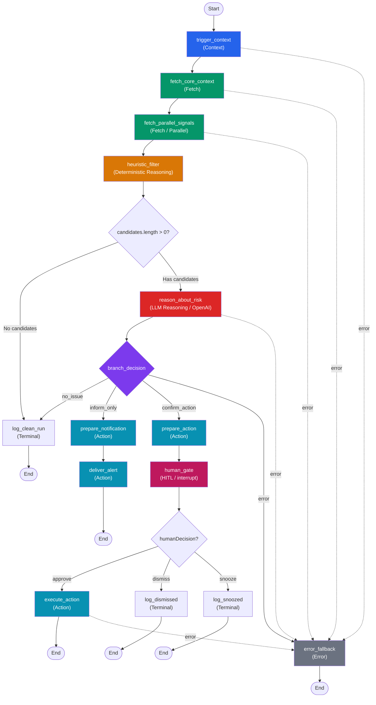

# Required Node Types Deep Dive
## Provenance

- Requirements-backed: assignment constraints and grader-facing deliverables from `requirements.md`. Where `FleetGraph_PRD.pdf` diverges, `requirements.md` wins.
- Codebase-backed: current Ship routes, files, UI patterns, and infra only when this doc cites specific Ship paths or endpoints.
- External-doc-backed: vendor pricing and API behavior only.
- Proposed design: FleetGraph architecture, node layouts, schemas, code sketches, and rollout plans unless explicitly marked as current Ship behavior.
- Assumption: latency budgets, scale math, token budgets, and operational estimates that are not directly measured in this repo.
- Reading rule: unlabeled code blocks are proposed FleetGraph implementation sketches, not current Ship code.


## Purpose

Engineer-ready specification for every node in the FleetGraph execution graph. Each node is defined with its TypeScript contract, what it reads and writes on `FleetGraphState`, whether it is deterministic or model-backed, and its expected execution time budget.

This document is the implementation blueprint. After reading it, a developer should be able to build any node without ambiguity about inputs, outputs, or responsibility boundaries.

## Shared State Shape

Every node reads from and writes to a single `FleetGraphState` object that flows through the graph. The full shape is defined here as the contract that all nodes share.

```typescript
import { Annotation } from "@langchain/langgraph";

/** Risk signal produced by heuristic_filter */
interface CandidateSignal {
  signalType:
    | "missing_standup"
    | "stale_issue"
    | "approval_bottleneck"
    | "scope_drift"
    | "risk_cluster"
    | "capacity_overload"
    | "ownership_gap";
  severity: "low" | "medium" | "high" | "critical";
  entityId: string;
  entityType: "issue" | "sprint" | "project";
  evidence: Record<string, unknown>;
  fingerprint: string; // hash for dedupe
}

/** Structured output from the reasoning node */
interface RiskAssessment {
  overallSeverity: "none" | "low" | "medium" | "high" | "critical";
  explanation: string;
  recommendation: string;
  suggestedAction: {
    type: "no_action" | "notify" | "mutate";
    target?: string;
    payload?: Record<string, unknown>;
  };
  confidence: number; // 0-100
}

/** Approval payload surfaced to the human */
interface ApprovalPayload {
  threadId: string;
  actionType: string;
  targetEntityId: string;
  targetEntityType: string;
  evidenceSummary: string;
  recommendedEffect: string;
  riskTier: "low" | "medium" | "high";
  generatedAt: string; // ISO timestamp
  fingerprint: string;
  traceLink: string;
}

/** Human response to an approval gate */
type HumanDecision =
  | { action: "approve" }
  | { action: "dismiss"; reason?: string }
  | { action: "snooze"; until: string }; // ISO timestamp

/** Action execution result */
interface ActionResult {
  success: boolean;
  httpStatus?: number;
  response?: Record<string, unknown>;
  error?: string;
}

/** The full graph state annotation */
const FleetGraphState = Annotation.Root({
  // --- trigger_context writes ---
  mode: Annotation<"proactive" | "on_demand">,
  actorId: Annotation<string | null>,
  entityId: Annotation<string>,
  entityType: Annotation<"issue" | "sprint" | "project">,
  workspaceId: Annotation<string>,
  traceId: Annotation<string>,

  // --- fetch_core_context writes ---
  coreContext: Annotation<Record<string, unknown>>,

  // --- fetch_parallel_signals writes ---
  signals: Annotation<Record<string, unknown>>,

  // --- heuristic_filter writes ---
  candidates: Annotation<CandidateSignal[]>,

  // --- reason_about_risk writes ---
  riskAssessment: Annotation<RiskAssessment | null>,

  // --- branch_decision writes ---
  branchPath: Annotation<"no_issue" | "inform_only" | "confirm_action" | "error">,

  // --- prepare_notification / prepare_action writes ---
  notification: Annotation<Record<string, unknown> | null>,
  approvalPayload: Annotation<ApprovalPayload | null>,

  // --- human_gate writes ---
  humanDecision: Annotation<HumanDecision | null>,

  // --- execute_action writes ---
  actionResult: Annotation<ActionResult | null>,

  // --- error_fallback writes ---
  error: Annotation<{ message: string; node: string; recoverable: boolean } | null>,
});
```

## Node Inventory

| Node | Family | Deterministic | LLM | Time Budget |
|------|--------|:---:|:---:|------------|
| `trigger_context` | Context | Yes | No | < 50ms |
| `fetch_core_context` | Fetch | Yes | No | < 2s |
| `fetch_parallel_signals` | Fetch | Yes | No | < 2s |
| `heuristic_filter` | Reasoning (deterministic) | Yes | No | < 100ms |
| `reason_about_risk` | Reasoning (LLM) | No | Yes | < 5s |
| `branch_decision` | Conditional edge | Yes | No | < 10ms |
| `prepare_notification` | Action | Yes | No | < 50ms |
| `prepare_action` | Action | Yes | No | < 50ms |
| `human_gate` | HITL gate | Yes | No | Unbounded (interrupt) |
| `execute_action` | Action | Yes | No | < 2s |
| `error_fallback` | Error | Yes | No | < 50ms |

Total deterministic path (no LLM, no approval): under 5 seconds.
Total with LLM reasoning: under 10 seconds.
Approval wait is unbounded but outside the detection SLA.

---

## 1. trigger_context

**Family:** Context node
**Deterministic:** Yes
**Time budget:** < 50ms

### Responsibility

Normalizes the entry point for both proactive and on-demand invocations into a uniform state shape. Every graph run starts here regardless of mode.

### Signature

```typescript
async function triggerContext(
  state: typeof FleetGraphState.State
): Promise<Partial<typeof FleetGraphState.State>> {
  // ...
}
```

### Reads from state

| Field | Source |
|-------|--------|
| (raw input) | Invocation payload passed at graph entry |

### Writes to state

| Field | Type | Description |
|-------|------|-------------|
| `mode` | `"proactive" \| "on_demand"` | How this run was triggered |
| `actorId` | `string \| null` | User ID if on-demand; null if proactive |
| `entityId` | `string` | The primary entity being analyzed |
| `entityType` | `"issue" \| "sprint" \| "project"` | Determines which fetch paths activate |
| `workspaceId` | `string` | Tenant scope for all API calls |
| `traceId` | `string` | UUID for LangSmith trace correlation |

### Behavior

**Proactive entry:**
The sweep scheduler or event queue provides `{ entityId, entityType, workspaceId }`. The node sets `mode = "proactive"`, `actorId = null`, and generates a fresh `traceId`.

**On-demand entry:**
The user's session provides `{ entityId, entityType, workspaceId, actorId }`. The node sets `mode = "on_demand"` and generates a fresh `traceId`.

**Entity type inference:**
If the caller provides a raw document ID without a type, the node can determine `entityType` by inspecting the entity's `document_type` field from the Ship API. In practice, callers should always provide the type to avoid an extra API call.

```typescript
async function triggerContext(state: typeof FleetGraphState.State) {
  const traceId = crypto.randomUUID();

  // Proactive: no actor; On-demand: actor from session
  const mode = state.actorId ? "on_demand" : "proactive";

  return {
    mode,
    actorId: state.actorId ?? null,
    entityId: state.entityId,
    entityType: state.entityType,
    workspaceId: state.workspaceId,
    traceId,
  };
}
```

---

## 2. fetch_core_context

**Family:** Fetch node
**Deterministic:** Yes
**Time budget:** < 2 seconds

### Responsibility

Loads the primary context for the target entity. The fetch strategy varies by entity type. All calls go through the Ship REST API.

### Reads from state

| Field | Purpose |
|-------|---------|
| `entityId` | Which entity to fetch |
| `entityType` | Determines which API calls to make |
| `workspaceId` | Tenant scope |

### Writes to state

| Field | Type | Description |
|-------|------|-------------|
| `coreContext` | `Record<string, unknown>` | Structured payload keyed by data domain |

### Fetch strategy per entity type

#### Issue

| API Call | Endpoint | What it returns |
|----------|----------|----------------|
| Issue detail | `GET /api/issues/:id` | Title, state, priority, assignee, estimate, timestamps, belongs_to |
| Issue history | `GET /api/issues/:id/history` | State transitions, field changes, who changed what |
| Sub-issues | `GET /api/issues/:id/children` | Child issue list with states |
| Associations | `GET /api/documents/:id/associations` | Parent, sprint, project, program links |

These four calls are independent and should be parallelized with `Promise.all`.

```typescript
// Issue entity fetch
const [issue, history, children, associations] = await Promise.all([
  shipApi.get(`/api/issues/${entityId}`),
  shipApi.get(`/api/issues/${entityId}/history`),
  shipApi.get(`/api/issues/${entityId}/children`),
  shipApi.get(`/api/documents/${entityId}/associations`),
]);

return {
  coreContext: { issue, history, children, associations },
};
```

#### Sprint (Week)

| API Call | Endpoint | What it returns |
|----------|----------|----------------|
| Claude context | `GET /api/claude/context?context_type=review&sprint_id=X` | Sprint detail, project, program chain, issues with stats, standups |
| Sprint issues | `GET /api/issues?sprint_id=X` | Full issue list for the sprint including states, priorities, assignees |
| Sprint activity | `GET /api/activity/sprint/X` | 30-day activity counts by date |

```typescript
// Sprint entity fetch
const [claudeContext, issues, activity] = await Promise.all([
  shipApi.get(`/api/claude/context?context_type=review&sprint_id=${entityId}`),
  shipApi.get(`/api/issues?sprint_id=${entityId}`),
  shipApi.get(`/api/activity/sprint/${entityId}`),
]);

return {
  coreContext: { claudeContext, issues, activity },
};
```

The Claude context endpoint is the richest single call for sprint analysis. It returns the full hierarchy: program goals, project plan, sprint plan, recent standups, and issue statistics. Use it as the primary context source and supplement with the raw issue list and activity data.

#### Project

| API Call | Endpoint | What it returns |
|----------|----------|----------------|
| Project detail | `GET /api/projects/:id` | Title, ICE scores, owner, RACI, plan, approval status |
| Project activity | `GET /api/activity/project/X` | 30-day activity counts |
| Action items | `GET /api/accountability/action-items` | Inference-based missing accountability items |
| Claude context (retro) | `GET /api/claude/context?context_type=retro&project_id=X` | Project with all sprints and cross-sprint issue stats |

```typescript
// Project entity fetch
const [project, activity, actionItems, retroContext] = await Promise.all([
  shipApi.get(`/api/projects/${entityId}`),
  shipApi.get(`/api/activity/project/${entityId}`),
  shipApi.get(`/api/accountability/action-items`),
  shipApi.get(`/api/claude/context?context_type=retro&project_id=${entityId}`),
]);

return {
  coreContext: { project, activity, actionItems, retroContext },
};
```

### Authentication

All API calls use the FleetGraph service account session cookie. For proactive mode, this is a long-lived API token stored in environment configuration. For on-demand mode, the user's session cookie is forwarded.

---

## 3. fetch_parallel_signals

**Family:** Fetch node
**Deterministic:** Yes
**Time budget:** < 2 seconds

### Responsibility

Fetches additional signals that are independent of each other and independent of `coreContext`. These are the supplementary data sources that the heuristic filter needs to detect problems.

### Reads from state

| Field | Purpose |
|-------|---------|
| `entityId` | Primary entity |
| `entityType` | Determines which signal fetches are relevant |
| `workspaceId` | Tenant scope |
| `coreContext` | Used to extract related entity IDs (sprint IDs from project, etc.) |

### Writes to state

| Field | Type | Description |
|-------|------|-------------|
| `signals` | `Record<string, unknown>` | Keyed by signal domain |

### Signal sources (all fetched in parallel)

| Signal | Endpoint | When relevant | Purpose |
|--------|----------|---------------|---------|
| Standups | `GET /api/standups?date_from=X&date_to=Y` | Sprint entity | Detect missing standups |
| Sprint issues (all) | `GET /api/issues?sprint_id=X` | Sprint/Project | Detect stale issues, scope changes |
| Sprint plan snapshot | `GET /api/weeks/lookup?project_id=X&sprint_number=N` | Sprint | Compare current issues against `planned_issue_ids` |
| Approval state | `GET /api/weeks/:id` (properties) | Sprint | Detect pending plan/review approvals |
| Team members | `GET /api/weeks/lookup-person?user_id=X` | All | Resolve person documents for ownership checks |
| Backlinks | `GET /api/documents/:id/associations` | Issue | Detect dependency chains |

### Implementation with Promise.all

```typescript
async function fetchParallelSignals(state: typeof FleetGraphState.State) {
  const fetches: Record<string, Promise<unknown>> = {};

  if (state.entityType === "sprint" || state.entityType === "project") {
    const sprintId = state.entityType === "sprint"
      ? state.entityId
      : extractSprintIds(state.coreContext);

    // Standup check: current week date range
    const { from, to } = computeSprintDateRange(state.coreContext);
    fetches.standups = shipApi.get(
      `/api/standups?date_from=${from}&date_to=${to}`
    );

    // All issues for scope comparison
    fetches.sprintIssues = shipApi.get(
      `/api/issues?sprint_id=${sprintId}`
    );
  }

  if (state.entityType === "issue") {
    fetches.associations = shipApi.get(
      `/api/documents/${state.entityId}/associations`
    );
  }

  // Resolve all in parallel
  const results: Record<string, unknown> = {};
  const entries = Object.entries(fetches);
  const resolved = await Promise.all(entries.map(([, p]) => p));
  entries.forEach(([key], i) => {
    results[key] = resolved[i];
  });

  return { signals: results };
}
```

### LangGraph parallel pattern alternative

If using LangGraph's native parallel branches instead of `Promise.all` inside a single node, each signal fetch becomes its own node with a `Send` call. The tradeoff: more granular traces in LangSmith but more graph complexity. For FleetGraph, `Promise.all` inside a single node is recommended because the fetches share authentication context and error handling, and the trace is already legible from the node's structured output.

---

## 4. heuristic_filter

**Family:** Reasoning (deterministic)
**Deterministic:** Yes
**Time budget:** < 100ms

### Responsibility

Runs pure deterministic checks against the fetched data. No LLM involvement. Produces an array of candidate signals with typed evidence. This is the gate that decides whether the expensive reasoning node runs at all.

### Reads from state

| Field | Purpose |
|-------|---------|
| `entityType` | Determines which heuristics apply |
| `coreContext` | Primary entity data |
| `signals` | Supplementary signal data |

### Writes to state

| Field | Type | Description |
|-------|------|-------------|
| `candidates` | `CandidateSignal[]` | Zero or more flagged signals |

### Heuristic implementations

#### BG-1: Missing standup detection

```typescript
function detectMissingStandup(
  coreContext: Record<string, unknown>,
  signals: Record<string, unknown>
): CandidateSignal | null {
  const sprint = coreContext.claudeContext as any;
  const standups = (signals.standups as any[]) || [];

  // Business days in current sprint window
  const expectedDays = getBusinessDaysSinceSprintStart(sprint);
  const actualDays = new Set(standups.map((s: any) => s.properties?.date));

  const missingDays = expectedDays.filter((d) => !actualDays.has(d));

  if (missingDays.length === 0) return null;

  return {
    signalType: "missing_standup",
    severity: missingDays.length >= 3 ? "high" : "medium",
    entityId: sprint.sprint_id,
    entityType: "sprint",
    evidence: {
      expectedDays: expectedDays.length,
      actualDays: actualDays.size,
      missingDays,
    },
    fingerprint: hashSignal("missing_standup", sprint.sprint_id, missingDays),
  };
}
```

#### BG-2: Stale issue detection

An issue is stale when it is in an active state (`in_progress`, `in_review`) but its `updated_at` is older than 3 business days.

```typescript
function detectStaleIssues(
  issues: any[]
): CandidateSignal[] {
  const now = new Date();
  const threshold = subtractBusinessDays(now, 3);

  return issues
    .filter((issue) => {
      const state = issue.state || issue.properties?.state;
      const updatedAt = new Date(issue.updated_at);
      return (
        ["in_progress", "in_review"].includes(state) &&
        updatedAt < threshold
      );
    })
    .map((issue) => ({
      signalType: "stale_issue" as const,
      severity: daysSince(issue.updated_at) > 5 ? "high" : "medium",
      entityId: issue.id,
      entityType: "issue" as const,
      evidence: {
        issueTitle: issue.title,
        state: issue.state || issue.properties?.state,
        lastUpdated: issue.updated_at,
        daysSinceUpdate: daysSince(issue.updated_at),
        assignee: issue.assignee_name,
      },
      fingerprint: hashSignal("stale_issue", issue.id, issue.updated_at),
    }));
}
```

#### BG-3: Approval bottleneck

A plan or review approval is bottlenecked when `plan_approval` or `review_approval` is set to `"pending"` and the approval was requested more than 2 business days ago.

```typescript
function detectApprovalBottleneck(
  coreContext: Record<string, unknown>
): CandidateSignal | null {
  const sprint = coreContext.claudeContext as any;
  const props = sprint || {};

  // Check plan approval
  if (props.plan_approval === "pending") {
    // Use history to determine when approval was requested
    const approvalAge = computeApprovalAge(props, "plan_approval");
    if (approvalAge > 2) {
      return {
        signalType: "approval_bottleneck",
        severity: approvalAge > 5 ? "critical" : "high",
        entityId: sprint.sprint_id,
        entityType: "sprint",
        evidence: {
          approvalType: "plan",
          daysPending: approvalAge,
          sprintTitle: sprint.sprint_title,
        },
        fingerprint: hashSignal(
          "approval_bottleneck",
          sprint.sprint_id,
          "plan"
        ),
      };
    }
  }

  // Same pattern for review_approval
  // ...

  return null;
}
```

#### BG-4: Scope drift

An issue was added to a sprint after the plan snapshot was taken. The sprint document stores `planned_issue_ids` and `snapshot_taken_at` in its properties.

```typescript
function detectScopeDrift(
  coreContext: Record<string, unknown>,
  signals: Record<string, unknown>
): CandidateSignal[] {
  const sprint = coreContext.claudeContext as any;
  const currentIssues = (signals.sprintIssues as any[]) || [];
  const plannedIds: string[] = sprint.planned_issue_ids || [];
  const snapshotDate = sprint.snapshot_taken_at;

  if (!snapshotDate || plannedIds.length === 0) return [];

  const currentIds = currentIssues.map((i: any) => i.id);
  const addedAfterPlan = currentIds.filter((id) => !plannedIds.includes(id));

  if (addedAfterPlan.length === 0) return [];

  const addedIssues = currentIssues.filter((i: any) =>
    addedAfterPlan.includes(i.id)
  );

  return addedIssues.map((issue) => ({
    signalType: "scope_drift" as const,
    severity: addedAfterPlan.length >= 3 ? "high" : "medium",
    entityId: issue.id,
    entityType: "issue" as const,
    evidence: {
      issueTitle: issue.title,
      addedAt: issue.created_at,
      snapshotDate,
      totalAdded: addedAfterPlan.length,
      originalPlannedCount: plannedIds.length,
    },
    fingerprint: hashSignal("scope_drift", sprint.sprint_id, issue.id),
  }));
}
```

#### BG-5: Risk clustering

Multiple weak signals converge on the same project. This heuristic runs after all other signal detections and promotes severity when multiple candidates exist for entities sharing a project.

```typescript
function detectRiskCluster(
  candidates: CandidateSignal[],
  coreContext: Record<string, unknown>
): CandidateSignal | null {
  if (candidates.length < 2) return null;

  const projectId = extractProjectId(coreContext);
  if (!projectId) return null;

  return {
    signalType: "risk_cluster",
    severity: candidates.length >= 4 ? "critical" : "high",
    entityId: projectId,
    entityType: "project",
    evidence: {
      signalCount: candidates.length,
      signalTypes: candidates.map((c) => c.signalType),
      signalSummaries: candidates.map((c) => ({
        type: c.signalType,
        severity: c.severity,
        entity: c.entityId,
      })),
    },
    fingerprint: hashSignal(
      "risk_cluster",
      projectId,
      candidates.map((c) => c.fingerprint).join(",")
    ),
  };
}
```

### Full heuristic_filter node

```typescript
async function heuristicFilter(state: typeof FleetGraphState.State) {
  const candidates: CandidateSignal[] = [];

  // Run all applicable heuristics
  if (state.entityType === "sprint" || state.entityType === "project") {
    const standup = detectMissingStandup(state.coreContext, state.signals);
    if (standup) candidates.push(standup);
  }

  if (state.signals.sprintIssues) {
    const stale = detectStaleIssues(state.signals.sprintIssues as any[]);
    candidates.push(...stale);
  }

  const bottleneck = detectApprovalBottleneck(state.coreContext);
  if (bottleneck) candidates.push(bottleneck);

  const drift = detectScopeDrift(state.coreContext, state.signals);
  candidates.push(...drift);

  // Risk clustering runs last, aggregating other signals
  const cluster = detectRiskCluster(candidates, state.coreContext);
  if (cluster) candidates.push(cluster);

  return { candidates };
}
```

---

## 5. reason_about_risk

**Family:** Reasoning (LLM)
**Deterministic:** No
**Time budget:** < 5 seconds

### Responsibility

Takes filtered candidates and full context, sends them to OpenAI via the Responses API, and receives a structured risk assessment. This node runs only when `candidates.length > 0`.

### Reads from state

| Field | Purpose |
|-------|---------|
| `candidates` | What was flagged by heuristics |
| `coreContext` | Full entity context for model reasoning |
| `signals` | Supplementary data |
| `entityType` | Adjusts prompt framing |
| `mode` | Adjusts tone (proactive vs. on-demand) |

### Writes to state

| Field | Type | Description |
|-------|------|-------------|
| `riskAssessment` | `RiskAssessment \| null` | Structured model output |

### OpenAI Responses call with Zod schema

```typescript
import OpenAI from "openai";
import { z } from "zod";
import { zodResponseFormat } from "openai/helpers/zod";

const RiskAssessmentSchema = z.object({
  overallSeverity: z.enum(["none", "low", "medium", "high", "critical"]),
  explanation: z
    .string()
    .describe("2-3 sentence explanation of the risk assessment"),
  recommendation: z
    .string()
    .describe("Concrete next action the team should take"),
  suggestedAction: z.object({
    type: z.enum(["no_action", "notify", "mutate"]),
    target: z.string().optional().describe("Entity ID to act on"),
    payload: z.record(z.unknown()).optional().describe("Mutation payload if type=mutate"),
  }),
  confidence: z
    .number()
    .int()
    .min(0)
    .max(100)
    .describe("Model confidence in this assessment"),
});

async function reasonAboutRisk(state: typeof FleetGraphState.State) {
  if (state.candidates.length === 0) {
    return { riskAssessment: null };
  }

  const openai = new OpenAI();

  const response = await openai.responses.parse({
    model: getFleetGraphModel("reasoning_primary"),
    instructions: buildInstructions(state.entityType, state.mode),
    input: [
      {
        role: "user",
        content: JSON.stringify({
          candidates: state.candidates,
          context: summarizeContext(state.coreContext),
          signals: summarizeSignals(state.signals),
        }),
      },
    ],
    text: {
      format: zodResponseFormat(RiskAssessmentSchema, "risk_assessment"),
    },
  });

  return {
    riskAssessment: response.output_parsed as RiskAssessment,
  };
}
```

### Prompt structure

```typescript
function buildInstructions(
  entityType: string,
  mode: string
): string {
  return `You are FleetGraph, a project intelligence agent for Ship.

Your job: analyze flagged risk signals for a ${entityType} and produce a structured risk assessment.

Context:
- Mode: ${mode}
- You receive candidate signals that passed deterministic heuristic checks
- You receive the full entity context from the Ship API
- You must assess whether these signals represent real delivery risk

Rules:
- Be specific. Reference issue titles, dates, and people by name.
- If multiple signals point to the same root cause, unify them.
- severity=none means the heuristic was a false positive. Explain why.
- severity=critical means imminent delivery failure. Be direct.
- suggestedAction.type=mutate only for clear, reversible, low-risk changes (reassignment, status update)
- suggestedAction.type=notify for everything else that needs human attention
- confidence below 60 means you are uncertain. Set suggestedAction.type=notify, not mutate.
- Keep explanation under 3 sentences.
- Keep recommendation to one concrete action.`;
}
```

### Context summarization

Raw API payloads are too large to send to the model. The `summarizeContext` function extracts only the fields relevant to risk assessment.

```typescript
function summarizeContext(
  coreContext: Record<string, unknown>
): Record<string, unknown> {
  // Issue context: title, state, priority, assignee, timestamps,
  // history (last 10 entries), children states
  // Sprint context: sprint plan, issue stats, standup count,
  // approval states, owner
  // Project context: title, plan, ICE scores, sprint count,
  // issue count, action items summary
  //
  // Omit: full document content bodies, raw TipTap JSON,
  // large arrays of unchanged historical entries
  return extractRelevantFields(coreContext);
}
```

---

## 6. branch_decision

**Family:** Conditional edge
**Deterministic:** Yes
**Time budget:** < 10ms

### Responsibility

Routes the graph to the correct downstream path based on candidates and the risk assessment. This is implemented as a conditional edge function, not a node that writes state.

### Reads from state

| Field | Purpose |
|-------|---------|
| `candidates` | Whether any signals were detected |
| `riskAssessment` | Model's severity and action recommendation |
| `error` | Whether an upstream node failed |

### Branch logic

```typescript
function branchDecision(
  state: typeof FleetGraphState.State
): "no_issue" | "inform_only" | "confirm_action" | "error" {
  // Error takes precedence
  if (state.error) {
    return "error";
  }

  // No candidates at all
  if (state.candidates.length === 0) {
    return "no_issue";
  }

  // Model ran but concluded no real risk
  if (
    state.riskAssessment &&
    state.riskAssessment.overallSeverity === "none"
  ) {
    return "no_issue";
  }

  // Model recommends a mutation (write to Ship API)
  if (
    state.riskAssessment?.suggestedAction.type === "mutate" &&
    state.riskAssessment.confidence >= 60
  ) {
    return "confirm_action";
  }

  // Everything else: notify the team
  return "inform_only";
}
```

### Graph registration

```typescript
import { StateGraph } from "@langchain/langgraph";

const graph = new StateGraph(FleetGraphState)
  // ... add nodes ...
  .addConditionalEdges("reason_about_risk", branchDecision, {
    no_issue: "log_clean_run",
    inform_only: "prepare_notification",
    confirm_action: "prepare_action",
    error: "error_fallback",
  });
```

### Downstream targets

| Branch | Next Node | Description |
|--------|-----------|-------------|
| `no_issue` | `log_clean_run` | Record clean trace, update last-seen digest, exit |
| `inform_only` | `prepare_notification` | Build notification payload, deliver alert |
| `confirm_action` | `prepare_action` | Build mutation payload, enter HITL gate |
| `error` | `error_fallback` | Log failure, attempt graceful degradation |

---

## 7. prepare_notification

**Family:** Action node
**Deterministic:** Yes
**Time budget:** < 50ms

### Responsibility

Builds a notification payload from the risk assessment. Does not deliver the notification; that is a separate delivery step. This node exists so the notification shape is inspectable in traces before delivery.

### Reads from state

| Field | Purpose |
|-------|---------|
| `riskAssessment` | Severity, explanation, recommendation |
| `candidates` | Raw signal evidence |
| `entityId` | What entity the notification is about |
| `entityType` | Entity type for routing |
| `workspaceId` | Tenant scope |
| `traceId` | For trace link in notification |

### Writes to state

| Field | Type |
|-------|------|
| `notification` | Structured notification payload |

```typescript
async function prepareNotification(state: typeof FleetGraphState.State) {
  const assessment = state.riskAssessment!;

  return {
    notification: {
      type: "fleet_graph_alert",
      workspaceId: state.workspaceId,
      entityId: state.entityId,
      entityType: state.entityType,
      severity: assessment.overallSeverity,
      title: buildNotificationTitle(assessment, state.candidates),
      body: assessment.explanation,
      recommendation: assessment.recommendation,
      evidence: state.candidates.map((c) => ({
        signalType: c.signalType,
        severity: c.severity,
        summary: summarizeEvidence(c.evidence),
      })),
      traceLink: buildTraceLink(state.traceId),
      createdAt: new Date().toISOString(),
    },
    branchPath: "inform_only" as const,
  };
}
```

---

## 8. prepare_action

**Family:** Action node
**Deterministic:** Yes
**Time budget:** < 50ms

### Responsibility

Builds an approval payload for a consequential action. This payload is what the human sees in the approval gate. The node does not execute anything. No writes happen before approval.

### Reads from state

| Field | Purpose |
|-------|---------|
| `riskAssessment` | Action recommendation |
| `candidates` | Evidence |
| `entityId`, `entityType` | Target |
| `traceId` | Trace link for audit |

### Writes to state

| Field | Type |
|-------|------|
| `approvalPayload` | `ApprovalPayload` |

```typescript
async function prepareAction(state: typeof FleetGraphState.State) {
  const assessment = state.riskAssessment!;
  const action = assessment.suggestedAction;

  return {
    approvalPayload: {
      threadId: state.traceId, // LangGraph thread ID for resume
      actionType: describeActionType(action),
      targetEntityId: action.target || state.entityId,
      targetEntityType: state.entityType,
      evidenceSummary: assessment.explanation,
      recommendedEffect: assessment.recommendation,
      riskTier: mapSeverityToRiskTier(assessment.overallSeverity),
      generatedAt: new Date().toISOString(),
      fingerprint: state.candidates[0]?.fingerprint || "",
      traceLink: buildTraceLink(state.traceId),
    },
    branchPath: "confirm_action" as const,
  };
}
```

---

## 9. human_gate

**Family:** Human-in-the-loop gate
**Deterministic:** Yes (deterministic code, but pauses for human input)
**Time budget:** Unbounded (interrupt)

### Responsibility

Pauses the graph and surfaces the approval payload to the user. Resumes when the user approves, dismisses, or snoozes.

### Reads from state

| Field | Purpose |
|-------|---------|
| `approvalPayload` | What to show the human |

### Writes to state

| Field | Type | Description |
|-------|------|-------------|
| `humanDecision` | `HumanDecision` | The user's response |

### LangGraph interrupt implementation

```typescript
import { interrupt } from "@langchain/langgraph";

async function humanGate(state: typeof FleetGraphState.State) {
  // Surface the approval payload and pause execution
  const decision = interrupt<HumanDecision>(state.approvalPayload);

  return {
    humanDecision: decision,
  };
}
```

### How interrupts work in LangGraph

1. When `interrupt()` is called, the graph execution suspends and the current state is persisted to the Postgres-backed checkpointer.
2. The `approvalPayload` is returned to the caller (the API endpoint) so it can be surfaced in the Ship frontend.
3. The graph remains suspended until `graph.invoke(null, { configurable: { thread_id } })` is called with the human's decision as a `Command` resume value.
4. On resume, the `humanGate` node restarts from the beginning. The `interrupt()` call returns the human's decision instead of pausing.

### Resume API

```typescript
import { Command } from "@langchain/langgraph";

// Called by the Ship API when user clicks Approve/Dismiss/Snooze
async function resumeApproval(
  threadId: string,
  decision: HumanDecision
) {
  await fleetGraph.invoke(
    new Command({ resume: decision }),
    { configurable: { thread_id: threadId } }
  );
}
```

### Frontend API shape

The Ship frontend calls these endpoints to interact with the approval gate:

```
POST /api/fleetgraph/approvals/:threadId/approve
POST /api/fleetgraph/approvals/:threadId/dismiss
  Body: { reason?: string }
POST /api/fleetgraph/approvals/:threadId/snooze
  Body: { until: string } // ISO timestamp
```

Each endpoint calls `resumeApproval` with the corresponding `HumanDecision`.

### Post-decision routing

After the human responds:

| Decision | Next node | Behavior |
|----------|-----------|----------|
| `approve` | `execute_action` | Proceed with the mutation |
| `dismiss` | `log_dismissed` | Record dismissal against fingerprint, suppress re-surfacing |
| `snooze` | `log_snoozed` | Record snooze-until timestamp, suppress until expiry |

```typescript
function postApprovalBranch(
  state: typeof FleetGraphState.State
): "execute_action" | "log_dismissed" | "log_snoozed" {
  switch (state.humanDecision?.action) {
    case "approve":
      return "execute_action";
    case "dismiss":
      return "log_dismissed";
    case "snooze":
      return "log_snoozed";
    default:
      return "log_dismissed"; // defensive default
  }
}
```

---

## 10. execute_action

**Family:** Action node
**Deterministic:** Yes
**Time budget:** < 2 seconds

### Responsibility

Performs the approved mutation against the Ship API. Runs only after human approval. Re-fetches the target entity's current state before executing to guard against stale data.

### Reads from state

| Field | Purpose |
|-------|---------|
| `approvalPayload` | What action was approved |
| `humanDecision` | Confirmation it was approved |
| `riskAssessment` | Action details |

### Writes to state

| Field | Type |
|-------|------|
| `actionResult` | `ActionResult` |

### Supported mutations

| Action Type | Ship API Call | Example |
|-------------|-------------|---------|
| Reassign issue | `PATCH /api/issues/:id` | `{ assignee_id: "new-user-uuid" }` |
| Change issue state | `PATCH /api/issues/:id` | `{ state: "in_progress" }` |
| Change issue priority | `PATCH /api/issues/:id` | `{ state: "urgent" }` |
| Move issue to sprint | `PATCH /api/issues/:id` | `{ belongs_to: [{ id: "sprint-uuid", type: "sprint" }] }` |

### Implementation

```typescript
async function executeAction(state: typeof FleetGraphState.State) {
  const payload = state.approvalPayload!;
  const action = state.riskAssessment!.suggestedAction;

  // Re-fetch current state to prevent stale writes
  const currentEntity = await shipApi.get(
    `/api/${payload.targetEntityType}s/${payload.targetEntityId}`
  );

  // Validate the entity still exists and is in expected state
  if (!currentEntity || currentEntity.deleted_at) {
    return {
      actionResult: {
        success: false,
        error: "Target entity no longer exists or was deleted",
      },
    };
  }

  try {
    const response = await shipApi.patch(
      `/api/${payload.targetEntityType}s/${payload.targetEntityId}`,
      action.payload
    );

    return {
      actionResult: {
        success: true,
        httpStatus: response.status,
        response: response.data,
      },
    };
  } catch (err: any) {
    return {
      actionResult: {
        success: false,
        httpStatus: err.response?.status,
        error: err.message,
      },
    };
  }
}
```

### Idempotency

The `fingerprint` from the approval payload serves as a deduplication key. The execution node checks whether an action with this fingerprint has already been executed before making the API call. This prevents duplicate writes if the graph is replayed.

---

## 11. error_fallback

**Family:** Error and fallback node
**Deterministic:** Yes
**Time budget:** < 50ms

### Responsibility

Catches failures from any upstream node and records them as structured error state. Ensures the graph never crashes silently. In proactive mode, suppresses the notification. In on-demand mode, returns a degraded response to the user.

### Reads from state

| Field | Purpose |
|-------|---------|
| `error` | Error details from the failing node |
| `mode` | Determines degradation behavior |
| `traceId` | For error logging |

### Writes to state

Does not write new state. The `error` field is already populated by the failing node's error handler.

### Error classification

| Class | Example | Recovery |
|-------|---------|----------|
| Read failure | Ship API returned 500 or timed out | Retry with bounded backoff (max 2 retries). If still failing, log and skip this sweep cycle. |
| Model failure | OpenAI returned 429 or 500 | Retry once. Fall back to heuristic-only surfacing if candidates had high severity. |
| Approval failure | LangGraph checkpoint corrupt or missing | Log error. Surface manual investigation alert to operator. |
| Action failure | PATCH to Ship API failed (409, 404) | Re-fetch entity state. If entity changed, log stale-action warning. If persistent, route to DLQ. |

### Implementation

```typescript
async function errorFallback(state: typeof FleetGraphState.State) {
  const err = state.error;
  if (!err) return {};

  console.error(
    `[FleetGraph] Error in node=${err.node} trace=${state.traceId}: ${err.message}`
  );

  // In proactive mode: suppress notification, record failure
  if (state.mode === "proactive") {
    // Record failure for retry on next sweep
    await recordFailedSweep(state.entityId, state.traceId, err);
    return {};
  }

  // In on-demand mode: return degraded response
  return {
    notification: {
      type: "fleet_graph_error",
      severity: "low",
      title: "FleetGraph encountered an issue",
      body: err.recoverable
        ? "Some data could not be loaded. Results may be incomplete."
        : "Unable to complete analysis. Please try again.",
      traceLink: buildTraceLink(state.traceId),
    },
  };
}
```

### Wrapping nodes with error handling

Each node should use the shared `withErrorHandling` helper. The canonical implementation lives in `api/src/fleetgraph/nodes/error-fallback.ts` and is specified in [Phase 2 / 07. Error and Failure Handling](../../Phase%202/07.%20Error%20and%20Failure%20Handling/README.md).

```typescript
import { withErrorHandling } from "./nodes/error-fallback.js";

// Usage
const graph = new StateGraph(FleetGraphState)
  .addNode("trigger_context", withErrorHandling("trigger_context", triggerContext))
  .addNode("fetch_core_context", withErrorHandling("fetch_core_context", fetchCoreContext))
  // ...
```

---

## Mermaid Graph Diagram



### Color legend

| Color | Node family |
|-------|-------------|
| Blue | Context |
| Green | Fetch |
| Amber | Deterministic reasoning |
| Red | LLM reasoning |
| Purple | Conditional edge |
| Teal | Action |
| Pink | HITL gate |
| Gray | Error/Fallback |

---

## Trace Visibility Requirements

Each node must produce a structured output that is visible in LangSmith traces. At minimum:

1. Node name matches the function name (LangGraph does this automatically)
2. Input state fields read by the node are logged
3. Output state fields written by the node are logged
4. For `reason_about_risk`: the full OpenAI request and response are traced via LangSmith's OpenAI integration
5. For `branch_decision`: the selected branch is logged as a trace tag
6. For `human_gate`: both the interrupt payload and the resume value are traced

This ensures a reviewer can open any LangSmith trace and immediately see which path the graph took and why.

## Relationship to Other Presearch Docs

| Document | Relationship |
|----------|-------------|
| [02. Proactive and On-Demand Modes / DEEP_DIVE](../02.%20Proactive%20and%20On-Demand%20Modes/DEEP_DIVE.md) | Use case inventory that feeds heuristic_filter signal types |
| [04. LangGraph and LangSmith](../04.%20LangGraph%20and%20LangSmith/README.md) | Framework choice that determines node registration and checkpoint APIs |
| [06. Ship REST API Data Source](../06.%20Ship%20REST%20API%20Data%20Source/README.md) | Endpoint catalog used by fetch nodes |
| [07. Human Approval Before Consequential Actions](../07.%20Human%20Approval%20Before%20Consequential%20Actions/README.md) | Approval UX spec consumed by human_gate |
| [Phase 2 / 04. Node Design](../../Phase%202/04.%20Node%20Design/README.md) | High-level node list that this document expands |
| [Phase 2 / 05. State Management](../../Phase%202/05.%20State%20Management/README.md) | State shape decisions formalized here as TypeScript types |
| [Phase 2 / 06. Human-in-the-Loop Design](../../Phase%202/06.%20Human-in-the-Loop%20Design/README.md) | HITL policy that this document implements as interrupt logic |
| [Phase 2 / 07. Error and Failure Handling](../../Phase%202/07.%20Error%20and%20Failure%20Handling/README.md) | Failure taxonomy implemented in error_fallback |
