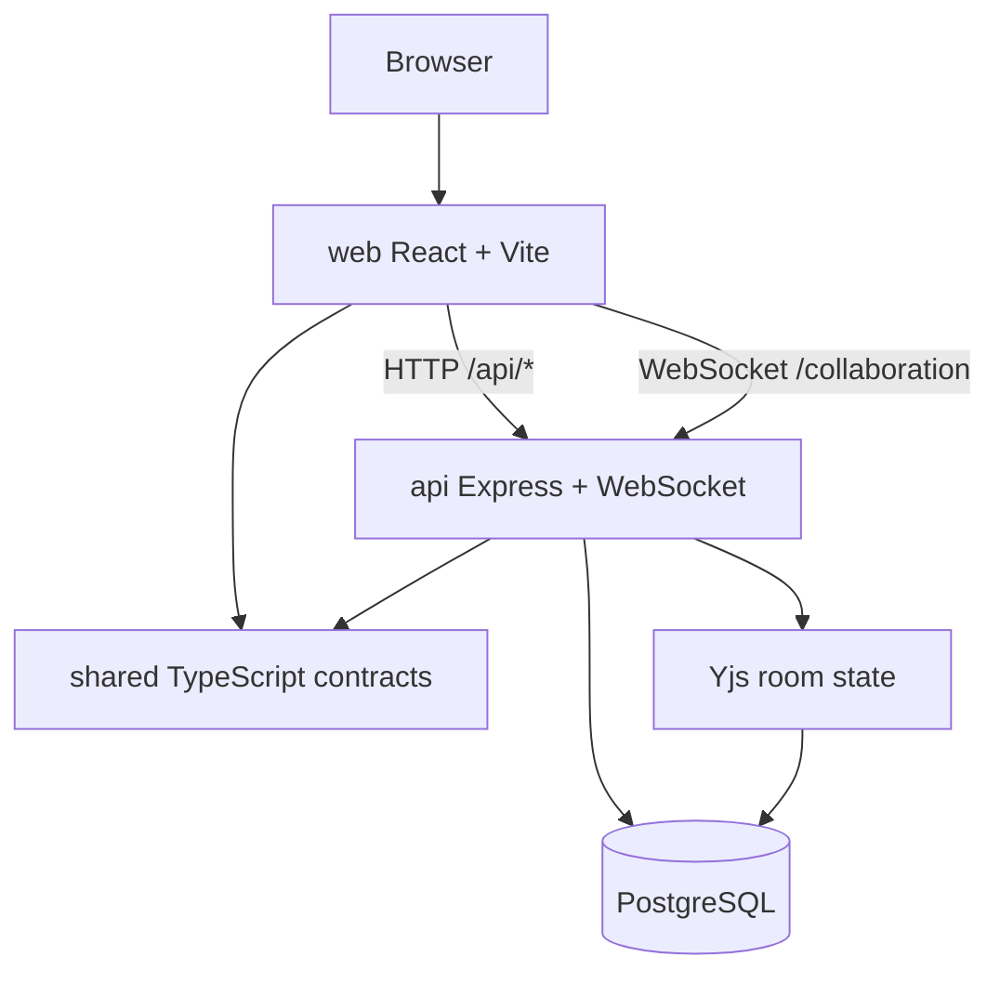

# Appendix: Codebase Orientation Checklist

Path audited: `/Users/maxpetrusenko/Desktop/Gauntlet/ShipShapeProject/ShipShape`  
Date: `2026-03-09`

## Phase 1: First Contact

### 1. Repository Overview

Primary refs:
- `ShipShape/package.json`
- `ShipShape/scripts/dev.sh`
- `ShipShape/docs/application-architecture.md`
- `ShipShape/docs/developer-workflow-guide.md`
- `ShipShape/docs/unified-document-model.md`
- `ShipShape/shared/src/types/document.ts`

Verified repo shape:
- monorepo with `api/`, `web/`, `shared/`, `e2e/`, `docs/`, and `terraform/`
- root package manager/runtime from `package.json`: `pnpm@10.27.0`, Node `>=20.0.0`, TypeScript `^5.7.2`
- root scripts present: `pnpm dev`, `pnpm build`, `pnpm type-check`, `pnpm test`, `pnpm test:e2e`, `pnpm db:seed`, `pnpm db:migrate`

Local startup path:
1. `pnpm dev`
2. `scripts/dev.sh` auto-creates `api/.env.local` if missing
3. the same script auto-creates a worktree-specific local Postgres database if missing
4. if `node_modules` is missing, the script installs dependencies
5. it builds `shared/`, runs migrations, runs seed data, finds free API/Web ports, writes `.ports`, then starts all dev servers

Local verification completed during this appendix pass:
- `corepack pnpm --filter @ship/api test` passed: `28` files, `451` tests
- `corepack pnpm --filter @ship/web test` executed successfully but reported `13` failing tests, which is useful orientation evidence for current frontend test health
- `PLAYWRIGHT_WORKERS=1 corepack pnpm test:e2e` completed global setup, built API and web, and began executing the Chromium suite locally

Important setup details that are easy to miss:
- the real bootstrap path is `scripts/dev.sh`, not just a plain workspace script
- port assignment is dynamic; `.ports` is the handoff artifact
- local login defaults appear in code/docs as `dev@ship.local` / `admin123`

Docs sweep method:
- reviewed the full `ShipShape/docs/` folder, then deep-read the core architecture, workflow, and document-model references to build the orientation summary
- read all `45` text artifacts directly (`.md`, `.json`, `.jsonl`)
- inventoried all `17` image artifacts under `docs/screenshots/` and `docs/pr-evidence/`
- used these core architecture docs as the primary narrative refs:
  - `docs/application-architecture.md`
  - `docs/developer-workflow-guide.md`
  - `docs/unified-document-model.md`
  - `docs/document-model-conventions.md`
  - `docs/ship-philosophy.md`
- treated `docs/screenshots/`, `docs/pr-evidence/`, `docs/metrics/`, and `docs/plans/` as supporting evidence and historical context rather than primary architecture prose

Key architectural decisions from docs:
- one unified `documents` model backs multiple product objects instead of separate per-type tables
- `shared/` is the contract layer between frontend and backend
- collaboration is server-authoritative with Yjs state persisted to the database
- the stack favors explicit SQL and explicit route behavior over an ORM abstraction
- deployment is script-driven and AWS-oriented, with government-environment constraints reflected in Docker and infra choices

Shared package review:
- `shared/src/types/document.ts`: unified document contracts and per-document property types
- `shared/src/types/api.ts`: API request/response shapes
- `shared/src/types/auth.ts`: auth/session-related types
- `shared/src/types/user.ts`: user contracts
- `shared/src/types/workspace.ts`: workspace contracts
- `shared/src/index.ts` and `shared/src/types/index.ts` re-export the shared surface consumed by both `web/` and `api/`

How `shared/` is used:
- `web/` imports shared document and API types so React/TanStack Query code matches backend payload shape
- `api/` imports the same contracts so route handlers and response shaping stay aligned with the frontend
- this reduces contract drift at the package boundary

Formal package relationship diagram:

### 2. Data Model

Primary refs:
- `ShipShape/api/src/db/schema.sql`
- `ShipShape/shared/src/types/document.ts`
- `ShipShape/docs/unified-document-model.md`

Schema sources read:
- `api/src/db/schema.sql`
- `api/src/db/migrations/*`
- `docs/unified-document-model.md`

Core tables identified:
- `workspaces`
- `users`
- `workspace_memberships`
- `sessions`
- `audit_logs`
- `documents`
- `document_associations`
- `document_history`
- `document_snapshots`
- `api_tokens`
- `comments`
- `files`
- `sprint_iterations`
- `issue_iterations`

Unified document model:
- the `documents` table is the center of the application
- one table backs `wiki`, `issue`, `program`, `project`, `sprint`, `person`, `weekly_plan`, `weekly_retro`, `standup`, and `weekly_review`
- subtype-specific behavior is driven by the `document_type` discriminator plus typed `properties`

`document_type` discriminator:
- defined in `shared/src/types/document.ts`
- used directly in route SQL filters such as `WHERE d.document_type = 'issue'`
- also used in joins, for example person-document lookups with `document_type = 'person'`

Relationships:
- `document_associations` handles cross-document links such as project membership, sprint membership, and parent-child links
- `parent_id` expresses direct hierarchy
- route code uses associations to map issues into programs, projects, and sprints without requiring separate entity tables per feature

Mental model:
- auth and access control live in membership/session structures
- content and product objects live in the unified document system

### 3. Request Flow

Primary refs:
- `ShipShape/web/src/components/IssuesList.tsx`
- `ShipShape/web/src/hooks/useIssuesQuery.ts`
- `ShipShape/web/src/lib/api.ts`
- `ShipShape/api/src/app.ts`
- `ShipShape/api/src/routes/issues.ts`

User action traced: create issue

Frontend path:
1. `web/src/components/IssuesList.tsx` calls `useCreateIssue().mutateAsync(...)`
2. `web/src/hooks/useIssuesQuery.ts` builds the payload in `createIssueApi(...)`
3. `web/src/lib/api.ts` fetches a CSRF token from `/api/csrf-token`, then performs the authenticated POST to `/api/issues`

Backend path:
4. `api/src/app.ts` mounts `/api/issues` behind middleware and conditional CSRF handling
5. `api/src/routes/issues.ts` validates the body with Zod
6. the same route opens a transaction, takes a workspace-scoped advisory lock, computes the next issue ticket number, inserts a row into `documents`, then inserts relationship rows into `document_associations`
7. the route returns the created issue as JSON, including resolved `belongs_to` display information

Return path to UI:
8. `useCreateIssue()` replaces the optimistic row with the server response and invalidates issue queries
9. list-view flows can then navigate to the created issue document

Middleware chain in `api/src/app.ts`:
1. `helmet`
2. API-wide rate limiting
3. `cors`
4. JSON and URL-encoded parsers
5. `cookie-parser`
6. `express-session`
7. CSRF token endpoint and health/docs routes
8. route-level conditional CSRF on state-changing endpoints
9. route auth middleware where required

Authentication behavior:
- session-cookie auth and Bearer-token auth are both supported
- missing session returns `401`
- invalid session returns `401`
- invalid or expired API token returns `401`
- revoked workspace access returns `403`
- idle timeout is `15` minutes
- absolute session timeout is `12` hours

Unauthenticated request behavior:
- public paths like login/setup are allowed
- protected API routes reject missing auth with `401`
- frontend request helpers distinguish missing session from expired session so UX can redirect correctly

## Phase 2: Deep Dive

### 4. Real-time Collaboration

Primary refs:
- `ShipShape/api/src/collaboration/index.ts`
- `ShipShape/docs/application-architecture.md`
- `ShipShape/docs/unified-document-model.md`

Sources used:
- `docs/application-architecture.md`
- `docs/unified-document-model.md`
- `api/src/collaboration/index.ts`
- frontend Yjs imports

Connection establishment:
- the frontend connects over WebSocket to the collaboration endpoint
- collaboration rooms are keyed by document identity

How Yjs sync works:
- server keeps `Y.Doc` instances in memory
- client-side local persistence uses `y-indexeddb`
- remote updates merge through Yjs CRDT semantics rather than lock ownership

Concurrent editing:
- simultaneous edits from two users are merged by CRDT rules
- the higher risk areas are not merge itself, but JSON fallback conversion and persistence timing

Persistence model:
- server persists Yjs state into `documents.yjs_state`
- if persisted Yjs bytes are absent, content can fall back to JSON `content`
- save behavior is debounced rather than persisted on every keystroke

### 5. TypeScript Patterns

Primary refs:
- `ShipShape/tsconfig.json`
- `ShipShape/shared/src/types/document.ts`
- `ShipShape/web/src/hooks/useIssuesQuery.ts`
- `ShipShape/api/src/routes/associations.ts`
- `ShipShape/web/src/components/icons/uswds/types.ts`

Version and config:
- TypeScript version: `^5.7.2`
- `tsconfig.json` confirms:
  - `strict: true`
  - `noUncheckedIndexedAccess: true`
  - `noImplicitReturns: true`
  - `noFallthroughCasesInSwitch: true`

Type sharing pattern:
- `@ship/shared` is the contract layer used by both frontend and backend
- frontend code consumes shared document/API types
- backend code shapes data against the same shared model

Examples found:
- generics:
  - `useQuery<Issue[]>` patterns in `web/src/hooks/useIssuesQuery.ts`
  - typed maps such as `Map<string, Y.Doc>` in collaboration code
- discriminated unions:
  - `shared/src/types/document.ts` defines document interfaces with literal `document_type` values such as `'wiki'`, `'issue'`, `'program'`, `'project'`, and `'sprint'`
  - downstream code can branch on `document_type` while keeping subtype-specific properties aligned
- utility types:
  - `Partial<ProjectProperties>` patterns in shared document typing
  - `Partial`, `Pick`, and `Omit` appear across route and frontend helper code
- type guards:
  - `isValidRelationshipType` in `api/src/routes/associations.ts`
  - `isValidIconName` in `web/src/components/icons/uswds/types.ts`
  - `isCascadeWarningError` in `web/src/hooks/useIssuesQuery.ts`

Pattern I explicitly researched:
- Playwright worker-scoped fixtures via `test.extend(...)` in `e2e/fixtures/isolated-env.ts`
- conclusion: each worker gets isolated DB/API/Web resources, which increases startup cost but sharply improves state isolation and reduces shared-environment flake

### 6. Testing Infrastructure

Primary refs:
- `ShipShape/api/vitest.config.ts`
- `ShipShape/web/vitest.config.ts`
- `ShipShape/playwright.config.ts`
- `ShipShape/e2e/global-setup.ts`
- `ShipShape/e2e/fixtures/isolated-env.ts`

Unit/integration stack:
- API tests use Vitest with `api/src/test/setup.ts`
- API setup truncates core tables and uses the shared Postgres pool
- API Vitest config disables file parallelism to avoid DB conflicts
- web tests use Vitest + jsdom via `web/vitest.config.ts`

Playwright structure:
- `playwright.config.ts` is Chromium-only
- worker count is computed from available memory
- retries are `2` in CI and `1` locally
- reporters include HTML and a JSONL progress reporter
- `e2e/global-setup.ts` builds API and web before tests start

Fixtures used:
- tests import `test` and `expect` from `e2e/fixtures/isolated-env.ts`
- that fixture defines worker-scoped:
  - `dbContainer` via `@testcontainers/postgresql`
  - `apiServer` via built `api/dist/index.js`
  - `webServer` via `vite preview`
  - a browser-context init script that disables the action-items modal for stability

Test DB setup/teardown:
- for API tests, the local test DB is cleaned/reset through the shared pool and test setup
- for Playwright, each worker starts a fresh Postgres container, runs migrations, then tears the container down when the worker ends

Test execution evidence:
- run stamp: `2026-03-09 15:31:31 EDT`
- command: `/usr/bin/time -p corepack pnpm --filter @ship/api test`
  - result: pass
  - `28` files passed
  - `451` tests passed
  - Vitest duration `13.24s`
  - wall-clock `13.70s`
- command: `/usr/bin/time -p corepack pnpm --filter @ship/web test`
  - result: fail
  - `16` files executed
  - `151` tests executed
  - `13` tests failed
  - Vitest duration `2.43s`
  - wall-clock `3.18s`
  - failures centered in:
    - `src/lib/document-tabs.test.ts`
    - `src/components/editor/DetailsExtension.test.ts`
    - `src/hooks/useSessionTimeout.test.ts`
- command: `PLAYWRIGHT_WORKERS=1 corepack pnpm test:e2e`
  - global setup ran
  - API build completed
  - web build completed
  - suite enumerated `869` Chromium tests
  - local run emitted low-memory warnings during setup
  - Playwright progressed past setup into live execution and started with:
    - `[1/869] [chromium] › e2e/accessibility-remediation.spec.ts:51:9`

Bottom line on test health:
- API tests pass
- web unit tests do not fully pass
- Playwright is wired, builds successfully, and begins executing locally under the isolated fixture model

### 7. Build and Deploy

Primary refs:
- `ShipShape/Dockerfile`
- `ShipShape/docker-compose.yml`
- `ShipShape/docker-compose.local.yml`
- `ShipShape/terraform/README.md`
- `ShipShape/scripts/deploy-infrastructure.sh`
- `ShipShape/scripts/deploy-api.sh`
- `ShipShape/scripts/deploy-frontend.sh`
- `ShipShape/scripts/deploy-web.sh`
- `ShipShape/scripts/deploy.sh`

Dockerfile:
- uses a public ECR Node 20 base image
- installs pnpm
- installs production dependencies
- copies prebuilt `shared/dist` and `api/dist`
- runs migrations on container start
- starts the API process

`docker-compose.yml`:
- optional local-only Postgres setup
- starts a single `postgres` service on `5432`
- intended for developers who do not use native local Postgres

`docker-compose.local.yml`:
- local multi-service development stack
- starts Postgres, API, and web

Terraform skim:
- root and module structure indicate AWS-oriented infrastructure
- major expected infrastructure components:
  - VPC
  - security groups
  - Aurora/Postgres
  - Elastic Beanstalk
  - S3 + CloudFront
  - WAF
  - SSM parameters

CI/CD:
- no `.github/` workflow directory was found
- deploy flow appears script-driven rather than pipeline-first
- deploy surface includes:
  - `scripts/deploy-infrastructure.sh`
  - `scripts/deploy-api.sh`
  - `scripts/deploy-frontend.sh`
  - `scripts/deploy-web.sh`
  - `scripts/deploy.sh`

## Phase 3: Synthesis

### 8. Architecture Assessment

Three strongest decisions:
1. unified `documents` model plus shared cross-package types
2. explicit SQL and schema-first backend instead of hiding behavior behind an ORM
3. Yjs-based collaboration with persisted server-side state and isolated E2E fixture design

Three weakest points:
1. some route files are very large and carry too much behavioral surface
2. frontend initial bundle is too large
3. root `pnpm test` does not represent the full application test contract

What I would tell a new engineer first:
1. start with `shared/src/types/document.ts`, `docs/unified-document-model.md`, and `api/src/app.ts`
2. understand the split between membership/auth data and content/document data before changing routes
3. expect explicit SQL, explicit route logic, and a lot of behavior centered on the unified document model

What likely breaks first at `10x` users:
1. collaboration room memory growth and save churn on the server
2. the heaviest route handlers and document queries in oversized API files
3. initial web payload and client-side responsiveness on cold load
